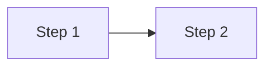

# Spec: Mermaid Diagrams in Posts

- **Goal**: Provide a stable, reviewable convention for embedding diagrams in sings.dev posts via `rehype-mermaid` (build-time SVG, dawn/night-themed).
- **Reference Philosophy**: Follow `docs/spec-editorial-philosophy.md`. Diagrams should serve the prose, not decorate it.
- **Authoritative source for design rationale**: `docs/superpowers/specs/2026-05-10-mermaid-diagrams-design.md`. This file is the author-facing reference manual.

## Markdown convention

Use a fenced code block with `mermaid` as the language tag:

````

````

The block is rendered at build time into a `<picture>` element with light + dark SVG variants. Standard mermaid syntax is supported (flowchart, sequence, state, gantt, ER, etc.). For now this site only uses `flowchart`; if you reach for another type and the theme variables don't cover it, add the missing variables to `src/utils/mermaidTheme.ts`.

## Theme palette

Theme variables are derived from the dawn/night palette in `src/styles/global.css` and live in `src/utils/mermaidTheme.ts`. Two exports — `mermaidThemeLight` and `mermaidThemeDark`. Maintenance: when the palette shifts, update both `global.css` and `mermaidTheme.ts` in the same commit.

## Light/dark behavior

`rehype-mermaid` emits `<picture>` with `prefers-color-scheme` media-query sources. A small JS hook in `src/layouts/Layout.astro`'s theme-toggle script also flips the picture source on manual `<html class="dark">` toggles, so the diagram tracks the rest of the page on toggle.

## Caption convention

Optional. The `remarkPostFigure` plugin auto-promotes `` siblings into `<figure>` with caption — it does not auto-promote mermaid blocks. Authors who want a caption add an italic line below the diagram:

````
```mermaid
...
```

_(Diagram: ...)_
````

## Build environment

`rehype-mermaid` requires Playwright + Chromium at build time. `package.json`'s `postinstall` hook downloads the matching Chromium binary on `npm install` / `npm ci`.

**Where the build runs:** GitHub Actions, `ubuntu-latest`. See [docs/spec-deploy.md](docs/spec-deploy.md) for the deploy pipeline overview. The runner ships with Chromium's system dependencies (`libatk-1.0.so.0`, `libnss3`, `libgbm1`, etc.) preinstalled — this is why the build was moved off Cloudflare's build image, which lacks those libraries and does not expose `sudo apt-get`. Full rationale: [docs/superpowers/specs/2026-05-12-github-actions-deploy-design.md](docs/superpowers/specs/2026-05-12-github-actions-deploy-design.md).

**Fonts:** `fontFamily` in [src/utils/mermaidTheme.ts](src/utils/mermaidTheme.ts) is pinned to `arial, sans-serif` so the build-time text-width measurement matches what view-time browsers render. `ubuntu-latest` already ships `fonts-liberation` (Arial-metric-compatible Latin), but not CJK fonts — the workflow installs `fonts-noto-cjk` before the build so Playwright Chromium can measure Korean glyph widths. Without this step, the build-time Korean fallback differs from what macOS / Windows browsers use at view time (Apple SD Gothic Neo, Malgun Gothic, etc.) and the last char of long Korean labels clips on the rendered SVG.

**Caching:** the workflow caches `~/.cache/ms-playwright/` keyed on `package-lock.json`. The cache invalidates automatically when the `playwright` package version changes, so the npm package and the cached binary never drift apart.

**Local development:** any modern macOS or Linux dev environment has the needed system libs. `npm install` runs the postinstall hook and Chromium lands in the Playwright cache; subsequent builds reuse it. After `npm update` (or any change to Playwright's pinned version), re-run `npm install` or `npx playwright install chromium` to re-sync.

## Out of scope

- Multi-locale label automation (each locale's mermaid block is hand-written, same as prose).
- Mermaid live-editor integration. The site is static.
