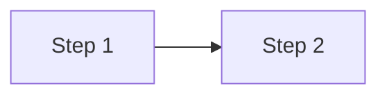

# Spec: Mermaid Diagrams in Posts

- **Goal**: Provide a stable, reviewable convention for embedding diagrams in sings.dev posts via `rehype-mermaid` (build-time SVG, dawn/night-themed).
- **Reference Philosophy**: Follow `docs/spec-editorial-philosophy.md`. Diagrams should serve the prose, not decorate it.
- **Authoritative source for design rationale**: `docs/superpowers/specs/2026-05-10-mermaid-diagrams-design.md`. This file is the author-facing reference manual.

## Markdown convention

Use a fenced code block with `mermaid` as the language tag:

````

````

The block is rendered at build time into a `<picture>` element with light + dark SVG variants. Standard mermaid syntax is supported (flowchart, sequence, state, gantt, ER, etc.). For now this site only uses `flowchart`; if you reach for another type and the theme variables don't cover it, add the missing variables to `src/utils/mermaidTheme.ts`.

## Theme palette

Theme variables are derived from the dawn/night palette in `src/styles/global.css` and live in `src/utils/mermaidTheme.ts`. Two exports — `mermaidThemeLight` and `mermaidThemeDark`. Maintenance: when the palette shifts, update both `global.css` and `mermaidTheme.ts` in the same commit.

## Light/dark behavior

`rehype-mermaid` emits `<picture>` with `prefers-color-scheme` media-query sources. A small JS hook in `src/layouts/Layout.astro`'s theme-toggle script also flips the picture source on manual `<html class="dark">` toggles, so the diagram tracks the rest of the page on toggle.

## Caption convention

Optional. The `remarkPostFigure` plugin auto-promotes `` siblings into `<figure>` with caption — it does not auto-promote mermaid blocks. Authors who want a caption add an italic line below the diagram:

````
```mermaid
...
```

_(Diagram: ...)_
````

## Build environment

`rehype-mermaid` requires Playwright + Chromium. `package.json`'s `postinstall` hook auto-downloads Chromium on `npm install`. The first build after install or in a clean CI cache adds 30–60s for the binary download; subsequent builds reuse the cache.

**CI/CD note:** the postinstall strategy depends on lifecycle scripts running. If a hardened CI environment uses `npm ci --ignore-scripts` (or the platform suppresses scripts by default), Chromium will not be downloaded and the `rehype-mermaid` render step will fail at build time. Fix in that case: append an explicit `npx playwright install chromium` step before the build runs.

**Version drift:** Playwright pins its Chromium revision to the package version. After `npm update` (or any time Playwright's package version changes), run `npx playwright install chromium` to re-sync the cached binary.

## Out of scope

- Multi-locale label automation (each locale's mermaid block is hand-written, same as prose).
- Mermaid live-editor integration. The site is static.
