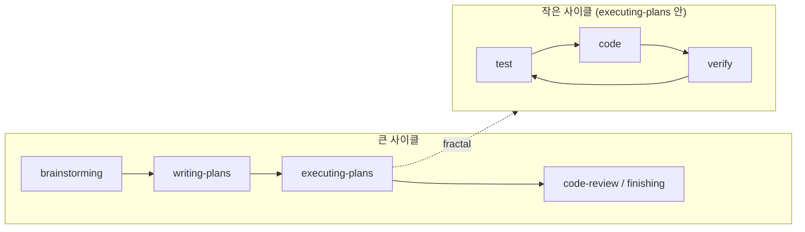
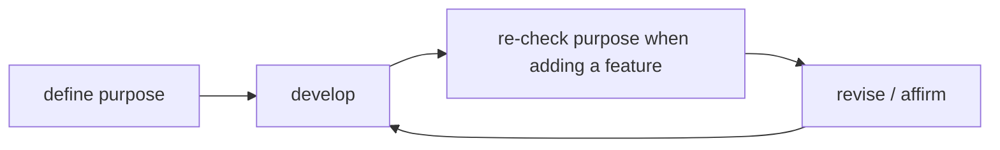
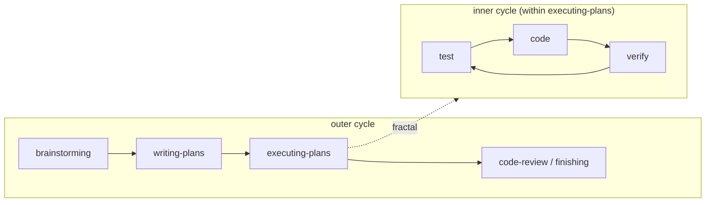
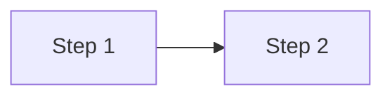

# Mermaid Diagrams Implementation Plan

> **For agentic workers:** REQUIRED SUB-SKILL: Use superpowers:subagent-driven-development (recommended) or superpowers:executing-plans to implement this plan task-by-task. Steps use checkbox (`- [ ]`) syntax for tracking.

**Goal:** Add mermaid diagram support to sings.dev posts via `rehype-mermaid` (build-time SVG, dawn/night-themed) and add two diagrams to the `purpose-driven-systems` essay in both KO and EN.

**Architecture:** `rehype-mermaid` plugin sits in `astro.config.ts`'s `markdown.rehypePlugins` array (next to the existing `rehypeCodeCopyButton`). A new `src/utils/mermaidTheme.ts` exports two `themeVariables` objects (`mermaidThemeLight`, `mermaidThemeDark`) derived from the dawn/night palette in [src/styles/global.css:24-53](src/styles/global.css:24). The `dark: true`-flavored option emits `<picture>` elements with `prefers-color-scheme` media-query sources, and a small JS hook in [src/layouts/Layout.astro](src/layouts/Layout.astro)'s existing theme-toggle script forces a `<picture>` re-evaluation when the user manually toggles `<html class="dark">` — pure CSS cannot override `<picture>` source selection (browser-side mechanism), so a JS line is unavoidable. Chromium binary auto-installs via `package.json` `postinstall` hook on `npm install`.

**Tech Stack:** `rehype-mermaid` v3+, Playwright (Chromium for build-time SVG render), Astro 6, Tailwind 4.

**Reference Spec:** [docs/superpowers/specs/2026-05-10-mermaid-diagrams-design.md](docs/superpowers/specs/2026-05-10-mermaid-diagrams-design.md). Task 6 amends a small wording in the spec to reflect the JS-hook approach (CSS truly cannot override `<picture>` source selection).

---

## File Structure

### Create

- `src/utils/mermaidTheme.ts` — exports `mermaidThemeLight` and `mermaidThemeDark` `themeVariables` objects.
- `docs/spec-mermaid-diagrams.md` — author-facing reference manual for mermaid usage in posts.

### Modify

- `package.json` — add `rehype-mermaid` + `playwright` to devDependencies; add `postinstall` script.
- `astro.config.ts` — add `rehype-mermaid` to `rehypePlugins`.
- `src/layouts/Layout.astro` — add a small picture-re-evaluation hook into the existing theme-toggle script.
- `src/content/blog/ko/purpose-driven-systems/index.md` — insert two `mermaid` fenced blocks (§2 + §5).
- `src/content/blog/en/purpose-driven-systems/index.md` — same, with English labels.
- `docs/spec-post-detail.md` — one-line addition pointing to `docs/spec-mermaid-diagrams.md`.
- `docs/spec-roadmap.md` — one-line addition flagging mermaid as a now-supported feature.
- `docs/superpowers/specs/2026-05-10-mermaid-diagrams-design.md` — small wording correction in the "Manual-toggle CSS" subsection (Task 6).

### Out of scope (per the spec)

- Retroactively converting other posts' diagrams to mermaid.
- Mermaid types beyond `flowchart`.
- Cloudflare Pages build-environment fine-tuning. Reported to author after first deploy.

---

## Tasks

### Task 1: Install rehype-mermaid + playwright; add postinstall hook

**Files:**
- Modify: `package.json`

- [ ] **Step 1: Add the two devDependencies + a postinstall script**

Open `package.json`. Find the `"scripts"` block and add a `"postinstall"` entry. Find the `"devDependencies"` block and add the two new packages. The exact JSON keys differ from project to project — match the existing JSON style (indent, trailing comma) precisely.

After the edits, the `"scripts"` block should include:

```json
"postinstall": "playwright install chromium"
```

And `"devDependencies"` should include (versions resolved by npm at install time):

```json
"playwright": "^1.49.0",
"rehype-mermaid": "^3.0.0"
```

If the existing `package.json` already pins specific minor versions for other deps, follow the same pinning strictness.

- [ ] **Step 2: Run `npm install`**

```bash
npm install
```

Expected: npm installs the two packages, then the `postinstall` script runs `playwright install chromium`, downloading Chromium (~150MB) into `~/Library/Caches/ms-playwright/` (mac) or the platform equivalent. The whole step takes 30–90s on first install with a clean cache.

If `playwright install` fails with a network error, retry once. If it fails with a permission error or missing system libs, this is a CI-environment issue — surface it and STOP.

- [ ] **Step 3: Verify Chromium binary exists**

```bash
ls -d ~/Library/Caches/ms-playwright/chromium-* 2>/dev/null || ls -d ~/.cache/ms-playwright/chromium-* 2>/dev/null
```

Expected: at least one directory listing — proof Playwright cached a Chromium build.

If neither path lists, run `npx playwright install chromium` manually and re-check. If it still fails, surface it and STOP.

- [ ] **Step 4: Verify the existing test suite + build still pass (no plugin wired yet)**

```bash
npm test 2>&1 | tail -3
npm run build 2>&1 | tail -3
```

Expected: 178/178 tests pass; build completes with `Finished in <Ns>`. The new packages add no behavior yet (they sit in `node_modules` only).

If anything fails at this stage, the failure is unrelated to mermaid — investigate and resolve before proceeding.

- [ ] **Step 5: Commit**

```bash
git add package.json package-lock.json
git commit -m "$(cat <<'EOF'
deps: add rehype-mermaid + playwright; install Chromium via postinstall

Sets up the build dependency chain for mermaid diagrams. The
postinstall hook auto-downloads Chromium on npm install for both
local dev and CI/CD; no manual step required.

Co-Authored-By: Claude Opus 4.7 (1M context) <noreply@anthropic.com>
EOF
)"
```

---

### Task 2: Create `src/utils/mermaidTheme.ts`

**Files:**
- Create: `src/utils/mermaidTheme.ts`

- [ ] **Step 1: Write the file with both theme objects**

Create `src/utils/mermaidTheme.ts` with the following exact content. Hex values are pulled from the `@theme` block at [src/styles/global.css:24-53](src/styles/global.css:24).

```ts
// Mermaid `themeVariables` mappings for the site's dawn (light) and night
// (dark) palettes. Source palette: src/styles/global.css `@theme` block.
// Used by rehype-mermaid in astro.config.ts.

export const mermaidThemeLight = {
  primaryColor: "#e8e3d9",         // dawn-200 — node fill
  primaryBorderColor: "#414868",   // dawn-700 — node frame
  primaryTextColor: "#24283b",     // dawn-800 — node body text
  secondaryColor: "#f5f3ee",       // dawn-100 — subgraph bg = page bg
  secondaryBorderColor: "#dcd6cc", // dawn-300 — subgraph hairline
  tertiaryColor: "#faf8f2",        // dawn-50  — deeper subgraph
  lineColor: "#414868",            // dawn-700 — edges/arrows
  mainBkg: "transparent",
  titleColor: "#24283b",           // dawn-800
  noteBkgColor: "#e8e3d9",         // dawn-200 (sequence/state notes — future-proofing)
  fontFamily: "inherit",
} as const;

export const mermaidThemeDark = {
  primaryColor: "#292e42",         // night-700
  primaryBorderColor: "#737aa2",   // night-300
  primaryTextColor: "#c0caf5",     // night-50
  secondaryColor: "#24283b",       // night-800 — subgraph bg = page bg
  secondaryBorderColor: "#3b4261", // night-600
  tertiaryColor: "#1f2335",        // night-900
  lineColor: "#737aa2",            // night-300
  mainBkg: "transparent",
  titleColor: "#c0caf5",           // night-50
  noteBkgColor: "#292e42",         // night-700
  fontFamily: "inherit",
} as const;
```

- [ ] **Step 2: Verify the build still passes (Astro type-checks .ts files imported into config)**

```bash
npm run build 2>&1 | tail -3
```

Expected: build succeeds. No TypeScript errors. (The file isn't imported anywhere yet, but its syntax must be valid.)

If you get a TS error, fix the syntax and rebuild.

- [ ] **Step 3: Commit**

```bash
git add src/utils/mermaidTheme.ts
git commit -m "$(cat <<'EOF'
feat: add mermaidTheme utility (dawn/night palette mapping)

Two themeVariables objects (light + dark) for rehype-mermaid,
derived from the @theme block in src/styles/global.css. Wiring
into astro.config follows in the next commit.

Co-Authored-By: Claude Opus 4.7 (1M context) <noreply@anthropic.com>
EOF
)"
```

---

### Task 3: Wire `rehype-mermaid` into `astro.config.ts`

**Files:**
- Modify: `astro.config.ts`

- [ ] **Step 1: Confirm the installed plugin's API shape**

Read `node_modules/rehype-mermaid/README.md` (or `node_modules/rehype-mermaid/index.d.ts`) for the actual installed version. Look specifically for:
- The default-export name (likely `rehypeMermaid` or `default`).
- The options-object shape — confirm `strategy`, `dark`, `mermaidConfig` keys exist with the expected types.
- Whether `dark: true` (boolean) is accepted vs. `dark: { ... }` (object overriding mermaidConfig for the dark variant).

Note any deviation from the spec's expected shape. If the plugin requires a slightly different config shape than the spec sketched, adjust the snippet in Step 2 accordingly.

- [ ] **Step 2: Modify `astro.config.ts` to wire the plugin**

Open `astro.config.ts`. Add the imports at the top (next to the existing remark/rehype imports):

```ts
import rehypeMermaid from "rehype-mermaid";
import { mermaidThemeLight, mermaidThemeDark } from "./src/utils/mermaidTheme";
```

Replace the existing `rehypePlugins` line:

```ts
rehypePlugins: [rehypeCodeCopyButton],
```

with:

```ts
rehypePlugins: [
  rehypeCodeCopyButton,
  [
    rehypeMermaid,
    {
      strategy: "img-svg",
      dark: { themeVariables: mermaidThemeDark },
      mermaidConfig: {
        theme: "base",
        themeVariables: mermaidThemeLight,
      },
    },
  ],
],
```

If Step 1 surfaced a different API shape, adjust the options object to match. (Common variant: `dark: true` instead of `dark: { themeVariables: ... }`. In that case, both light and dark use the same `mermaidConfig.themeVariables` — pick one — and the spec's "two flavors" decision becomes a follow-up: add the dark theme via the `darkOptions` key or via a dual-pass approach. Verify which variant the installed plugin supports and proceed accordingly. Document any deviation in the commit message.)

- [ ] **Step 3: Verify the build still passes (no mermaid blocks anywhere → plugin loads but produces no output)**

```bash
npm run build 2>&1 | tail -5
```

Expected: build succeeds. Plugin loads cleanly. No `<picture>` elements in any output yet.

If the build fails:
- "Cannot find module" → check the import path.
- Type errors on the options object → adjust to match the API shape from Step 1.
- Playwright launch errors → STOP and report; this means Chromium can't run in your environment.

- [ ] **Step 4: Run tests**

```bash
npm test 2>&1 | tail -3
```

Expected: 178/178 still pass.

- [ ] **Step 5: Commit**

```bash
git add astro.config.ts
git commit -m "$(cat <<'EOF'
feat: wire rehype-mermaid into astro.config.ts

Plugin sits in markdown.rehypePlugins next to rehypeCodeCopyButton.
Strategy: img-svg with dawn/night themeVariables. No mermaid blocks
in any post yet — diagrams are added in subsequent commits.

Co-Authored-By: Claude Opus 4.7 (1M context) <noreply@anthropic.com>
EOF
)"
```

---

### Task 4: Add §2 "내 사이클" diagram to KO post + smoke verify

**Files:**
- Modify: `src/content/blog/ko/purpose-driven-systems/index.md`

- [ ] **Step 1: Locate the §2 insertion point**

Read [src/content/blog/ko/purpose-driven-systems/index.md](src/content/blog/ko/purpose-driven-systems/index.md). The §2 paragraph that ends with "복잡성이 쌓이기 시작합니다." is followed by an italic 곁다리 line `_(말로는 단순합니다. ...)_`. Insert the mermaid block between those two — directly after the §2 paragraph, before the italic line — so the diagram immediately follows the bolded text cycle and the italic 곁다리 reads as commentary on the just-shown cycle.

- [ ] **Step 2: Insert the mermaid block**

The exact insertion: after the line ending in "복잡성이 쌓이기 시작합니다." and before the line `_(말로는 단순합니다. ...)_`, add a blank line, the mermaid fenced block, and another blank line.

The block content (use the Edit tool with `old_string` covering the surrounding context to make the placement unambiguous):

````

````

- [ ] **Step 3: Build and verify the picture element rendered**

```bash
npm run build 2>&1 | tail -5
grep -c '<picture>' dist/posts/purpose-driven-systems/index.html
```

Expected: build succeeds; one `<picture>` element in the rendered HTML (corresponding to the one diagram we just added).

If the build fails on this step, the most likely causes are:
- Mermaid syntax error → check the block matches Step 2 exactly.
- Chromium fails to launch → already validated in Task 1, but re-confirm.

- [ ] **Step 4: Verify Korean glyphs are in the rendered SVG**

The `` inside `<picture>` has its `src` set to a `data:image/svg+xml,...` URI. Decode it and grep for Korean characters:

```bash
python3 << 'PY'
import re
import urllib.parse
html = open('dist/posts/purpose-driven-systems/index.html').read()
m = re.search(r' with data URI found")
else:
    svg = urllib.parse.unquote(m.group(1))
    has_korean = any(ord(c) >= 0xAC00 and ord(c) <= 0xD7A3 for c in svg)
    has_target = '목적 정의' in svg and '개발' in svg
    print(f"contains Korean syllables: {has_korean}")
    print(f"contains '목적 정의' and '개발': {has_target}")
PY
```

Expected output:
```
contains Korean syllables: True
contains '목적 정의' and '개발': True
```

If `contains Korean syllables: False` despite labels containing Korean, Chromium's font fallback didn't find a Korean font and rendered the labels as boxes — see "Korean glyph fallback" sub-step below.

- [ ] **Step 5 (only if Step 4 failed): Korean glyph fallback**

Two practical paths:

(a) **Add a webfont to the mermaidConfig**: edit `src/utils/mermaidTheme.ts` to set `fontFamily: "Pretendard Std Variable, sans-serif"` (instead of `"inherit"`), and ensure the Pretendard webfont is preloaded before mermaid renders. (Check whether rehype-mermaid honors webfont URLs — likely needs to be a system font.)

(b) **Install a system Korean font in the build environment**: this is platform-specific and will need to be repeated per host (local mac, CF Pages CI). Lower-effort short-term: rely on Chromium's bundled fallback (Noto-CJK if present); higher-effort long-term: install `fonts-noto-cjk` or equivalent in the build container.

For local dev on macOS, system Korean fonts are typically present and Chromium picks them up — Step 4 should pass without intervention. If it fails, surface to author and STOP.

- [ ] **Step 6: Verify the test suite still passes**

```bash
npm test 2>&1 | tail -3
```

Expected: 178/178 pass.

- [ ] **Step 7: Commit**

```bash
git add src/content/blog/ko/purpose-driven-systems/index.md
git commit -m "$(cat <<'EOF'
content: add §2 cycle diagram to KO purpose-driven-systems essay

Inserts a flowchart-style mermaid diagram of the purpose-preservation
cycle right under the bolded text cycle. The text version stays so
RSS / terminal readers still see the cycle.

Co-Authored-By: Claude Opus 4.7 (1M context) <noreply@anthropic.com>
EOF
)"
```

---

### Task 5: Add manual-toggle JS hook to `Layout.astro`

**Files:**
- Modify: `src/layouts/Layout.astro`

- [ ] **Step 1: Locate the existing theme-toggle script**

Read [src/layouts/Layout.astro](src/layouts/Layout.astro). Find the `<script>` block(s) that handle theme switching — specifically the function that runs when the user clicks the theme toggle button. Note the function signature, where it sets `root.classList.toggle("dark", isDark)`, and any pattern used (e.g. dispatching a custom event, calling helpers).

- [ ] **Step 2: Add the picture re-evaluation helper**

Inside the same `<script>` block, just below the theme-toggle handler that updates the `.dark` class, add this helper and call it after the `.dark` toggle. The exact placement depends on the script's existing structure — match its indentation and surrounding patterns:

```js
const setMermaidPictureTheme = (isDark) => {
  document.querySelectorAll('figure picture').forEach((picture) => {
    picture.querySelectorAll('source').forEach((source) => {
      // Cache the original media query on first run so we can restore it.
      if (!source.dataset.originalMedia) {
        source.dataset.originalMedia = source.media;
      }
      // Override the dark-variant source's media to "all" when manually
      // dark, restore the original prefers-color-scheme query when light.
      if (source.dataset.originalMedia.includes('dark')) {
        source.media = isDark ? 'all' : source.dataset.originalMedia;
      }
    });
    // Picture source selection is browser-side and only re-evaluates on
    // insertion. Clone-replace forces re-evaluation against the new media
    // attribute. The existing 250ms .theme-transition fade absorbs any
    // visual flicker.
    const clone = picture.cloneNode(true);
    picture.replaceWith(clone);
  });
};
```

Then wire the call into the existing toggle handler. After the line that sets the `.dark` class (e.g., `root.classList.toggle("dark", isDark);`), add:

```js
setMermaidPictureTheme(isDark);
```

Also call `setMermaidPictureTheme` once on initial page load with the current dark state, so a page that loads in dark mode (because the user previously toggled and saved to `localStorage`) starts with the correctly-flipped diagrams. The existing init-on-load section of the script is the right place.

- [ ] **Step 3: Run the build to confirm syntax compiles cleanly**

```bash
npm run build 2>&1 | tail -3
```

Expected: build succeeds. Astro catches script syntax errors at build time, so a green build means the JS is valid.

- [ ] **Step 4: Run tests**

```bash
npm test 2>&1 | tail -3
```

Expected: 178/178 pass. (The added script doesn't break any test paths — it only runs in the browser.)

- [ ] **Step 5: Manual verification deferred to author**

Note in the commit message that the manual-toggle behavior has not been visually verified — the subagent has no browser. The author should run `npm run dev`, open `/posts/purpose-driven-systems/`, and click the theme-toggle button to confirm the diagram flips alongside the rest of the page.

- [ ] **Step 6: Commit**

```bash
git add src/layouts/Layout.astro
git commit -m "$(cat <<'EOF'
feat: flip <picture> source on manual theme toggle

Adds a small helper to the existing theme-toggle script that updates
each <picture>'s dark-source media attribute and clone-replaces the
element to force re-evaluation. Pure CSS cannot override <picture>
source selection — that's a browser-side mechanism — so a JS line
is unavoidable.

Author follow-up: visually verify in dev (npm run dev) that
diagrams flip alongside the rest of the page on toggle.

Co-Authored-By: Claude Opus 4.7 (1M context) <noreply@anthropic.com>
EOF
)"
```

---

### Task 6: Amend the design spec to match the actual JS-hook mechanism

**Files:**
- Modify: `docs/superpowers/specs/2026-05-10-mermaid-diagrams-design.md`

The spec currently says manual-toggle compatibility is achieved via "a short CSS block". CSS cannot in fact override `<picture>` source selection — Task 5 implements this as a JS hook in Layout.astro instead. This task corrects the spec language to match what was implemented.

- [ ] **Step 1: Replace the "Manual-toggle compatibility" Decision bullet**

Find the bullet in the "Decision" section that begins with `**Manual-toggle compatibility**:`. Replace its body with:

> the site uses `<html class="dark">` toggling via [src/layouts/Layout.astro](src/layouts/Layout.astro), not `prefers-color-scheme` directly. A small JS hook added to the existing theme-toggle script in `Layout.astro` overrides each `<picture>` element's `<source media>` and clone-replaces the picture to force re-evaluation, so manual toggles flip the diagram alongside the rest of the page. CSS alone cannot override `<picture>` source selection — that is a browser-side mechanism — so a JS line is unavoidable.

- [ ] **Step 2: Replace the "Manual-toggle CSS over rendering both SVGs..." Why bullet**

Find the Why bullet that begins with `**Manual-toggle CSS over rendering both SVGs and JS-toggling**`. Replace it with:

> **JS hook for manual toggle, not double-render**: rendering both light + dark SVGs to the DOM and CSS-toggling visibility would double the payload. A small JS hook in the existing theme-toggle script changes each `<source>`'s `media` attribute and clone-replaces the picture to force re-evaluation. Same-page mechanism, no double-payload, no flicker on toggle (the existing 250ms `.theme-transition` fade absorbs it).

- [ ] **Step 3: Replace the "Manual-toggle CSS" Architecture sub-section heading + body**

Find the architecture sub-section titled `### Manual-toggle CSS` and rename it to `### Manual-toggle JS`. Replace its body (the prose intro + the CSS code block) with:

> [src/layouts/Layout.astro](src/layouts/Layout.astro)'s existing theme-toggle script gets a small helper that updates each `<picture>`'s dark-source media attribute and clone-replaces the picture to force re-evaluation against the new media. The helper runs inside the same handler that toggles the `.dark` class.
>
> ```js
> const setMermaidPictureTheme = (isDark) => {
>   document.querySelectorAll('figure picture').forEach((picture) => {
>     picture.querySelectorAll('source').forEach((source) => {
>       if (!source.dataset.originalMedia) {
>         source.dataset.originalMedia = source.media;
>       }
>       if (source.dataset.originalMedia.includes('dark')) {
>         source.media = isDark ? 'all' : source.dataset.originalMedia;
>       }
>     });
>     const clone = picture.cloneNode(true);
>     picture.replaceWith(clone);
>   });
> };
> ```
>
> The existing 250ms `.theme-transition` fade absorbs any visual flicker from clone-replace.

- [ ] **Step 4: Verify spec self-consistency**

```bash
grep -n "CSS block" docs/superpowers/specs/2026-05-10-mermaid-diagrams-design.md
grep -n "Manual-toggle CSS" docs/superpowers/specs/2026-05-10-mermaid-diagrams-design.md
grep -n "JS hook" docs/superpowers/specs/2026-05-10-mermaid-diagrams-design.md
```

Expected: zero matches for "CSS block" and "Manual-toggle CSS"; multiple matches for "JS hook". If "CSS block" or "Manual-toggle CSS" still appears in the spec, find each occurrence and update.

- [ ] **Step 5: Commit**

```bash
git add docs/superpowers/specs/2026-05-10-mermaid-diagrams-design.md
git commit -m "$(cat <<'EOF'
docs: correct mermaid spec — manual toggle is JS, not CSS

Pure CSS cannot override <picture> source selection (browser-side
mechanism). The implementation in Layout.astro uses a small JS hook
that clone-replaces each <picture> on toggle. Updates Decision,
Why, and Architecture sections of the spec to match.

Co-Authored-By: Claude Opus 4.7 (1M context) <noreply@anthropic.com>
EOF
)"
```

---

### Task 7: Add §5 fractal diagram to KO post

**Files:**
- Modify: `src/content/blog/ko/purpose-driven-systems/index.md`

This diagram exercises mermaid's `subgraph` syntax with a dotted "fractal" link between the outer and inner cycles — a more complex layout than Task 4's simple flowchart. If the build trips on subgraph syntax, the failure surfaces at this step.

- [ ] **Step 1: Locate the §5 insertion point**

Read [src/content/blog/ko/purpose-driven-systems/index.md](src/content/blog/ko/purpose-driven-systems/index.md). Find the §5 paragraph beginning "흥미로운 건, 이 흐름이 fractal하다는 점입니다." This sentence describes the fractal pattern. The mermaid diagram should sit immediately above this sentence (in the blank line separating it from the Sierpinski figure) so the prose reads as commentary on the diagram.

- [ ] **Step 2: Insert the mermaid block**

The block content:

````

````

Insert it directly above the "흥미로운 건, 이 흐름이 fractal하다는 점입니다." paragraph, separated by blank lines on both sides.

- [ ] **Step 3: Build and verify both pictures render**

```bash
npm run build 2>&1 | tail -3
grep -c '<picture>' dist/posts/purpose-driven-systems/index.html
```

Expected: build succeeds; **two** `<picture>` elements in the rendered HTML (Task 4's §2 diagram + this §5 diagram).

If the build fails with a mermaid parse error, the most likely cause is a typo in the subgraph syntax — re-check the block above against what was inserted.

- [ ] **Step 4: Verify subgraph labels are in the rendered SVG**

```bash
python3 << 'PY'
import re
import urllib.parse
html = open('dist/posts/purpose-driven-systems/index.html').read()
matches = re.findall(r'&1 | tail -3
```

Expected: 178/178 pass.

- [ ] **Step 6: Commit**

```bash
git add src/content/blog/ko/purpose-driven-systems/index.md
git commit -m "$(cat <<'EOF'
content: add §5 fractal diagram to KO purpose-driven-systems essay

Visualizes the brainstorm↔plan↔execute outer cycle and the
test↔code↔verify inner cycle as nested subgraphs with a fractal
dotted link between them. Sits above the fractal sentence so
the prose reads as commentary on the diagram.

Co-Authored-By: Claude Opus 4.7 (1M context) <noreply@anthropic.com>
EOF
)"
```

---

### Task 8: Mirror both diagrams to the EN post

**Files:**
- Modify: `src/content/blog/en/purpose-driven-systems/index.md`

- [ ] **Step 1: §2 — insert the cycle diagram with EN labels**

Find the §2 paragraph in [src/content/blog/en/purpose-driven-systems/index.md](src/content/blog/en/purpose-driven-systems/index.md) (the one ending "the moment that loop breaks, complexity starts to pile up.") and the italic line `_(Simple to describe. ...)_` that follows. Insert the mermaid block between them — same placement pattern as the KO post (Task 4):

````

````

- [ ] **Step 2: §5 — insert the fractal diagram with EN labels**

Find the §5 paragraph beginning "Interestingly, this flow is fractal." Insert this mermaid block immediately above it (same placement pattern as the KO post, Task 7):

````

````

- [ ] **Step 3: Temporarily flip `draft: true` → `draft: false` to verify EN renders, then revert**

The EN post is a draft. Production builds skip drafts entirely. To verify the diagrams render, temporarily flip the frontmatter:

```bash
# verify before edit
grep '^draft:' src/content/blog/en/purpose-driven-systems/index.md
```

Edit `draft: true` → `draft: false` in the EN frontmatter (line 11), then build:

```bash
npm run build 2>&1 | tail -3
grep -c '<picture>' dist/en/posts/purpose-driven-systems/index.html
```

Expected: build succeeds; **two** `<picture>` elements.

Then verify the EN labels rendered:

```bash
python3 << 'PY'
import re
import urllib.parse
html = open('dist/en/posts/purpose-driven-systems/index.html').read()
matches = re.findall(r'&1 | tail -3
```

Expected: 178/178 pass.

- [ ] **Step 5: Commit**

```bash
git add src/content/blog/en/purpose-driven-systems/index.md
git commit -m "$(cat <<'EOF'
content: mirror §2 + §5 mermaid diagrams to EN translation

Adds the same two diagrams as the KO post with English labels
(define purpose / develop / etc.; outer cycle / inner cycle / etc.).
Stays draft until author flips for publish.

Co-Authored-By: Claude Opus 4.7 (1M context) <noreply@anthropic.com>
EOF
)"
```

---

### Task 9: Reference docs (new sub-spec + 2 link additions)

**Files:**
- Create: `docs/spec-mermaid-diagrams.md`
- Modify: `docs/spec-post-detail.md`
- Modify: `docs/spec-roadmap.md`

- [ ] **Step 1: Create the new sub-spec**

Write `docs/spec-mermaid-diagrams.md` with the following exact content. This is the author-facing reference manual — distilled from the design spec, focused on the conventions an author needs when writing posts.

````markdown
# Spec: Mermaid Diagrams in Posts

- **Goal**: Provide a stable, reviewable convention for embedding diagrams in sings.dev posts via `rehype-mermaid` (build-time SVG, dawn/night-themed).
- **Reference Philosophy**: Follow `docs/spec-editorial-philosophy.md`. Diagrams should serve the prose, not decorate it.
- **Authoritative source for design rationale**: `docs/superpowers/specs/2026-05-10-mermaid-diagrams-design.md`. This file is the author-facing reference manual.

## Markdown convention

Use a fenced code block with `mermaid` as the language tag:

````

````

The block is rendered at build time into a `<picture>` element with light + dark SVG variants. Standard mermaid syntax is supported (flowchart, sequence, state, gantt, ER, etc.). For now this site only uses `flowchart`; if you reach for another type and the theme variables don't cover it, add the missing variables to `src/utils/mermaidTheme.ts`.

## Theme palette

Theme variables are derived from the dawn/night palette in `src/styles/global.css` and live in `src/utils/mermaidTheme.ts`. Two exports — `mermaidThemeLight` and `mermaidThemeDark`. Maintenance: when the palette shifts, update both `global.css` and `mermaidTheme.ts` in the same commit.

## Light/dark behavior

`rehype-mermaid` emits `<picture>` with `prefers-color-scheme` media-query sources. A small JS hook in `Layout.astro`'s theme-toggle script also flips the picture source on manual `<html class="dark">` toggles, so the diagram tracks the rest of the page on toggle.

## Caption convention

Optional. The `remarkPostFigure` plugin auto-promotes `` siblings into `<figure>` with caption — it does not auto-promote mermaid blocks. Authors who want a caption add an italic line below the diagram:

````
```mermaid
...
```

_(Diagram: ...)_
````

## Build environment

`rehype-mermaid` requires Playwright + Chromium. `package.json`'s `postinstall` hook auto-downloads Chromium on `npm install`. The first build after install or in a clean CI cache adds 30–60s for the binary download; subsequent builds reuse the cache.

## Out of scope

- Multi-locale label automation (each locale's mermaid block is hand-written, same as prose).
- Mermaid live-editor integration. The site is static.
````

- [ ] **Step 2: Add the link to `docs/spec-post-detail.md`**

Read [docs/spec-post-detail.md](docs/spec-post-detail.md). Find a natural location (e.g. right after the existing description of figures/images, or in a "Related" / "See also" tail section, depending on the file's structure). Add this single line:

```markdown
- **Mermaid diagrams**: see `docs/spec-mermaid-diagrams.md`.
```

If the spec already has a similar pattern of "See `docs/spec-X.md`" cross-references, match that format precisely.

- [ ] **Step 3: Add the link to `docs/spec-roadmap.md`**

Read [docs/spec-roadmap.md](docs/spec-roadmap.md). Find the section that lists shipped / supported features (or the "Done" / "Recently shipped" / current section, whichever the file uses). Add this single line:

```markdown
- **Mermaid diagrams**: build-time SVG via `rehype-mermaid`. See `docs/spec-mermaid-diagrams.md`.
```

Match the file's existing list format.

- [ ] **Step 4: Verify the build still passes**

```bash
npm run build 2>&1 | tail -3
```

Expected: build succeeds. (Pure docs additions don't affect the build, but a stray markdown error would surface here.)

- [ ] **Step 5: Commit**

```bash
git add docs/spec-mermaid-diagrams.md docs/spec-post-detail.md docs/spec-roadmap.md
git commit -m "$(cat <<'EOF'
docs: add mermaid diagrams spec + crossrefs from post-detail and roadmap

New author-facing reference manual at docs/spec-mermaid-diagrams.md
covering markdown convention, theme palette, light/dark behavior,
caption convention, and build environment. Linked from
spec-post-detail.md and spec-roadmap.md so authors find it.

Co-Authored-By: Claude Opus 4.7 (1M context) <noreply@anthropic.com>
EOF
)"
```

---

### Task 10: Final verification

**Files:**
- None modified. Verification only.

- [ ] **Step 1: Test suite**

```bash
npm test 2>&1 | tail -5
```

Expected: 178/178 pass.

- [ ] **Step 2: Production build**

```bash
npm run build 2>&1 | tail -5
```

Expected: build succeeds. Output ends with `Finished in <Ns>`.

- [ ] **Step 3: KO post: both diagrams rendered**

```bash
grep -c '<picture>' dist/posts/purpose-driven-systems/index.html
```

Expected: `2`.

- [ ] **Step 4: EN post: zero diagrams in production output (because draft)**

```bash
ls dist/en/posts/purpose-driven-systems/ 2>&1 | head -3
```

Expected: `No such file or directory` — confirming `draft: true` correctly excludes the EN post from production output. (The diagrams are present in source and rendered correctly in dev, verified during Task 8 Step 3.)

- [ ] **Step 5: KO label content sanity**

```bash
python3 << 'PY'
import re
import urllib.parse
html = open('dist/posts/purpose-driven-systems/index.html').read()
matches = re.findall(r'` element grep patterns in Tasks 4, 7, 8, 10 are consistent ✓

**Placeholder scan:** No `TBD` / `TODO` / "implement later" / "fill in details" anywhere. Each step references concrete code, exact paths, and specific verification commands.

---

After plan execution, the next step is `superpowers:finishing-a-development-branch` to merge to main (consistent with the previous purpose-driven-systems work).
