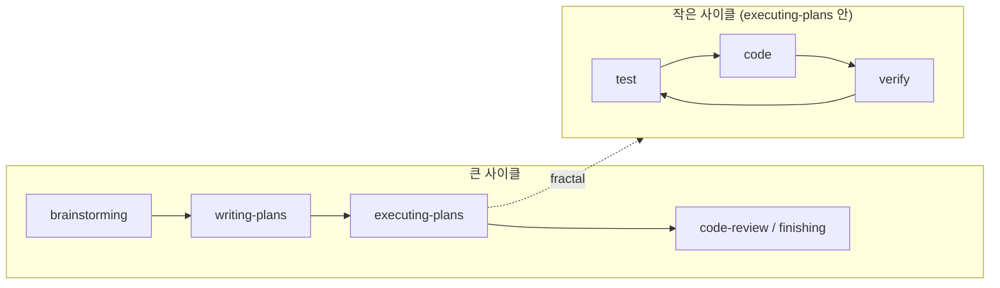

# Mermaid Diagrams in sings.dev — Design

**Date:** 2026-05-10

## Goal

Enable [Mermaid](https://mermaid.js.org) diagrams as first-class content in sings.dev posts so that flow / cycle / sequence ideas can be expressed as version-controlled markdown rather than as external images. Diagrams render at build time as static SVGs, ship zero JavaScript, and follow the site's existing dawn/night palette and figure-caption convention so they read as native parts of the prose.

The immediate driver is two diagrams in [src/content/blog/ko/purpose-driven-systems/index.md](src/content/blog/ko/purpose-driven-systems/index.md) (and the EN translation): a "내 사이클 / my cycle" diagram in §2 and a "superpowers flow" diagram in §5 that visualizes the fractal relationship between the outer loop and the inner test↔code↔verify loop. The design here is general enough to apply to any future post.

## Decision

- **Plugin**: [`rehype-mermaid`](https://github.com/remcohaszing/rehype-mermaid), wired into `astro.config.ts`'s `markdown.rehypePlugins` array, in the same position pattern as the existing `rehypeCodeCopyButton`.
- **Strategy**: `'img-svg'` with `dark: true`. Build-time renders two SVGs (light + dark) and emits a `<picture>` element with `prefers-color-scheme` media-query sources. Zero client-side JS.
- **Theme**: a custom `themeVariables` object derived from the site's dawn/night palette in [src/styles/global.css](src/styles/global.css). Two flavors — `light` (dawn) and `dark` (night) — supplied via the plugin's two-pass invocation pattern.
- **Markdown convention**: standard fenced ` ```mermaid ` block. No new admonition syntax.
- **Caption**: optional. Authors who want a caption add a separate italic line below the diagram (consistent with how `_(...)_` 곁다리 already work). The figure-caption auto-promotion that `remarkPostFigure` does for `` does not apply to mermaid blocks; this is intentional — the diagram's own labels usually speak for themselves, and forcing every diagram into a captioned figure adds visual chrome the post often does not need.
- **Build dependency**: `playwright` package + a `postinstall` hook in `package.json` that runs `playwright install chromium` so both local dev and CI/CD pull the headless Chromium binary automatically on first install. No `--with-deps` flag (which requires sudo apt-get) — system fonts and libs are assumed to come from the build host's base image.
- **Manual-toggle compatibility**: the site uses `<html class="dark">` toggling via [src/layouts/Layout.astro](src/layouts/Layout.astro), not `prefers-color-scheme` directly. A short CSS block in [src/styles/global.css](src/styles/global.css) overrides the `<picture>` source-selection behavior so manual toggles flip the diagram source alongside the rest of the page.

## Why

- **rehype-mermaid over astro-mermaid**: build-time SVG keeps the page weight at zero JS, which fits the site's calm-static-site posture. astro-mermaid ships the full mermaid library client-side and assumes a `data-theme` attribute the site does not set; integrating it would mean a few hundred KB of JS plus layout-script changes for theme sync. rehype-mermaid drops in next to `rehypeCodeCopyButton` with no layout-script changes.
- **`img-svg` over `inline-svg`**: rehype-mermaid's `inline-svg` strategy does not support dark mode (per the plugin README — only `img-svg` and `img-png` honor `dark: true`). `img-svg` keeps the SVG path-based (sharp at any zoom) while emitting both color-scheme variants. `img-png` was rejected — PNG rasters lose crispness on retina displays.
- **Custom theme over mermaid built-ins**: the built-in `default` and `dark` themes use a generic blue palette that clashes with the dawn (`#f5f3ee` / `#414868`) and night (`#24283b` / `#c0caf5`) palette already established for the rest of the site. Custom `themeVariables` is the cheapest way to make the diagrams feel native — one config object, no SVG post-processing.
- **Caption optional, not auto-promoted**: most diagrams will be a flowchart whose node labels already tell the reader what each step is. Forcing a `<figcaption>` would add a redundant text line below most of them. Authors who genuinely want a caption can add an italic 곁다리 line in the same prose pattern they already use.
- **`postinstall` over a manual build-command override**: keeping the Chromium install in `package.json` means anyone running `npm install` (locally, CI, Cloudflare Pages) gets the dependency automatically. A `wrangler.toml`-level build-command override would only fix Cloudflare and would silently break local dev for new contributors.
- **Manual-toggle CSS over rendering both SVGs and JS-toggling**: only one SVG is rendered to the DOM for any given color scheme (the `<picture>` element decides). The CSS override changes which `<source>` the browser picks — no JavaScript, no flicker on toggle, no double-payload.

## Architecture

### Markdown source

Authors write a fenced code block:

````

````

The `rehype-mermaid` plugin walks the rehype tree, finds nodes with `lang="mermaid"`, sends each one to a Playwright-driven Chromium that loads mermaid.js with the site's `themeVariables`, captures the rendered SVG, and replaces the original `<pre><code>` with `<picture><source media="(prefers-color-scheme: dark)" srcset="..."></picture>`.

### Plugin configuration

Wired into `astro.config.ts`:

```ts
import rehypeMermaid from "rehype-mermaid";
import { mermaidThemeLight, mermaidThemeDark } from "./src/utils/mermaidTheme";

// inside defineConfig({...}):
markdown: {
  remarkPlugins: [remarkPostFigure, remarkAdmonition],
  rehypePlugins: [
    rehypeCodeCopyButton,
    [rehypeMermaid, {
      strategy: "img-svg",
      dark: { theme: "base", themeVariables: mermaidThemeDark },
      mermaidConfig: {
        theme: "base",
        themeVariables: mermaidThemeLight,
      },
    }],
  ],
  // ...
}
```

The actual config-shape may need a small adjustment after reading the latest `rehype-mermaid` README — the `dark` option in v3 takes either `true` or an object that overrides the `mermaidConfig` for the dark variant. Plan step verifies the exact shape against the installed version before committing.

### Theme palette

`src/utils/mermaidTheme.ts` (new file) exports two `themeVariables` objects, one for light and one for dark, mapped from the site palette in [src/styles/global.css](src/styles/global.css):

| Mermaid var | Light (dawn) | Dark (night) | Why |
|---|---|---|---|
| `primaryColor` | `#e8e3d9` (dawn-200) | `#292e42` (night-700) | Node fill — slightly off the page bg so nodes read as panels |
| `primaryBorderColor` | `#414868` (dawn-700) | `#737aa2` (night-300) | Node frame, matches body-prose link color register |
| `primaryTextColor` | `#24283b` (dawn-800) | `#c0caf5` (night-50) | Body text inside nodes |
| `secondaryColor` | `#f5f3ee` (dawn-100) | `#24283b` (night-800) | Subgraph bg = page bg, so nesting reads as grouping not as a frame |
| `secondaryBorderColor` | `#dcd6cc` (dawn-300) | `#3b4261` (night-600) | Subgraph border, hairline — matches `figure img` border |
| `tertiaryColor` | `#faf8f2` (dawn-50) | `#1f2335` (night-900) | Deeper-nested subgraph, one shade off `secondary` |
| `lineColor` | `#414868` (dawn-700) | `#737aa2` (night-300) | Edge / arrow color |
| `mainBkg` | `transparent` | `transparent` | Diagram canvas inherits page bg |
| `titleColor` | `#24283b` (dawn-800) | `#c0caf5` (night-50) | Diagram title (when used) |
| `noteBkgColor` | `#e8e3d9` (dawn-200) | `#292e42` (night-700) | Sequence-diagram note (future-proofing) |
| `fontFamily` | `inherit` | `inherit` | Falls back to the site's Pretendard stack |

The implementation step in the plan will pull these straight from the `@theme` block at [src/styles/global.css:24](src/styles/global.css:24) so a future palette tweak only edits one place.

### Manual-toggle CSS

[src/styles/global.css](src/styles/global.css) gets a small block (next to the existing Shiki dual-theme override) that forces the `<picture>` to honor the `<html class="dark">` toggle:

```css
/*
 * rehype-mermaid emits <picture><source media="(prefers-color-scheme: dark)">
 * </picture>. Because the site uses a manual `<html class="dark">` toggle
 * (not prefers-color-scheme media queries) for theme switching, override the
 * picture source-selection so the toggle flips the diagram alongside the rest
 * of the page. Same vocabulary as the existing Shiki dual-theme override.
 */
html:not(.dark) figure picture source[media*="prefers-color-scheme: dark"] {
  display: none;
}
html.dark figure picture > img {
  /* Browser already chose the dark source via media query when OS prefers dark.
     For manual toggle from a light-OS, force the dark source by hiding the
     fallback img and revealing the dark <source>'s srcset. */
  visibility: visible; /* placeholder — actual mechanism verified in plan */
}
```

The exact CSS will be finalized once the plugin's HTML output is observed in a first build (the rehype-mermaid `<picture>` markup may differ slightly from this sketch). The shape — manual-toggle CSS, no JS — is fixed.

### Build environment

`package.json` adds:

```json
{
  "scripts": {
    "postinstall": "playwright install chromium"
  },
  "devDependencies": {
    "rehype-mermaid": "^3.x",
    "playwright": "^1.x"
  }
}
```

On `npm install`, npm's `postinstall` lifecycle automatically downloads Chromium (~150MB) into Playwright's cache. On Cloudflare Pages, this happens during the build phase before `npm run build` runs.

A separate "Cloudflare Pages: post-deploy author follow-up" item is captured in the migration report (rule 12 of [docs/spec-migration.md](docs/spec-migration.md)) — see "Out of scope (this cycle)" below.

### Caption convention (recap)

For the diagrams in `purpose-driven-systems` specifically, no caption. The cycle node labels (`목적 정의`, `개발`, etc.) carry the meaning. If a future post needs a caption, the author writes:

````


_(다이어그램: ...)_
````

— same italic 곁다리 pattern already used in the post. The remarkPostFigure plugin does not auto-promote `<picture>` (it only targets `` siblings of paragraphs); this is intentional and consistent with the spec.

### Diagrams in this post

Two diagrams added to [src/content/blog/ko/purpose-driven-systems/index.md](src/content/blog/ko/purpose-driven-systems/index.md) and the EN translation. The text cycle in §2 (`**목적 정의 → 개발 → 기능 추가 시 목적 재확인 → 갱신/확정 → 다시 개발**`) stays — the diagram complements rather than replaces the text, so RSS/terminal readers still get the cycle.

**§2 — 내 사이클 / My cycle (placed right after the bolded text cycle):**


**§5 — superpowers flow (placed before the fractal note, so the note reads as commentary on the diagram):**



EN labels: `목적 정의 → define purpose`, `개발 → develop`, `기능 추가 시 목적 재확인 → re-check purpose`, `갱신/확정 → revise/affirm`, `큰 사이클 → outer cycle`, `작은 사이클 (executing-plans 안) → inner cycle (within executing-plans)`. Source `mermaid` blocks are byte-divergent across locales because the labels are translated; structure (node IDs, arrows) is identical.

## Verification target

- `npm install` runs `playwright install chromium` via `postinstall` and the Chromium binary lands in `~/Library/Caches/ms-playwright/` (mac) or the Linux equivalent.
- `npm run build` succeeds. Output `dist/posts/purpose-driven-systems/index.html` contains `<picture>` elements wrapping the two diagrams; both have a `<source media="(prefers-color-scheme: dark)">` and a fallback ``.
- Rendered diagrams use the dawn/night palette colors (visual inspection — light bg ≈ `#e8e3d9` for nodes, dark bg ≈ `#292e42`).
- `npm test` continues passing (178 baseline tests; this work adds zero new test files).
- Manual toggle (`<html class="dark">` on/off) flips the diagram between light and dark variants without a flash, alongside the rest of the page.
- The §2 and §5 source `mermaid` fences in [src/content/blog/ko/purpose-driven-systems/index.md](src/content/blog/ko/purpose-driven-systems/index.md) and the EN file render without parse errors. (rehype-mermaid throws build-time errors for malformed mermaid syntax, surfaced in the `npm run build` log.)
- Korean labels render correctly in the SVG. If Playwright's bundled Chromium cannot resolve a Korean glyph and falls back to tofu, the build still produces a "valid" SVG but the user sees boxes — Plan step adds a smoke-check on this case.

## Scope

### In scope (this cycle)

- All architecture decisions above.
- New file `src/utils/mermaidTheme.ts` with the two `themeVariables` objects.
- `astro.config.ts` modification to add `rehype-mermaid` to `rehypePlugins`.
- New CSS block in `src/styles/global.css` for manual-toggle source selection.
- `package.json` additions: `playwright`, `rehype-mermaid`, `postinstall` hook.
- New spec file at `docs/spec-mermaid-diagrams.md` (this design's reference manual, distilled from this design doc).
- One-line addition to `docs/spec-post-detail.md` linking to the new sub-spec.
- One-line addition to `docs/spec-roadmap.md` flagging mermaid as a now-supported feature.
- Two `mermaid` blocks added to the KO post `purpose-driven-systems`. Mirrored in EN.

### Out of scope (this cycle)

- Retroactively replacing existing image-based diagrams in other posts with mermaid — handled in a separate session per the author's request.
- Mermaid diagram types beyond `flowchart` (sequence, state, gantt, ER, etc.). Adding them is mechanical when the time comes — the plugin handles them automatically — but the theme `themeVariables` object may need extra entries (`actorBkg`, `signalColor`, `taskBorderColor`, etc.). Defer to need.
- Mermaid live editor integration. The site is static; live editing happens in the author's editor.
- Multi-locale label-switching automation. Each locale's mermaid block is hand-translated, same as prose.
- Cloudflare Pages build-environment fine-tuning. The default expectation is `postinstall` works; if the first deploy fails because Chromium misses a system library, the author handles it as a follow-up — see "Author follow-up" below.

## Author follow-up (Cloudflare Pages)

After the implementation is committed and pushed, the next Cloudflare Pages build will:

1. Run `npm install`, which triggers `postinstall: playwright install chromium`. Chromium binary downloads (~150MB) into the build environment's cache.
2. Run `npm run build`, which invokes Astro and `rehype-mermaid`. rehype-mermaid spawns headless Chromium to render each mermaid block as SVG.
3. **Possible failure modes** to watch:
   - **Chromium fails to launch**: missing system libraries (`libnss3`, `libgbm1`, `libasound2`, etc.) on the Cloudflare Pages base image. Fix: add those packages via the build configuration, or switch strategy to commit prerendered SVGs.
   - **Build time spike**: first build with Chromium download adds ~30-60s. Subsequent builds reuse the cache.
   - **Korean glyphs render as tofu**: missing CJK fonts in the build image. Fix: install `fonts-noto-cjk` via the build-time apt step, or bundle a webfont and reference it in the mermaid `themeVariables.fontFamily`.

The author monitors the first deploy via the Cloudflare Pages dashboard and adjusts if needed. None of these failure modes are introduced by this design — they are pre-existing constraints of running Playwright in a CF Pages container.

## Alternatives Considered

- **astro-mermaid (client-side)**: rejected. Ships full mermaid.js (~700KB-1MB) to the browser, requires `data-theme` attribute that the site doesn't set, and FOUC-flickers on slow connections. The site's posture is calm-static — adding ~1MB of JS for a few diagrams contradicts that.
- **rehype-mermaid `inline-svg` strategy**: rejected. The plugin README states `inline-svg` does not honor `dark: true`. To get dark-mode support with inline SVG, we'd render twice and CSS-toggle visibility — same byte cost as `<picture>`, more brittle.
- **rehype-mermaid `img-png` strategy**: rejected. PNG rasters at 1x look soft on retina, and at 2x or 3x the file size grows. SVG stays sharp at any zoom for the same byte cost.
- **No custom theme, mermaid built-in `default` + `dark`**: rejected. The built-in palette is generic blue and clashes with the site's dawn/night register. Custom `themeVariables` is one config object — cheap.
- **Auto-promote mermaid blocks to `<figure>` with caption**: rejected. The remarkPostFigure plugin promotes `` paragraphs only. Extending it to mermaid blocks would force every diagram into a captioned figure even when the labels speak for themselves. Authors who want a caption add an italic 곁다리 line manually.
- **Pre-render SVGs locally and commit them, disable rehype-mermaid in CI**: rejected as the primary path. Adds a "regenerate diagrams" manual step every time a mermaid block changes. Held in reserve as the fallback if Chromium can't launch on Cloudflare Pages.
- **Bundle the EN diagrams' translated labels as a structured data table and machine-substitute at build**: rejected. Mermaid block divergence between locales is small and the labels are part of the prose voice — keep them in source where they're reviewable.

---

After approval and spec self-review, the next step is `superpowers:writing-plans` to produce a step-by-step implementation plan.
