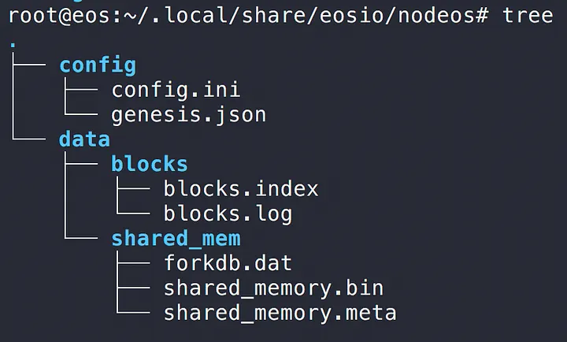
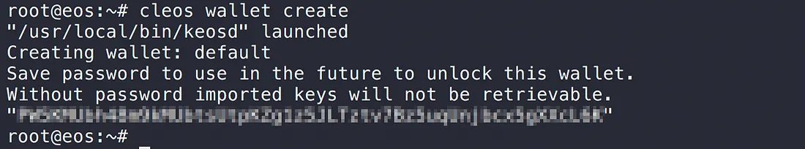
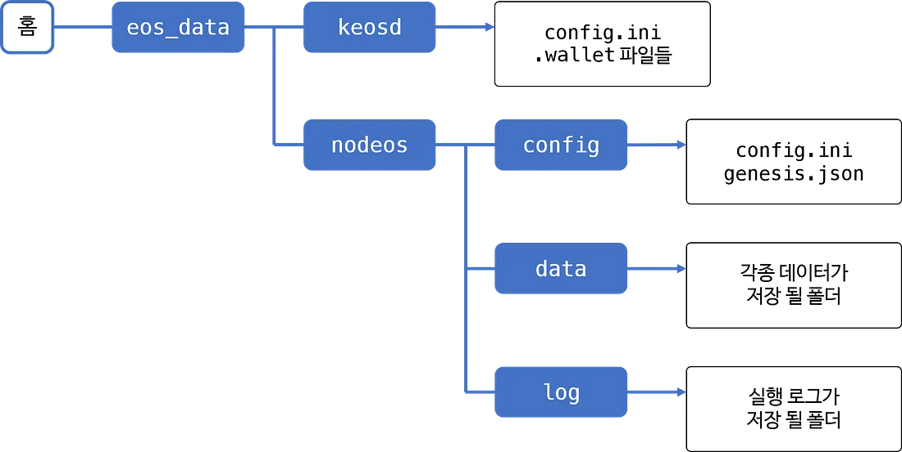

The previous post covered installing and starting EOS. This one introduces the main EOS components, walks through how they actually behave at runtime, sets up a tidier configuration layout, and finishes with the start / stop shell scripts I use to make daily operation simple.

## Main components

A quick tour of the components. The diagram below comes from the official EOS guide and shows how they relate.


### nodeos

The core daemon that produces EOS blocks. It can run with various plugins combined together, and it exposes API endpoints (think of these as URLs grouped by feature).

### cleos

The frontline command-line tool for talking to the components. Internally it calls nodeos's API. `cleos -h` lists all available commands.


### keosd

EOS organizes keys in units called wallets. `keosd` is the daemon that manages those wallets. If you run nodeos without `wallet_api_plugin`, `keosd` is launched automatically the first time `cleos` runs a wallet command.

## How nodeos behaves

The previous post started nodeos like this:

```
$ nodeos -e -p eosio --plugin eosio::chain_api_plugin --plugin eosio::history_api_plugin
```

- `-e` : produces blocks even without producer voting. Needed for testing.
- `-p eosio` : sets the producer name for the current node.
- `--plugin` : lists plugins to load at startup.

You'll have seen something like this in the log:


A few things to notice:

- **EOS data** is created under `(home)/.local/share`
- An **HTTP endpoint for blockchain operations** is created
- An **HTTP endpoint for wallet operations** is created

Sure enough, head into `~/.local/share` and you'll find an `eosio` folder with the related files inside:



When nodeos starts, it needs `config.ini` (configuration) and `genesis.json` (genesis-block info). We didn't specify either, so EOS generated default versions.

## How keosd behaves

`keosd` manages wallets. With nodeos still running, let's exercise keosd through cleos by creating a wallet:

```
$ cleos wallet create
```

The result:



The first line tells us keosd was started. You can run keosd directly, but if there's no keosd process when cleos issues a wallet command, one is created automatically.

`ps` confirms keosd is running. The auto-launched keosd uses port `8900` by default.


After the process starts, an `eosio-wallet` folder appears in your home directory:


Inside it: a `config.ini` with keosd's configuration, and the default wallet file we just created. Any wallet you create later also lands here as a `.wallet` file.


Like nodeos, keosd needs a `config.ini` at startup. We didn't specify one, so EOS generated a default for keosd as well.

The default locations and required files for nodeos and keosd:

|                | nodeos                                | keosd                       |
| -------------- | ------------------------------------- | --------------------------- |
| Default home   | `(home)/.local/share/eosio/nodeos/`   | `(home)/eosio-wallet/`      |
| Data dir       | `(default home)/data/`                | `(default home)`            |
| Config file    | `(default home)/config/config.ini`    | `(default home)/config.ini` |
| Genesis file   | `(default home)/config/genesis.json`  |                             |
| Default port   | `8888`                                | `8900`                      |

## Configuration

Now that we've run nodeos and keosd directly and seen where their auto-generated `config.ini` files live, the next step is to edit those files to consolidate the scattered information, and to write scripts so we can start and stop the node easily.

For tidier management, we'll collect everything into the folder structure below. Create folders to match:



### nodeos configuration

Start with nodeos. Until now we hadn't specified `config.ini` or `genesis.json`, so nodeos created defaults itself. Copy those two files into `(home)/eos_data/nodeos/config/`:

```
$ cp ~/.local/share/eosio/nodeos/config/* ~/eos_data/nodeos/config/
```

Then edit the copied `config.ini` and update these lines (uncomment them if they're commented out with `#`):

```ini
http-server-address = 0.0.0.0:8888
wallet-dir = "/root/eos_data/keosd"
plugin = eosio::chain_api_plugin
plugin = eosio::history_api_plugin
plugin = eosio::wallet_api_plugin
```

- `http-server-address`: I changed this to `0.0.0.0` so any IP can reach the node (leave it as `127.0.0.1` if you don't want external access). I set this up because I wanted to test the API server later via RPC.
- `wallet-dir` : the location replacing `eosio-wallet`. Use the path from our layout above.
- `plugin` : list of plugins to load when nodeos starts.

Notice that `wallet_api_plugin` is added on top of the default plugins. With this, nodeos can serve wallet operations on its own — no separate keosd needed (when cleos runs a wallet command, no separate keosd process is spawned; nodeos handles everything). The two methods eosio describes are:

1. Use the keosd process that nodeos auto-launches
2. Run keosd separately and use it

Either works, but both require managing two distinct processes, and method 1's auto-launched keosd uses port `8900` by default. That means future API work requires knowing two different endpoints. To avoid that, this post adds `wallet_api_plugin` to nodeos directly.

### keosd configuration

Next, set up keosd. Move the files inside the auto-generated `eosio-wallet` folder to the location we chose (if you don't need the default wallet that was created earlier, just copy `config.ini`):

```
$ cp ~/eosio-wallet/* ~/eos_data/keosd/
```

Since nodeos's `wallet-dir` config now points here, the nodeos instance loaded with `wallet_api_plugin` will use the `config.ini` and wallet files in this location.

> Strictly speaking, with our current setup, the `config.ini` we copied to `eos_data/keosd` won't be read at all — nodeos plus `wallet_api_plugin` is doubling as the wallet manager. And if you look closely at nodeos's `config.ini`, every setting that would belong in keosd's `config.ini` is already covered there.
> If you ever need to run keosd standalone, that's when this file becomes useful.

### cleos configuration

Since nodeos now handles wallet operations, when you run wallet commands via cleos, you need to point its wallet URL at nodeos. Otherwise cleos will spawn yet another keosd process, recreate `eosio-wallet`, and reference a fresh set of config and wallet files instead of the ones we set up above.

A simple alias makes `cleos` behave as if `--wallet-url` were always passed:

```
$ alias cleos='cleos --wallet-url http://localhost:8888'
```

Now cleos uses the location we configured by default, and a duplicate keosd process is never spawned.

> To keep this alias across shell sessions, add the line to `.bashrc` (for bash).

### Start script

To run nodeos with the layout above, you'd have to pass both `--config-dir` and `--data-dir` every time:

```
$ nodeos -e -p eosio --config-dir ~/eos_data/nodeos/config --data-dir ~/eos_data/nodeos/data
```

That's a mouthful, so let's wrap it in a shell script that handles startup in one go. The script does:

1. Defines folder locations
2. Checks if a nodeos process is already running (errors out if yes)
3. Runs nodeos
4. Verifies the process actually started after the command (errors out if not)
5. Creates a log file named by the current date and time

**start.sh**

```bash
#!/bin/bash

NODEOS_ROOT_DIR=/root/eos_data/nodeos
CONFIG_DIR=/root/eos_data/nodeos/config
DATA_DIR=/root/eos_data/nodeos/data
LOG_DIR=/root/eos_data/nodeos/log

## WALLET DIR is defined as datadir inside config.ini!!!
## plugins are also defined inside config.ini!!!
## server address is also defined inside config.ini!!!

CURTIME=$(date +"%Y%m%d_%H%M%S")
LOG_FILENAME=$CURTIME".log"
PRODUCER_NAME=eosio

PROCESS_COUNT=$(ps -ef | grep nodeos | grep -v grep | awk '{print $2}' | wc -l)

if [ $PROCESS_COUNT -ne 0 ]; then
    printf "nodeos is already running.\n"
    exit 1
fi

printf "Starting the GOD EOS daemon...\n"

nohup nodeos -e -p $PRODUCER_NAME --config-dir $CONFIG_DIR --data-dir $DATA_DIR $1 &> $LOG_DIR/$LOG_FILENAME &

sleep 1s

PROCESS_COUNT=$(ps -ef | grep nodeos | grep -v grep | awk '{print $2}' | wc -l)

if [ $PROCESS_COUNT -ne 1 ]; then
    printf "Something went wrong launching EOS (failed to start, or more than one process running).\n"
    printf "  * Log file : %s\n" $LOG_DIR"/"$LOG_FILENAME
    echo
    exit 1
fi

printf "GOD EOS daemon started.\n"

printf "  * Config dir : \t%s\n" $CONFIG_DIR
printf "  * Data dir   : \t%s\n" $DATA_DIR
printf "  * Log file   : \t%s\n" $LOG_DIR"/"$LOG_FILENAME
```

nodeos runs in the background via `nohup` and `&`. stdout and stderr are redirected to a file like `20180505_130324.log` and accumulated under `~/eos_data/nodeos/log/`.

### Stop script

The stop script is almost the same shape as the start script. Internally it does:

1. Defines folder locations
2. Checks if a nodeos process is running (errors out if not)
3. Finds nodeos's process id and kills it
4. Verifies no nodeos process is still running (errors out if any remains)

**stop.sh**

```bash
#!/bin/bash

NODEOS_ROOT_DIR=/root/eos_data/nodeos
CONFIG_DIR=/root/eos_data/nodeos/config
DATA_DIR=/root/eos_data/nodeos/data
LOG_DIR=/root/eos_data/nodeos/log

## WALLET DIR is defined as datadir inside config.ini!!!
## plugins are also defined inside config.ini!!!
## server address is also defined inside config.ini!!!

CURTIME=$(date +"%Y-%m-%d_%T")
LOG_FILENAME=$CURTIME".log"
PRODUCER_NAME=eosio

PROCESS_COUNT=$(ps -ef | grep nodeos | grep -v grep | awk '{print $2}' | wc -l)

if [ $PROCESS_COUNT -eq 0 ]; then
    printf "No running nodeos found.\n"
    exit 1
fi

printf "Stopping the GOD EOS daemon...\n"

ps -ef | grep nodeos | grep -v grep | awk '{print $2}' | xargs kill -9

sleep 1s

PROCESS_COUNT=$(ps -ef | grep nodeos | grep -v grep | awk '{print $2}' | wc -l)

if [ $PROCESS_COUNT -ne 0 ]; then
    printf "nodeos is still running."
    echo
    exit 1
fi

printf "GOD EOS daemon stopped.\n"
```

---

That covers running EOS and laying out the configuration. The next post moves on to actually creating accounts on EOS and working with contracts.
