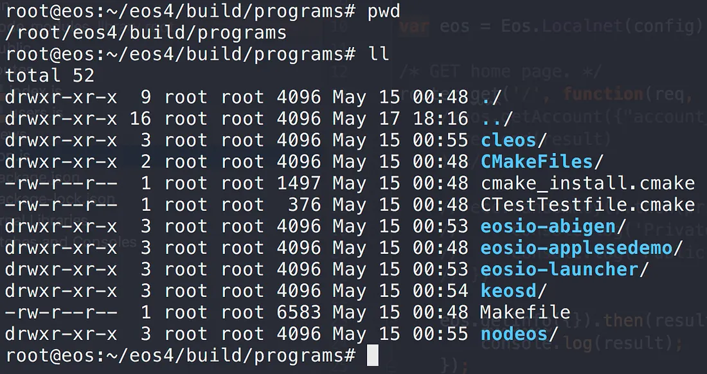
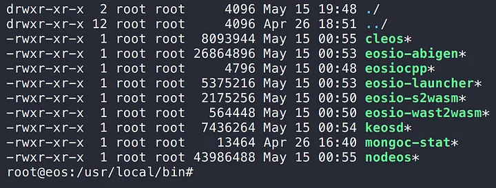
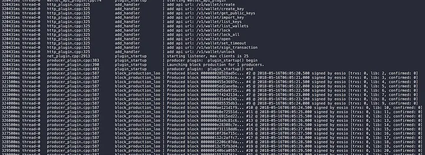

The EOS 1.0 mainnet went live on June 2, 2018.

> **Additional…**
> The current release is v1.0.9. The build process hasn't changed much across versions, so the steps below should apply to other versions just as well.

This post walks through actually installing and running EOS. It's been a little over a month since the 1.0 release, but the technical documentation is detailed enough that you can stand a node up without much trouble.

> I'm following the official EOS guide, but with a few **configuration tweaks** and **start / stop scripts** to make day-to-day operation easier. I've also added **Additional…** notes wherever the official guide skims over something. It's a long post — give it a careful read. [(Official setup guide)](https://github.com/EOSIO/eos/wiki/Local-Environment/10b1474d44e1812c319009edb0aca3fe1e2b7e90)

The server I installed EOS on:

- **Memory** : 7974MB
- **OS** : Ubuntu Linux 16.04.4 LTS (Xenial Xerus)
- **Kernel** : 4.4.0-124-generic
- **GIT** : 2.7.4
- **EOS Source** : 4.1.0

The full list of OSes EOS supports:

1. Amazon 2017.09 and higher
2. Centos 7
3. Fedora 25 and higher (Fedora 27 recommended)
4. Mint 18
5. Ubuntu 16.04 (Ubuntu 16.10 recommended) *(commit history actually mentions **18.04 build and test work** too — support for the latest LTS looks close.)*
6. MacOS Darwin 10.12 and higher (MacOS 10.13.x recommended)

> EOS is still under active development. Some of what's described here may be removed in future versions, and parts that are still in flux may be added — keep that in mind.

## Install

### 1. Clone the source

Clone the EOS source with `git clone`. By default it creates an `eos` folder in your current location. To use a different folder name, append it to the command (e.g., `--recursive eosSource`).

```
$ git clone https://github.com/EOSIO/eos --recursive
```

> **Additional..**
> You have to clone with **git** — not download the source archive. The recursive option pulls submodules conveniently, and the next step ("Build the source") explicitly checks for a `.git` directory, so an archive download **won't even build**. [(Reference: line 100 of `eosio_build.sh`)](https://github.com/EOSIO/eos/blob/master/eosio_build.sh#L100)

### 2. Build the source

Now turn the source you just cloned into actual binaries. EOS ships a build script to make this straightforward. The required system specs:

- 8GB RAM
- 20GB disk

> **Additional…**
> Those are the requirements from the official guide, but the build script is implemented to proceed as long as you have at least 7000MB of RAM. [(Reference: line 27 of `eosio_build_ubuntu.sh`)](https://github.com/EOSIO/eos/blob/master/scripts/eosio_build_ubuntu.sh#L27)

**@ Mac OS users**

On Mac OS you'll need `xcode-select` installed. Run:

```
$ xcode-select --install
```

Move into the source folder you cloned and run `eosio_build.sh` (this takes a while):

```
$ cd eos             (or whatever folder name you used)
$ ./eosio_build.sh -s EOS
```

> **Additional…**
> The `-s` flag defines the eosio system token symbol. The source defaults to `SYS`, so `-s EOS` is needed.

The script does three things:

1. Checks OS-specific system prerequisites
2. Installs required libraries (boost, mongodb, wasm)
3. Runs the build

The main outputs land in the `build` folder.

> **Additional…**
> While installing the required libraries, the script creates an `opt` folder under your home directory and drops [boost](https://www.boost.org/), [mongodb](https://www.mongodb.com/), and [wasm](https://clang.llvm.org/) inside. So make sure there's no existing `opt` folder you'd be conflicting with!

### 3. Verify the build (optional)

This step isn't required, but it confirms the build is correct. Run the steps below *(this also takes a while).*

First start mongodb (built into `~/opt`):

```
$ ~/opt/mongodb/bin/mongod -f ~/opt/mongodb/mongod.conf &
```

Then move into the `build` folder under the EOS source and run the tests:

```
$ cd build
$ make test
```

### 4. Install the binaries globally

Installation is now complete. The main outputs are in `<eos-source>/build/programs`.



But because the programs you'll run all the time live nested under that folder, you'd have to type the full path every time. EOS solves this by offering an `install` step that copies the binaries to a location already on your `$PATH` — `/usr/local/bin`.

Move into the `build` folder under the EOS source and run install:

```
$ cd build
$ sudo make install        (sudo is needed because /usr/local/bin requires admin)
```



After this, you can run EOS programs from anywhere.

## Run

### 1. Start the EOS node (nodeos)

Start the EOS node — the main daemon:

```
$ nodeos -e -p eosio --plugin eosio::chain_api_plugin --plugin eosio::history_api_plugin
```

(That's all one command!)

You'll see blocks being produced continuously:



Since you started nodeos straight in the foreground, its output will fill the console. nodeos needs to keep running so we can verify cleos in the next step — open a new terminal window and continue there.

### 2. Run the EOS command-line interface (cleos)

`cleos` lets you send commands to nodeos and check its state. Let's print out the node info:

```
$ cleos get info
```


cleos ran the command and talked to the running nodeos correctly.

That's the full path from cloning the EOS testnet source, building it, and running a node. The next post covers how nodeos, cleos, and keosd are wired together at runtime, and the configuration changes that make day-to-day operation easier.
