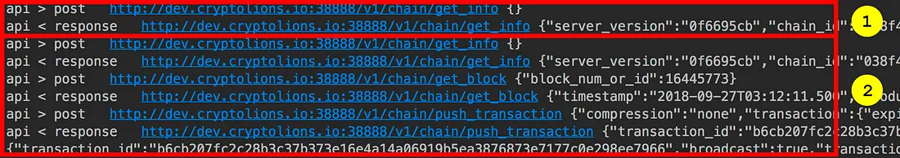

This post introduces eosjs, the JavaScript library for the EOSIO blockchain.

eosjs plays the same role for EOSIO that web3.js plays for Ethereum: **a per-language API for talking to a specific blockchain — JavaScript, in eosjs's case.** Other-language implementations exist (SwiftyEOS for Swift, eos-java-rpc-wrapper for Java, and so on), but eosjs is the one developed by the EOSIO team itself.

## Why eosjs when EOSIO already has RPC?

EOSIO's own HTTP RPC is fully capable — it serves chain info and broadcasts transactions just fine. But eosjs offers some advantages worth covering. Here's what a coin transfer looks like over plain RPC:

1. Call `/v1/chain/get_info` to fetch `last_irreversible_block_num`
2. Call `/v1/chain/get_block` to fetch the corresponding block
3. Call `/v1/chain/push_transaction` to broadcast the transaction

That's three HTTP calls, plus error handling for each one, all on the developer. eosjs is ultimately a wrapper around the same RPC, but it bundles these workflows into named action functions. The same coin transfer is a single **transfer** call.

Let's actually use it to send EOS.

## Installing eosjs

To use eosjs from a plain HTML page, drop in the script tag:

```html
<script src="https://cdn.jsdelivr.net/npm/eosjs@16.0.9/lib/eos.min.js"
  integrity="sha512-zhPSKFEBlDVvUzjl9aBS66cI8tDYoLetynuKvIekHT8NZZl2oxwcZ//M/eT/2Rb/pR/cjFvLD8104Cy//sdEnA=="
  crossorigin="anonymous"></script>
```

For a Node.js / npm setup, install and require it like any other package:

```bash
# install eosjs in your project
$ npm install eosjs --save
```

```javascript
// pull eosjs in
let Eos = require('eosjs');
```

> [!NOTE]
> A breaking-change update for eosjs is scheduled for the second week of October. Anything you build from this post may diverge after that point — pin your version in `package.json` (e.g., `"^16.0.8"`) if you need to reproduce the behavior shown here.

## Configuring eosjs

Once installed, eosjs needs three things: which chain to talk to, the private keys to sign with, and the nodeos endpoint to send requests to.

```javascript
let eos = Eos({
    chainId: '038f4b0fc8ff18a4f0842a8f05...',
    keyProvider: [
        "5JR9m7o......",
        "5JAj2AMS5....",
        ......
    ],
    httpEndpoint: "https://eos.greymass.com:443",
    broadcast: true,
    verbose: true,
    sign: true
});
```

- `chainId`: identifies the chain. The major chain IDs at the time of writing:

| Chain | Chain ID |
| --- | --- |
| EOS mainnet | `aca376f206b8fc25a6ed44dbdc66547c36c6c33e3a119ffbeaef943642f0e906` |
| Jungle testnet | `038f4b0fc8ff18a4f0842a8f0564611f6e96e8535901dd45e43ac8691a1c4dca` |
| Crypto Kylin testnet | `5fff1dae8dc8e2fc4d5b23b2c7665c97f9e9d8edf2b6485a86ba311c25639191` |

- `keyProvider`: the private keys eosjs will use to sign transactions from your accounts.
- `httpEndpoint`: the nodeos endpoint requests are sent to. The example uses [greymass](https://greymass.com)'s public RPC endpoint.

## Sending EOS

With configuration done, the actual coin transfer is a single call. The `transfer` method on the eos object takes **sender**, **recipient**, **amount**, and **memo**, in that order:

```javascript
eos.transfer('lazylion1234', 'babylion1234', '1.0000 EOS', 'send!');
```

You can pass a callback as the final argument:

```javascript
eos.transfer('lazylion1234', 'babylion1234', '1.0000 EOS', 'send!',
    (error, result) => {
        if(error) {
            console.error('Failed...');
        } else {
            console.log("Success!");
        }
    }
);
```

That callback runs asynchronously, as you'd expect from JS. Without a callback, `transfer` returns a Promise — so the same flow can be written with `await`:

```javascript
async function() {
    try {
        ......
        let result = await eos.transfer('lazylion1234', 'babylion1234', '1.0000 EOS', 'send!');
        // print the resulting transaction id
        console.log('transaction ID is '+ result.transaction_id);
        ......
    } catch (err) {
        console.error('error!');
    }
}
```

## Inspecting the transfer log

Calling `transfer` produces this log output:



- **1**: triggered automatically when the eos object is created — eosjs sends a `get_info` request to the configured `httpEndpoint`.
- **2**: produced by the `transfer` call itself. Internally it makes several RPC requests to carry out the transfer action.

That covers the basics: install eosjs, configure it, and use the convenience `transfer` method to send EOS. The next post moves to the `transaction` method for sending tokens that aren't the native EOS coin.
