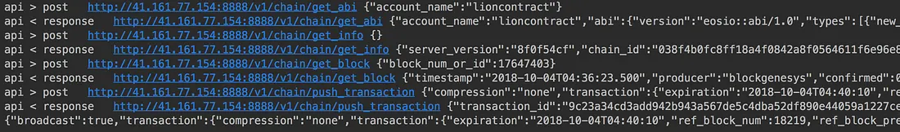

The previous post used eosjs's `transfer` method to send the native EOS coin. Any "action" on EOS — `transfer` included — needs two pieces of information:

- The contract account name (for EOS coin: `eosio.token`)
- The action name defined on that contract (for EOS coin: `transfer`)

The `transfer` method we used in the previous post bakes these two values in for you. It's a convenience that makes sense given EOS is the chain's native currency and the most-transferred asset.

**Tokens** are a different story. eosjs has no way to know which contract account a given token lives on, and that contract's transfer action might not even be named `transfer`. For those cases, eosjs exposes the lower-level `transaction` method.

## The transaction method

Here's what a token transfer looks like via `transaction`. The example uses `await` so the result is bound to a `result` variable:

```javascript
let result = await eos.transaction({
    actions: [{
        account: "lioncontract",
        name: "transfer",
        data: {
            from: "lazylion1234",
            to: "babylion1234",
            quantity: "12.0000 LION",
            memo: "eosjs is quite easy to use!!"
        },
        authorization: [{
            actor: "lazylion1234",
            permission: "active"
        }]
    }]
});

console.log(result.transaction_id); // print the resulting transaction id
```

- `actions`: the list of actions to perform. A single transfer action is the typical case for sending a token. The example fires the `transfer` action on the `lioncontract` contract.
- `actions → account`: the contract's account name.
- `actions → name`: the action name defined on the contract.
- `actions → data`: the payload the action expects. Note that `lioncontract`'s transfer takes the same fields as the native EOS transfer.
- `actions → authorization`: the permission used to sign this action. Since the sender is `lazylion1234`, the call needs that account's `active` permission.

## Inspecting the transaction log

Here's what calling `transaction` logs:



eosjs fetches the contract's ABI, retrieves the current block info, builds the matching transaction, signs it, and pushes it.

That wraps up coin and token transfers with eosjs. The hard parts — assembling the right RPC sequence, signing, broadcasting — collapse into a single call.
