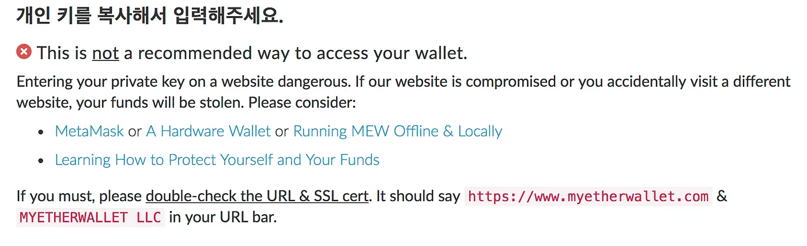
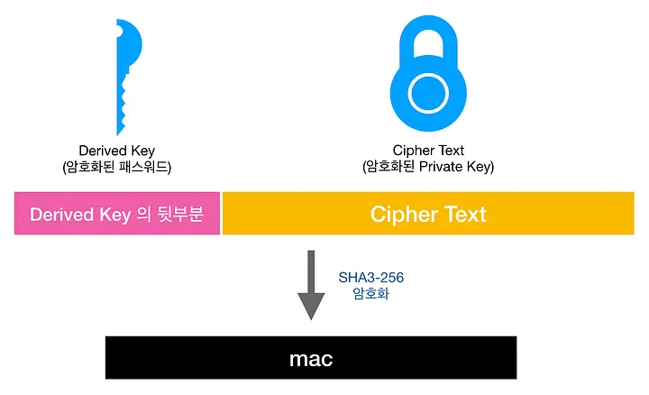

Ethereum uses KeyStore files as the way to identify an account holder. By entering the password they originally chose when the file was created, a user authenticates themselves and gains access to the account. So how is a KeyStore file actually generated, and what kind of encryption keeps the underlying private key safe? Let's walk through it.

## What a KeyStore file is

> What we ultimately need is the private key.

An Ethereum KeyStore file is an encrypted version of an Ethereum private key. It serves as the means by which an account holder authenticates themselves, and it's used to sign transactions.

You could, of course, use the private key directly. After all, what comes out at the end of decryption is the private key itself. But handling sensitive, unencrypted material directly is fragile — there are many ways for it to leak.

If a private key is stolen, the attacker gains complete control over the account, which is why most wallet applications and websites discourage using one directly.



This is why KeyStore files exist. Think of a KeyStore file as an encrypted private key. With it, you get both **security** and **usability** — the proverbial two birds with one stone.

- **Security:** an attacker would also have to figure out the password
- **Usability:** users carry around a KeyStore file plus a password instead of a long, raw private key string

In short, an Ethereum KeyStore file is an encrypted form of the private key, and it lets users transact without ever exposing the raw key.

## What's inside a KeyStore file

Before getting into the encryption and decryption mechanics, let's take a quick look at what an actual KeyStore file looks like.

```json
{
    "version": 3,
    "id": "4c07993f-ded2-405a-b83d-3b627eebe5cd",
    "address": "e449efddf8c9b174bbd40a0e0e1902d6eee72068",
    "Crypto": {
        "cipher": "aes-128-ctr",
        "cipherparams": {
          "iv": "7d416faf14c88bb124486f6cd851fa88"
        },
        "ciphertext":"e99f6d0e37f33124ee3020fad01363d9d7500efce913aede8a8119229b7a5f2e",
        "kdf": "scrypt",
        "kdfparams": {
            "dklen": 32,
            "salt": "c47f395c9031233453168f01b5a9999a06ec97c829a395ecd16e1ad37102ec7f",
            "n": 8192,
            "r": 8,
            "p": 1
        },
        "mac": "82078437ee94331c69125eef4001ff4b78b481e909a62a9ac25aa916237b70be"
    }
}
```

The `Crypto` object holds all the information about how the KeyStore file is encrypted.

- **cipher:** the name of the algorithm used to encrypt the private key
- **cipherparams:** the parameters that algorithm needs
- **ciphertext:** the result of encrypting the private key with that algorithm
- **kdf (Key Derivation Function):** the name of the algorithm used to derive a key from the password
- **kdfparams:** the parameters the KDF needs
- **mac:** used to verify the entered password when the KeyStore file is opened

Now let's walk through the generation and encryption process step by step, including how the entered password gets verified.

## Generation and encryption

### 1. Public / private key generation

First, generate the public/private key pair. There are several public-key cryptography algorithms to choose from, but Ethereum uses ECDSA (Elliptic Curve Digital Signature Algorithm), one of the discrete-logarithm-based options.

> ECDSA is preferred because it provides cryptographic strength comparable to RSA (which is based on integer factorization) using much shorter keys.

The generated public key feeds into the account's address, and the private key is what proves a user has authority over that address.

### 2. Encrypting the entered password

Step 1 gave us the most important piece — the private key. The user has also entered a password, so we can use that to encrypt the private key, right? Not quite. It's safer to derive a key from the password and encrypt with that derived value instead. _(More on why in part 2.)_


A password never needs to be decrypted (during verification we just compare encrypted values), so we use a one-way function — **Scrypt** — to derive the key.

- **kdf (Key Derivation Function):** the algorithm name. We use Scrypt here.
- **kdfparams:** parameters required by the KDF. Since we picked Scrypt, the entries below are Scrypt-specific.
- **salt:** the salt for the derivation. A random 32-byte value, written as a 64-character hex string.
- **dklen:** short for *Derived Key Length* — the byte length of the output.
- **n:** CPU/memory cost. Higher values mean stronger derivation.
- **r:** Block size. Typically 8.
- **p:** Parallelization factor. Higher values mean stronger derivation.

### 3. Encrypting the private key

Now we encrypt the private key in earnest. The derived key from step 2 is used as the encryption key. Because the private key needs to be recoverable later — that's the value that actually signs transactions — we need a two-way algorithm. Here, **AES** is used.


- **cipher:** the algorithm name. We use `aes-128-ctr`.
- **cipherparams:** parameters required by the algorithm — AES-specific entries below.
- **iv (Initialization Vector):** the initialization value. A random 16-byte value, written as a 32-character hex string.
- **ciphertext:** the resulting encrypted value.

### 4. Generating the mac

There's one item left in the `Crypto` object that we haven't explained: the `mac`. This is what's used at decryption time to check that the entered password is correct before attempting to decrypt the private key.



We take the last 16 bytes of the 32-byte derived key, concatenate them with the 32-byte ciphertext, and hash the result with SHA3-256. Per the [SHA3-256](https://en.wikipedia.org/wiki/SHA-3) spec, the output is 32 bytes — and that's what gets stored as the `mac`.

---

That covers the generation and encryption side of Ethereum KeyStore files. You might still have questions — e.g., why isn't the Scrypt result stored anywhere? how does decryption actually work? why use a random salt? — and the next post picks up there.
