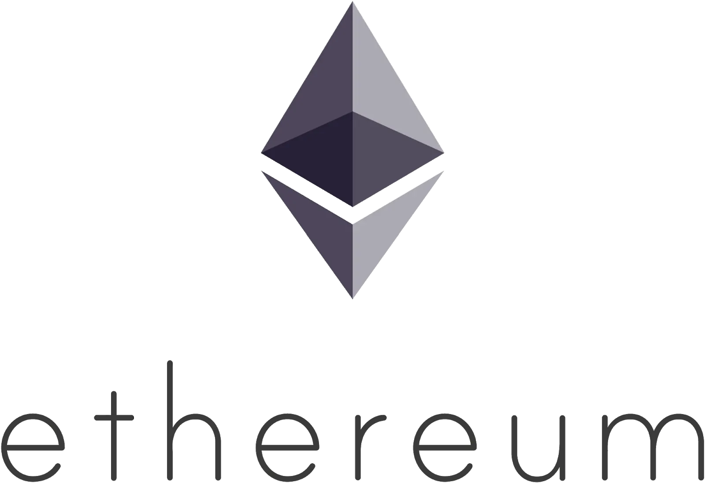
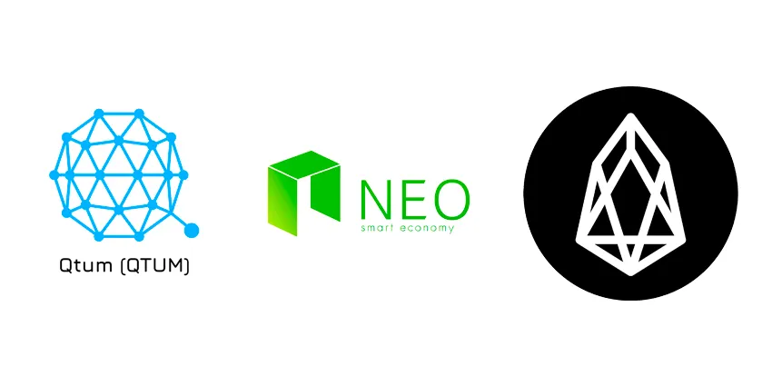
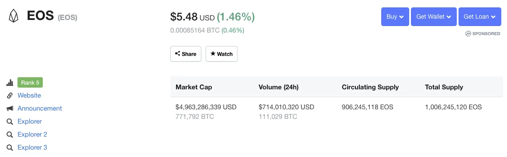
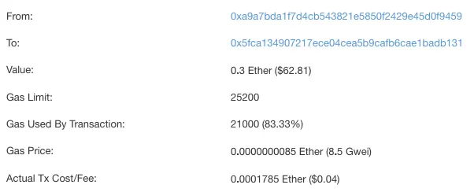

Stepping back from any one technical area, this post takes a wider look at the blockchain landscape — specifically, a comparison between Ethereum (the second-generation flagship) and EOS (the third-generation flagship).

## How we got here

Bitcoin emerged in the late 2000s, marking the start of blockchain. In the early days few people knew about it and trading volume was thin. Through the 2010s interest grew, and a wave of projects built on Bitcoin's source code began appearing. Even now, as the standard-bearer of the first generation, Bitcoin's symbolic weight is enormous — it still holds the #1 spot in market cap and remains a heavyweight in the ecosystem.

Bitcoin let people send coins between computers, and the famous 2010 transaction — paying for Papa John's pizza with 10,000 BTC — has become legend.


But to build a wider range of services on blockchain, demand grew for **programmable blockchain coins**. Around this time Vitalik Buterin entered the picture and started talking about a coin with a built-in scripting language for application development — the backdrop for Ethereum's birth in 2015 as the second-generation flagship.



Through Ethereum, people saw the possibility of programs (smart contracts) running on a blockchain. To this day, Ethereum hosts the largest number of dApps and sits at #2 in market cap.

Ethereum brought a wider audience to blockchain. A wave of new projects sprang up promising to fix Bitcoin's and Ethereum's shortcomings — this era is generally called the third generation.



Among the third-generation coins, EOS ran its ICO under the **Ethereum killer** label. The ICO was unusual — it ran for roughly a year, raising around $7.1B by 2018. Like Ethereum, EOS ships its own engine for smart-contract development; it has no fee burden and pitches throughput roughly 200× faster than Ethereum as it grows its ecosystem. EOS is the most active third-generation coin today and sits at #5 in market cap.



A lot of projects have launched in a short window. Among smart-contract platforms, Ethereum and EOS are the two names that come up most. So which one will lead the market next: the second-gen flagship Ethereum, or the rising third-gen contender EOS? Let's compare them across usability, fees, and dApp adoption.

## Round 1: Usability

The established coins — Bitcoin, Ethereum — both work in terms of an **address**. An address plays the same role as a bank account number. So if A wants to send ether (ETH, Ethereum's native currency) to B, A has to know B's address. Ethereum addresses are made of digits and letters and look like this:

```text
0x15a664416e42766a6cc0a1221d9c088548a6e731
0xc5b4aaa4a05017e2e44d483d132c8c9c82cbc493
0x69189716420FFCc0cA2e4F9869433389Df331f9c
```

Not friendly. An Ethereum address isn't human-readable, so it's hard to imagine a general user feeling comfortable working with one directly.

EOS adds an **account** layer on top of the address concept. An account is closer to a **username** than an account number. Users sign up on the EOS blockchain — similar to creating an account on a website — and can then send EOS to other people's accounts.

Another way to think about EOS accounts is the IP-address-vs-domain analogy. Strictly speaking, reaching a website requires knowing its IP address. But nobody types `125.209.222.142` into the browser to visit Naver. DNS already exists for that — it maps IP addresses to human-readable strings — so we visit the site through `www.naver.com` instead of the raw IP.


EOS accounts look like this:

```text
flowerprince
upbitwallets
lioninjungle
```

EOS accounts are human-readable strings. You can memorize your own account name, share it easily, and the whole thing feels much more familiar to a general user.

This difference in how users are identified shows up in who actually signs a transfer. The diagram below illustrates how transfers work on Ethereum vs. EOS.


## Round 2: Fees

In any computer network, taking an action — e.g., sending coins — eventually means someone's machine has to do that work. Nothing is free, so somebody has to cover the cost.

On Ethereum, every transaction incurs a **fee**. If A sends some ether to B, A pays a fee to whoever processed and recorded that transaction on the blockchain. This is also a defining trait of PoW-based coins in general.



EOS works a little differently. There is no concept of a fee. Instead, the user stakes a certain amount of EOS to the system, and that stake grants the right to use the EOS network in proportion to it. The staked amount isn't consumed — it can be reclaimed at any time.

By staking EOS, you're effectively **acquiring ownership of system resources** in proportion to the staked amount. Three resource types exist — CPU, NET, and RAM — and you need to know which of the three to allocate more of, depending on the kind of transactions you plan to issue.


This unusual structure means a general user feels the fee burden less, but actually using EOS properly requires understanding the resource model — so there's a small learning curve up front.

## Round 3: dApp adoption

One key measure of a healthy ecosystem is how many participants live in it. For blockchain networks — especially platform coins like Ethereum and EOS — that translates into how many dApps are running on the platform. [stateofthedapps.com/stats](https://www.stateofthedapps.com/stats) tracks this in detail.

Across all platforms, the dApp count has grown steadily. As the long-time leader in smart contracts, Ethereum-based dApps make up the lion's share. The largest single category is exchange-related projects — platform-specific tokens, decentralized-exchange dApps, and so on — most of them on Ethereum.


The next-largest category is gambling and games. Here, EOS-platform dApps make up the majority.


That's likely because EOS's TPS (transactions per second) is much higher than Ethereum's, which makes building latency-sensitive dApps like games more practical.

Beyond raw dApp counts, the other thing worth watching is how much actual usage those dApps see.


Ethereum, the dominant platform coin, has an overwhelming lead in total dApp count. But looking at metrics like daily active users and transactions, EOS is actually far more active.

## So who wins?

We've compared Ethereum and EOS across several dimensions. Predicting that one of the two — long-standing market leader Ethereum, or the speed-and-features upstart EOS — will dominate the future of blockchain platforms isn't easy. Both are also evolving by watching and learning from each other. And since the two platforms aim in slightly different directions on a number of axes, picking a winner outright may be the wrong question to begin with.

Blockchain platforms themselves are still early. Watching this many projects grow in this short a window is genuinely enjoyable — both as a developer and as a regular user. Ethereum and EOS are both strong projects, and where they go from here is worth paying attention to.
