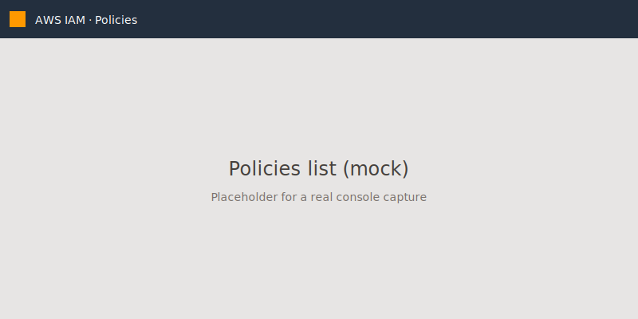

When you create a new policy in AWS, following the console UI step by step is easy to get wrong. These are the three details I most often miss in practice, written down so I can stop tripping over them. A related routing-structure discussion lives in [this earlier post](/en/posts/routing-with-clarity/).

## 1. Look at the Policies list first

The **Policies** menu in the console's left sidebar lists every existing policy. Scanning the list first tells you whether someone has already made something close to what you need.



If a similar policy exists, cloning and editing it is safer than writing `CreatePolicy` from scratch.

## 2. Switch to the JSON editor

The Visual editor is great for quickly picking actions, but once the `Condition` block gets complex, JSON is much easier to read.


An example policy document:

```json
{
  "Version": "2012-10-17",
  "Statement": [
    {
      "Effect": "Allow",
      "Action": ["s3:GetObject"],
      "Resource": "arn:aws:s3:::my-bucket/*",
      "Condition": {
        "StringEquals": {
          "aws:SourceVpc": "vpc-12345678"
        }
      }
    }
  ]
}
```

Same thing from the CLI:

```bash
aws iam create-policy \
  --policy-name AllowS3ReadFromVpc \
  --policy-document file://policy.json
```

> Tip: dry-running the policy or validating it locally with `aws iam simulate-custom-policy` removes a lot of "denied" lines from production logs later.


## 3. Write the ARN down so your SDK can reuse it

The ARN of the new policy is what you will reach for when you attach it to a role. In CDK:

```typescript
import { aws_iam as iam } from "aws-cdk-lib";

const readOnly = iam.ManagedPolicy.fromManagedPolicyArn(
  this,
  "ReadOnlyFromVpc",
  "arn:aws:iam::123456789012:policy/AllowS3ReadFromVpc",
);

const role = new iam.Role(this, "WorkerRole", {
  assumedBy: new iam.ServicePrincipal("lambda.amazonaws.com"),
  managedPolicies: [readOnly],
});
```

Finding the right values by clicking  through the console is slower than writing the ARN down once up front.

For the full field reference, see the [AWS IAM policy grammar documentation](https://docs.aws.amazon.com/IAM/latest/UserGuide/reference_policies_grammar.html).
