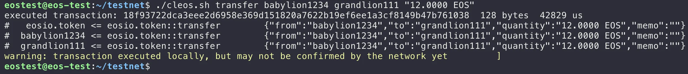
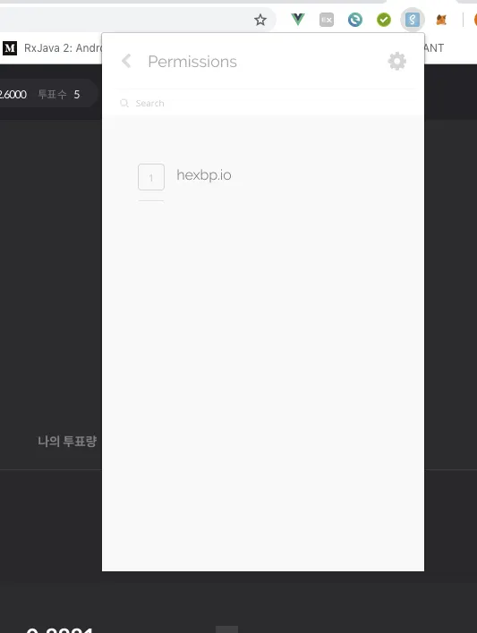

Last time we used Scatter to bind an EOS account to a web page. This post walks through what you can actually do with that bound account — sending coins, transferring custom tokens, voting, and signing out.

## Transferring EOS (transfer)

EOS has a `transfer` command — use it to send EOS tokens from one account to another. Here's the command and what it returns:



To bring that transfer into a web service, we used eosjs in the previous post. The Scatter-based approach we're walking through today still uses eosjs, so the calling code is identical. The difference is **how the call gets authorized**.

```javascript
this.eos.transfer('babylion1234', 'lazylion1234', '12.0000 EOS', 'this is memo field');
```

That's the eosjs `transfer` method — same effect as the CLI command above. Here's the result:


The one thing that differs is **how authentication happens**.

As the previous post explained, any blockchain action requires a private key. With eosjs alone, you have to embed it in the source:

```javascript
let eos = Eos({
    chainId: '038f4b0fc8ff18a4f0842a8f05...',
    keyProvider: [
        "5JR9m7o......",
        "5JAj2AMS5....",
        ......
    ],
    httpEndpoint: "https://eos.greymass.com:443,
    broadcast: true,
    verbose: true,
    sign: true
});
```

When you then call something like `transfer`, eosjs looks up the right key in the `keyProvider` array and signs the transaction with it.

With Scatter bound, you skip that key configuration entirely. Instead, the user sees this prompt:


## Custom token transfer (transaction)

The `transaction` method in eosjs handles arbitrary contract actions. Custom token transfers go through the same method, and Scatter pops up its prompt the same way:


## Voting (voteproducer)

As one more example, you can build an EOS BP-vote transaction. Wrap a `voteproducer` action inside the `transaction` method:

```javascript
this.eos.transaction(tr => {
    tr.voteproducer("flowerprince", "", ["acroeos12345", "teamgreymass"]);
});
```

That's account `flowerprince` voting for two block producers. The Scatter approval prompt looks like this:


`voteproducer` is one of the methods eosjs generates by reading the ABI of well-known contracts — call them inside `transaction` the same way.

## Signing out, option 1: from inside Scatter

Once an account is bound through Scatter, the Permissions menu in the extension lists the connected sites:



Disconnecting (signing out) is simple — pick the entry and click **Revoke Identity**.


## Signing out, option 2: from your code (eosjs)

You can't really expect every visitor to learn the Scatter UI just to sign out. eosjs exposes a programmatic way to do the same thing:

```javascript
if(this.scatter.identity) {
    this.scatter.forgetIdentity();
}
```

It checks for an identity, and if one exists (i.e., Scatter is bound), calls **`forgetIdentity()`** to clear it. Same effect as option 1, just driven from your code.

That wraps up the two-post series on using eosjs and Scatter together in a web service.
