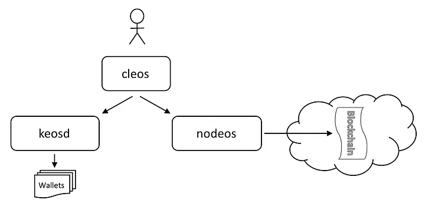
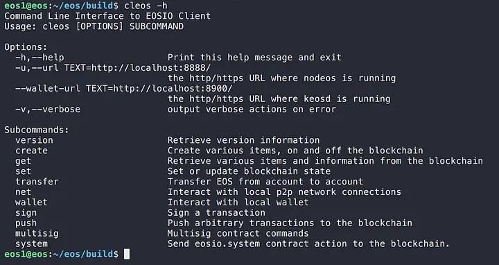
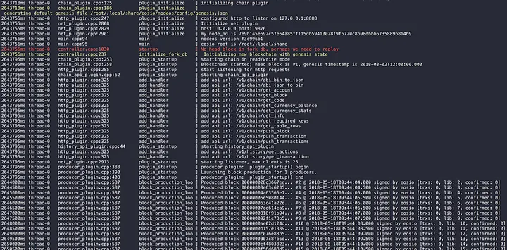
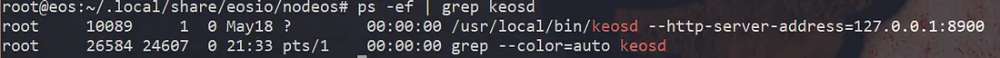
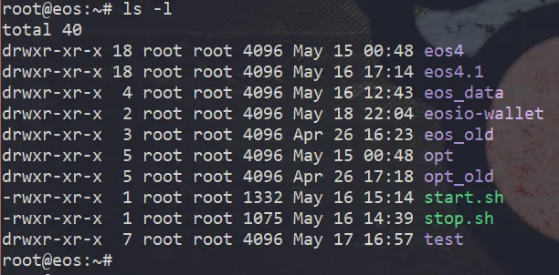
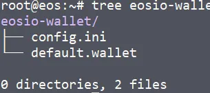

이전 글에서 EOS 설치 및 실행까지 진행했습니다. 이번 글에서는 EOS 의 주요 컴포넌트에 대한 간략한 소개와 동작 구조, 환경설정, 마지막으로 EOS 시작 및 종료 과정을 단순화 하기 위해 제가 작성한 쉘 스크립트를 소개하려 합니다.

## 주요 컴포넌트

간략히 EOS의 주요 컴포넌트들에 대해 소개를 하고 넘어가겠습니다. 아래 그림은 EOS 공식 가이드에 있는 주요 컴포넌트들 사이의 관계도입니다.



### nodeos

EOS의 블록을 생성하는 코어 데몬입니다. 여러 플러그인을 결합해 실행할 수 있고, API 엔드 포인트 (접근 가능한 기능별 URL이라 생각하시면 됩니다) 를 제공합니다.

### cleos

사용자가 컴포넌트들에 접근할 수 있게 해주는 최전방 Command-line 툴입니다. 내부적으로 nodeos의 API를 사용합니다. **cleos -h** 명령어를 사용해 사용 가능한 명령의 목록을 확인할 수 있습니다.



### keosd

EOS 는 wallet이라는 단위로 key를 관리할 수 있습니다. keosd 는 EOS의 wallet을 관리하는 데몬입니다. wallet_api_plugin 없이 nodeos를 실행했다면, cleos로 wallet 관련 명령어를 실행할 때 자동으로 데몬이 실행됩니다.

## nodeos의 동작

저번 글에서 아래의 명령어를 사용해 nodeos를 시작했었습니다.

```
$ nodeos -e -p eosio --plugin eosio::chain_api_plugin --plugin eosio::history_api_plugin
```

- `-e` : producer 투표 없이도 블록을 생성합니다. 테스트를 위해 필요합니다.
- `-p eosio` : 현재 노드의 producer 이름을 정합니다.
- `--plugin` : 실행 시 추가할 플러그인들을 명시합니다.

그리고 아래와 같은 log가 출력되었을 겁니다.



위 log를 통해 아래의 사항을 확인할 수 있습니다.

- (홈폴더)/.local/share 아래에 **EOS의 데이터**가 생성됨
- **블록체인 관련 HTTP end point**가 생성됨
- **지갑 관련 HTTP end point**가 생성됨

실제로 ~/.local/share 로 들어가 보면 eosio 폴더가 생성되어있고, 내부에 관련 파일들이 생성되었습니다. 구조는 아래와 같습니다.


nodeos를 구동할 때, 설정 정보가 기재된 config.ini 파일과 제네시스 블록의 정보가 기재된 genesis.json 파일이 필요합니다. 우리는 두 파일을 명시하지 않았기 때문에, EOS가 직접 default 파일을 생성하였습니다.

## keosd의 동작

keosd는 wallet을 관리하는 역할을 합니다. nodeos가 실행 중인 상태에서, cleos를 통해 keosd의 동작을 확인해 봅시다. 아래의 명령어를 통해 wallet을 생성해 봅시다.

```
$ cleos wallet create
```

결과는 아래와 같습니다.


첫 라인을 보면, keosd가 실행된 것을 확인할 수 있습니다. keosd를 따로 실행할 수도 있지만, cleos를 통해 wallet 관련 명령이 수행될 때 실행 중인 keosd 프로세스가 없다면 자동으로 프로세스를 생성합니다.

ps 명령어를 통해 keosd가 실행 되었음을 확인할 수 있습니다. 자동으로 실행되는 keosd 프로세스는 8900 포트를 기본값으로 사용합니다.



프로세스 생성 후, 홈 폴더에 가보면 eosio-wallet 폴더가 생성되어있는것을 확인할 수 있습니다.



이 폴더 내부엔, keosd 설정 정보가 저장된 config.ini 파일, 그리고 위 단계에서 생성한 default wallet 파일이 존재합니다. 이후 새롭게 생성하는 wallet도 이 폴더에 .wallet 확장자의 파일로 생성됩니다.



nodeos와 비슷하게, keosd를 구동할 때 설정 정보가 기재된 config.ini 파일이 필요합니다. 우리는 이 파일을 명시하지 않았기 때문에, EOS가 직접 default 파일을 생성하였습니다.

nodeos, keosd의 기본 설정 위치 및 필요 파일은 아래와 같습니다.

|                | nodeos                          | keosd               |
| -------------- | ------------------------------- | ------------------- |
| 기본 위치      | (홈)/.local/share/eosio/nodeos/ | (홈)/eosio-wallet/  |
| 데이터 위치    | (기본 위치)/data/               | (기본 위치)         |
| 설정 파일      | (기본 위치)/config/config.ini   | (기본 위치)/config.ini |
| 제네시스 파일  | (기본 위치)/config/genesis.json |                     |
| 기본 포트      | 8888                            | 8900                |

## 환경설정

지금까지 nodeos와 keosd를 직접 구동해보고, EOS 가 직접 생성하는 config.ini 파일과 해당 위치를 알 수 있었습니다. 다음 단계에서는 이 config.ini 파일을 수정하여 흩어져 있는 정보들을 모으고, 쉽게 시작 및 종료할 수 있도록 스크립트를 작성해봅시다.

관리의 편의성을 위해, 아래의 폴더 구조 안에 필요 파일들을 모아놓겠습니다. 아래의 구조처럼 폴더를 생성해주세요.


### nodeos 설정

우선 nodeos 설정부터 진행하겠습니다. 기존에는 config.ini, genesis.json 파일을 명시하지 않았으므로 기본 파일을 nodeos측에서 직접 생성해줬었습니다. 이제 이 두 파일을 (홈)/eos_data/config/ 아래로 복사합니다.

```
$ cp ~/.local/share/eosio/nodeos/config/* ~/eos_data/nodeos/config/
```

그리고 방금 복사한 config.ini파일의 내용 중 아랫 부분을 수정해줍시다 (#으로 주석처리 되어있다면 해제 후 수정해주세요).

```ini
http-server-address = 0.0.0.0:8888
wallet-dir = "/root/eos_data/keosd"
plugin = eosio::chain_api_plugin
plugin = eosio::history_api_plugin
plugin = eosio::wallet_api_plugin
```

- `http-server-address`: 어떤 IP에서도 접근 가능하도록 하기 위해 address를 0.0.0.0으로 변경했습니다 (외부 접속을 원치 않으시면 원본 그대로 127.0.0.1로 놔두시면 됩니다). 추후 rpc를 활용한 api 서버 테스트를 위해 저는 이렇게 설정했습니다.
- `wallet-dir` : 기존 eosio-wallet 폴더를 대체할 위치입니다. 위에서 우리가 설계한 위치를 적어줍니다.
- `plugin` : nodeos 실행 시, 추가해 실행할 플러그인을 나열해줍시다.

위 플러그인 옵션에서, 기본 실행 옵션과 다르게 wallet_api_plugin이 추가되었습니다. 이렇게 nodeos를 실행하면 keosd 없이 nodeos 만으로도 wallet 관련 기능을 사용할 수 있습니다 (cleos에서 wallet 관련 명령 수행 시, keosd 프로세스가 자동으로 생성되지 않고 nodeos에서 다 같이 처리하게 됩니다). eosio 에서 설명하는 방법은

1. nodeos에서 자동으로 생성한 keosd 프로세스 사용
2. keosd 를 임의로 실행 후 사용

입니다. 어떠한 방법도 상관없지만, 위 방법들은 서로 다른 두 개의 프로세스를 관리해야할 뿐더러 1번 방법에서의 keosd 프로세스는 8900 이라는 기본 포트를 가지고 생성됩니다. 따라서 추후 API 관련 작업을 할 때 두 곳의 end point를 알아야 하기 때문에, 이 글에선 nodeos 데몬에 wallet_api_plugin을 추가해 실행하였습니다.

### keosd 설정

이제 keosd 관련 설정을 진행해봅시다. nodeos가 기본 생성한 eosio-wallet 내부의 파일들을 우리가 정한 위치로 옮겨주세요 (기존에 생성한 default wallet이 필요 없다면, config.ini 파일만 복사하시면 됩니다).

```
$ cp ~/eosio-wallet/* ~/eos_data/keosd/
```

nodeos 의 config 내용 중 wallet-dir을 이 위치로 지정했기 때문에, wallet_api_plugin이 탑재된 nodeos 실행 시, 이 위치의 config.ini와 wallet 파일을 사용해 명령을 수행하게 됩니다.

> **Additional…**
> 사실, 현재의 설정대로 eos를 다룬다면 eos_data/keosd로 복사한 config.ini는 참조하지 않게 됩니다. 왜냐하면 nodeos 에 wallet_api_plugin이 추가되어 wallet 관리자의 역할을 겸하게 되기 때문이죠. 또한, (이런 구동방식을 위해서인지) nodeos의 config.ini파일을 잘 보시면, keosd의 config.ini 파일에서 설정해야 할 부분이 전부 포함되어있습니다.
> 추후 keosd를 독립적으로 구동해야 한다면, 그 때 사용하시면 됩니다.

### cleos 설정

위처럼 nodeos에서 wallet 관련 사항도 담당하게 되었으므로, cleos를 통해 wallet 명령 실행 시, wallet의 url을 nodeos로 명시해줘야 합니다. 그렇지 않으면 관련 명령 실행 시, 또 다른 keosd 프로세스가 실행되고, eosio-wallet 폴더를 생성하면서 위의 만들어놓은 설정 및 wallet 파일 대신 새로운 설정 및 wallet 파일을 참조하게 됩니다.

간편히 alias를 활용해 cleos 만 입력해도 --wallet-url 옵션을 준 것처럼 만들어봅시다.

```
$ alias cleos='cleos --wallet-url http://localhost:8888'
```

이제 cleos 명령 사용 시, 기본적으로 우리가 설정한 위치를 참조하게 되고, keosd 프로세스가 중복으로 생성되지 않게 됩니다.

> **Additional…**
> 콘솔 접속 시, 언제나 위 alias를 사용하려면 .bashrc 파일에 위 alias 구문을 추가하세요 (bash 기준).

### 시작 스크립트

지금까지의 설정을 사용해 nodeos를 실행하려면 config의 위치, data의 위치를 각각 **--config-dir, --data-dir** 옵션을 사용하여 실행해야 합니다.

```
$ nodeos -e -p eosio --config-dir ~/eos_data/nodeos/config --data-dir ~/eos_data/nodeos/data
```

그러나 명령이 너무 길어지므로, 시작 관련 작업을 한 번에 수행하는 쉘 스크립트를 작성해봅시다. 스크립트가 수행하는 내용은 아래와 같습니다.

1. 각종 폴더 위치 명시
2. 실행 중인 nodeos가 존재하는지 확인 (있으면 에러 후 종료)
3. nodeos 실행
4. 실행 명령 후, 실제로 process가 생성되었는지 확인 (없으면 에러 후 종료)
5. 현재날짜, 시간 기준 log 파일 생성

**start.sh**

```bash
#!/bin/bash

NODEOS_ROOT_DIR=/root/eos_data/nodeos
CONFIG_DIR=/root/eos_data/nodeos/config
DATA_DIR=/root/eos_data/nodeos/data
LOG_DIR=/root/eos_data/nodeos/log

## WALLET DIR 은 config.ini 파일 안의 datadir 로  정의!!!
## plugin들도 config.ini 파일 안에 정의!!!
## server address 도 config.ini 파일 안에 정의!!!

CURTIME=$(date +"%Y%m%d_%H%M%S")
LOG_FILENAME=$CURTIME".log"
PRODUCER_NAME=eosio

PROCESS_COUNT=$(ps -ef | grep nodeos | grep -v grep | awk '{print $2}' | wc -l)

if [ $PROCESS_COUNT -ne 0 ]; then
    printf "이미 실행중인 nodeos가 존재합니다.\n"
    exit 1
fi

printf "GOD EOS 데몬을 시작 중...\n"

nohup nodeos -e -p $PRODUCER_NAME --config-dir $CONFIG_DIR --data-dir $DATA_DIR $1 &> $LOG_DIR/$LOG_FILENAME &

sleep 1s

PROCESS_COUNT=$(ps -ef | grep nodeos | grep -v grep | awk '{print $2}' | wc -l)

if [ $PROCESS_COUNT -ne 1 ]; then
    printf "EOS 실행에 문제가 있습니다. (실행 실패 혹은 1개 이상의 프로세스가 실행됨)\n"
    printf "  * 로그파일 이름 : %s\n" $LOG_DIR"/"$LOG_FILENAME
    echo
    exit 1
fi

printf "GOD EOS 데몬이 시작되었습니다.\n"

printf "  * 설정파일 경로 : \t%s\n" $CONFIG_DIR
printf "  * 데이터 파일 경로 : \t%s\n" $DATA_DIR
printf "  * 로그파일 이름 : \t%s\n" $LOG_DIR"/"$LOG_FILENAME
```

nodeos 실행 시, nohup 및 & 를 사용해 백그라운드 작업으로 실행됩니다. 또한, stdout과 stderr를 20180505_130324.log 같은 형식의 파일로 리다이렉션 하여 특정 폴더 (~/eos_data/nodeos/log/) 안에 쌓게 됩니다.

### 종료 스크립트

종료 스크립트도 시작 스크립트와 거의 비슷합니다. 내부 로직은 아래와 같습니다.

1. 각종 폴더 위치 명시
2. 실행 중인 nodeos가 존재하는지 확인 (없으면 에러 후 종료)
3. nodeos의 프로세스 id를 찾아 kill
4. 아직도 실행 중인 nodeos가 있는지 확인 (있다면 에러 후 종료)

**stop.sh**

```bash
#!/bin/bash

NODEOS_ROOT_DIR=/root/eos_data/nodeos
CONFIG_DIR=/root/eos_data/nodeos/config
DATA_DIR=/root/eos_data/nodeos/data
LOG_DIR=/root/eos_data/nodeos/log

## WALLET DIR 은 config.ini 파일 안의 datadir 로  정의!!!
## plugin들도 config.ini 파일 안에 정의!!!
## server address 도 config.ini 파일 안에 정의!!!

CURTIME=$(date +"%Y-%m-%d_%T")
LOG_FILENAME=$CURTIME".log"
PRODUCER_NAME=eosio

PROCESS_COUNT=$(ps -ef | grep nodeos | grep -v grep | awk '{print $2}' | wc -l)

if [ $PROCESS_COUNT -eq 0 ]; then
    printf "실행 중인 nodeos가 없습니다.\n"
    exit 1
fi

printf "GOD EOS 데몬을 종료 중...\n"

ps -ef | grep nodeos | grep -v grep | awk '{print $2}' | xargs kill -9

sleep 1s

PROCESS_COUNT=$(ps -ef | grep nodeos | grep -v grep | awk '{print $2}' | wc -l)

if [ $PROCESS_COUNT -ne 0 ]; then
    printf "아직 실행 중인 nodeos가 존재합니다."
    echo
    exit 1
fi

printf "GOD EOS 데몬 종료됨.\n"
```

---

지금까지 eos의 구동 및 환경설정 등에 관해 이야기해보았습니다. 다음 글에서는 eos 위에 실제 계정 생성 및 컨트랙트 관련 내용으로 찾아뵙겠습니다.

감사합니다.
