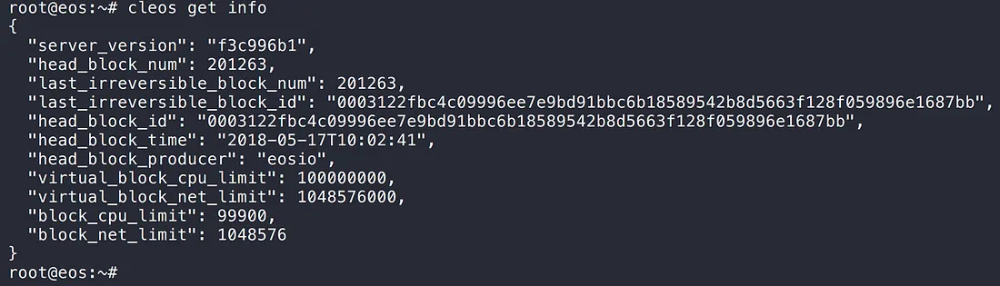

2018년 6월 2일, EOS 1.0 메인넷이 릴리즈되었습니다!

> 현재 릴리즈된 EOS의 버전은 v1.0.9 입니다. 빌드 과정 자체는 버전 별 차이가 크지 않으므로, 다른 버전을 사용하실 경우에도 동일하게 진행하면 되겠습니다.

이번 글에서는 실제로 EOS를 설치 및 실행해보는 과정에 대해 설명하겠습니다. 현재 EOS 는 1.0 버전이 출시된 지 한 달 남짓 되었습니다. 하지만 꽤 상세히 기술문서를 잘 만들어 놓았기 때문에 큰 문제 없이 node 구축이 가능합니다.

> EOS 의 가이드를 따르되, 손쉬운 운영을 위해 약간의 **설정 변경 작업**, **start, stop 스크립트**를 작성하였습니다. 또한, 공식 가이드에 설명이 부족한 부분에 관해 **추가 설명**을 달아놓았으니 긴 글이지만 꼼꼼하게 읽어주세요! [(공식 구축 가이드 링크)](https://github.com/EOSIO/eos/wiki/Local-Environment/10b1474d44e1812c319009edb0aca3fe1e2b7e90)

제가 EOS 를 설치해 본 서버 환경은 아래와 같습니다.

- **Memory** : 7974MB
- **OS** : Ubuntu Linux 16.04.4 LTS (Xenial Xerus)
- **Kernel** : 4.4.0-124-generic
- **GIT** : 2.7.4
- **EOS Source** : 4.1.0

그 외 EOS 에서 지원하는 전체 OS 목록은 아래와 같습니다.

1. Amazon 2017.09 and higher
2. Centos 7
3. Fedora 25 and higher (Fedora 27 recommended)
4. Mint 18
5. Ubuntu 16.04 (Ubuntu 16.10 recommended) *(참고로, 소스 커밋 내역 중 **18.04 빌드 및 테스트에 대한 언급**도 등장합니다. 최신 LTS 버전에 대한 지원도 기대해볼 만 하겠네요.)*
6. MacOS Darwin 10.12 and higher (MacOS 10.13.x recommended)

> EOS 는 현재도 개발이 이루어지고 있습니다. 따라서 이번 글에서 설명하는 내용이 제외될 수도 있고, 또한 현재 개발이 덜 진행된 부분이 추가될 수 있다는 점 참고하시기 바랍니다.

## 설치

### 1. 소스 내려받기

git clone 명령어를 통해 eos 소스를 내려받습니다. 기본적으로 현재 위치에 eos 폴더를 생성해 소스를 내려받게 됩니다. 다른 폴더명을 지정하려면, 아래 명령어 맨 뒤에 폴더명을 기재해주세요. ( 예: --recursive eosSource )

```
$ git clone https://github.com/EOSIO/eos --recursive
```

> 소스 압축파일을 다운받는 방식이 아닌, 위처럼 **git 을 이용해 소스를 내려받아야 합니다.** 현재 프로젝트의 하위 모듈들을 recursive 옵션을 통해 쉽게 받을 수 있기도 하거니와, 애초에 다음 과정인 "소스 빌드하기"에서 `.git` 폴더(git 관련 파일들이 위치하는 숨김폴더)의 존재 여부를 확인하는 과정이 있기 때문에 **빌드 자체가 안됩니다.** [(참고 : `eosio_build.sh`의 100번 라인 )](https://github.com/EOSIO/eos/blob/master/eosio_build.sh#L100)

### 2. 소스 빌드하기

위 단계에서 내려받은 소스를 가지고 실제 실행파일을 만들어 봅시다. EOS에서는 빌드를 쉽게 하기 위하여 스크립트 파일을 준비해두었습니다.
필요한 시스템 요구사항은 아래와 같습니다.

- 8GB 메모리
- 20GB 디스크 용량

> 위의 시스템 요구사항은 공식 가이드에 나와 있는 내용입니다. 하지만, 실제 빌드 스트립트는 7000MB 이상의 메모리가 있다면 문제없이 진행되도록 구현되어 있습니다. [( 참고 : `eosio_build_ubuntu.sh`의 27번 라인 )](https://github.com/EOSIO/eos/blob/master/scripts/eosio_build_ubuntu.sh#L27)

**@ Mac OS 사용자**

Mac OS 사용자의 경우, `xcode-select`가 설치되어 있어야 합니다. 아래의 명령어를 입력해 `xcode-select`의 설치를 진행해 주세요.

```
$ xcode-select --install
```

이제 소스 내려받기 과정에서 생성된 소스 폴더로 이동 후, `eosio_build.sh` 스크립트를 실행하세요 (꽤 오랜 시간이 소요됩니다).

```
$ cd eos             (또는, 임의로 생성한 폴더의 이름)
$ ./eosio_build.sh -s EOS
```

> -s 옵션을 통해 eosio 시스템 토큰의 심볼을 정의할 수 있습니다. 소스의 시스템 토큰이 기본적으로 SYS 이기 때문에, -s EOS 옵션이 필요합니다.

이 스크립트를 실행함으로써, 아래 세 과정이 진행됩니다.

1. 운영체제 별 시스템 기본 요구사항 체크
2. 필요한 라이브러리 설치 (boost, mongodb, wasm)
3. 빌드 실행

결과적으로, `build` 폴더 내부에 주요 결과물들이 생성됩니다.

> 필요 라이브러리 설치 과정에서, 현재 계정의 홈 폴더 아래에 `opt` 폴더를 생성 후 필요 라이브러리들([boost](https://www.boost.org/), [mongodb](https://www.mongodb.com/), [wasm](https://clang.llvm.org/))을 만들어 넣습니다. 따라서, 이미 존재하는 `opt` 폴더가 있는지 확인하세요!

### 3. 빌드가 잘 되었나 확인 (Optional)

이 과정은 필수는 아니지만, 빌드한 결과물이 올바른지 확인할 수 있습니다. 아래의 과정을 진행하세요 *(꽤 오랜 시간이 소요됩니다).*

우선 mongodb를 실행합니다 (`~/opt` 폴더 내에 빌드되어 있습니다).

```
$ ~/opt/mongodb/bin/mongod -f ~/opt/mongodb/mongod.conf &
```

그리고 eos 소스폴더 내부의 `build` 폴더로 이동 후, 테스트를 진행합니다.

```
$ cd build
$ make test
```

### 4. 전역 실행파일 생성

지금까지의 과정을 통해 성공적으로 설치를 마쳤습니다. 주요 결과물은 `<eos 소스폴더>/build/programs` 폴더에 생성됩니다.


하지만 이제부터 빈번히 실행해야 할 프로그램들이 특정 폴더 하위에 포함되어있기 때문에, 매번 실행할 때마다 해당 경로를 직접 입력해줘야 합니다.

EOS 는 이에 대한 해결책으로, `$PATH`에 등록된 특정 위치(`/usr/local/bin`)에 실행 파일들을 복사해놓는 방법을 제공합니다.

소스폴더 내부의 `build` 폴더로 이동 후, install 과정을 진행하세요.

```
$ cd build
$ sudo make install        (/usr/local/bin 은 관리자 계정이 필요하므로 sudo 필요)
```


위 과정을 통해, 어느 위치에서든 eos 관련 프로그램을 실행할 수 있게 되었습니다.

## 실행

### 1. EOS 노드 실행 (nodeos)

eos 의 메인이 되는 eos 노드를 실행해봅시다.

```
$ nodeos -e -p eosio --plugin eosio::chain_api_plugin --plugin eosio::history_api_plugin
```

위 명령의 결과로 다음과 같이 블록이 계속 생성됨을 확인할 수 있습니다.


단순히 nodeos를 실행했기 때문에, nodeos의 메시지가 콘솔 가득 출력될 것입니다. 다음 단계인 cleos 구동 확인을 위해 nodeos가 실행 중이어야 하므로, 새로운 콘솔 창을 열고 다음 단계로 진행바랍니다.

### 2. EOS 커맨드라인 인터페이스 실행 (cleos)

cleos 를 통해 nodeos에 명령을 내리고 상태를 확인할 수 있습니다. cleos를 통해 nodeos의 정보를 출력해보겠습니다.

```
$ cleos get info
```



cleos가 명령을 정상적으로 수행하였고, 실행 중인 nodeos와 올바르게 통신했음을 알 수 있습니다.

지금까지의 과정을 통해, eos 테스트넷 소스를 받아 직접 빌드하고 노드를 실행해보았습니다. 이어지는 다음 글에서는 노드가 실행될 때의 각 실행프로그램들(nodeos, cleos, keosd)의 동작 구조 및 손쉬운 운영을 위한 환경설정을 소개하겠습니다.
