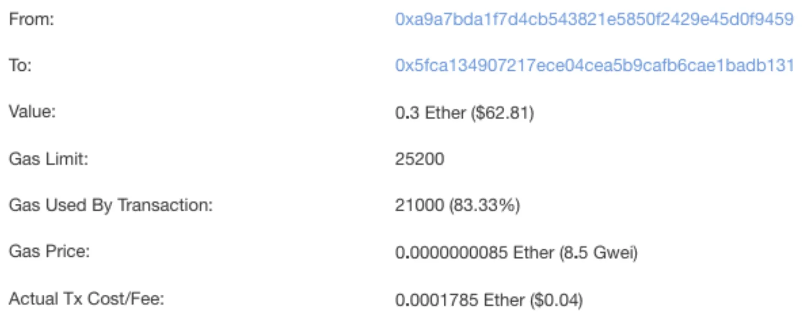
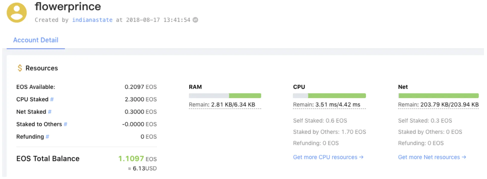

안녕하세요, 김상호입니다. 이번 포스팅에서는 주소체계, 수수료 측면에서 이더리움과 이오스를 비교해보도록 하겠습니다.

## 주소체계

기존의 대표적인 코인인 비트코인, 이더리움은 **주소**의 개념이 존재합니다. 주소는 은행 계좌의 계좌번호와 같은 역할을 합니다. 따라서 A가 B에게 이더(이더리움 플랫폼의 기축 통화. ETH)를 송금을 하기 위해선 B의 주소를 알아야 합니다. 이더리움의 주소는 숫자와 문자의 조합으로 이루어지며, 예를 들어 아래와 같은 형식을 갖습니다.

```text
0x15a664416e42766a6cc0a1221d9c088548a6e731
0xc5b4aaa4a05017e2e44d483d132c8c9c82cbc493
0x69189716420FFCc0cA2e4F9869433389Df331f9c
```

상당히 복잡합니다. 이처럼 이더리움의 주소는 사람이 읽을 수 있는 형식이 아니므로(non human-readable), 일반적인 사용자가 해당 주소를 사용하는데 친숙함을 느끼기가 쉽지 않을 것이라 생각합니다.

이오스는 주소의 개념 상위에 **계정**이라는 레이어가 존재합니다. 계정은 계좌번호라기보다 **아이디**에 가깝다고 볼 수 있습니다. 사용자는 이오스 블록체인에 마치 회원가입을 하듯 계정을 생성하게 되고, 다른 이의 계정에 이오스를 송금할 수 있습니다.

이오스의 계정을 IP 주소와 도메인에 비유할 수도 있습니다. 인터넷에서 특정 사이트에 접속하기 위해선 원칙적으로 해당 사이트의 IP 주소를 알아야 합니다. 하지만 우리는 네이버에 접속할 때 아무도 125.209.222.142라는 IP 주소를 브라우저에 입력하지 않습니다. 이미 인터넷 환경에는 IP 주소를 사람이 읽을 수 있는 문자열로 바꿔주는 DNS가 있기 때문에, 우리는 복잡한 IP 주소 대신 www.naver.com 이라는 도메인을 통해 사이트에 접속하게 됩니다.


이오스의 계정은 아래와 같은 형식을 갖습니다.

```text
flowerprince
upbitwallets
lioninjungle
```

이처럼 이오스의 계정은 사람이 읽을 수 있는 문자열입니다(human-readable). 따라서 자신의 계정명을 외울 수 있고, 다른 이에게 알려주기 수월하며, 일반 사용자에게 좀 더 친숙할 수 있습니다.


## 수수료

모든 컴퓨터 네트워크에서, 어떠한 액션을 취하기 위해선(예: 코인 송금) 누군가의 컴퓨터가 해당 작업을 처리할 것입니다. 세상에 공짜는 없으므로, 이에 대한 비용을 누군가는 지불을 해야 합니다.

이더리움에선 모든 트랜잭션에 대해 **수수료**가 발생합니다. A가 B에게 일정량 이더를 송금한다면, 해당 행위를 컴퓨터로 처리하고 블록체인에 기록하는 작업을 수행한 이에게 일정량의 수수료를 지불하게 되는 개념이죠. PoW 합의 알고리즘을 채용한 코인들의 특징이기도 합니다.



이오스는 조금 다른 방식을 가지고 있습니다. 이오스에서는 수수료의 개념이 없습니다. 대신에, 사용자는 이오스 시스템에 일정 금액의 이오스를 맡겨 놓으면 맡겨놓은 양만큼 이오스 네트워크를 사용할 수 있는 권한을 얻습니다. 또한, 맡겨놓은 금액은 소모되지 않으며 원하는 시간에 다시 되찾을 수 있도록 설계되었습니다.

사용자는 이오스 시스템에 자신의 이오스를 맡김으로써, 해당 수량만큼 **시스템 자원에 대한 소유권을 얻는 것**이라 볼 수 있습니다. 자원에는 CPU/NET/RAM 세 종류가 존재하며, 자신이 발생할 트랜잭션 종류에 따라 세 자원 중 어떤 것에 더 많이 할당해야 하는지 알 필요가 있습니다.



이러한 이오스의 독특한 구조 때문에 일반 사용자는 수수료의 부담을 덜 가질 수 있으나, 자원에 대한 이해가 수반되어야 제대로 이오스 시스템을 사용할 수 있다는 점에선 약간의 학습이 필요하다고 생각합니다.
