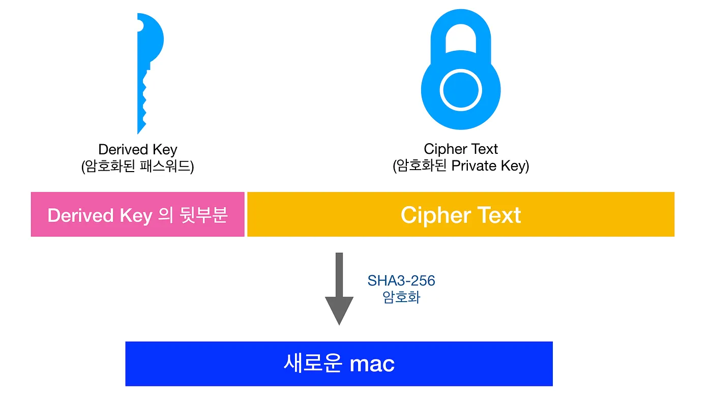
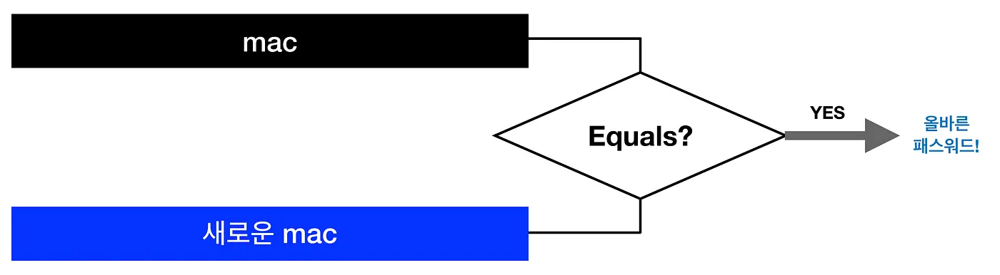
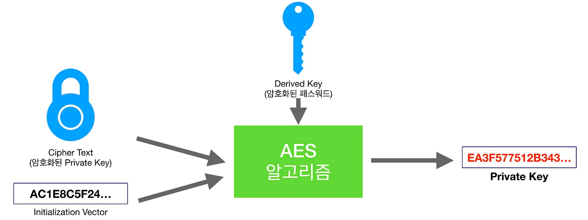

이전 글에서 이더리움 KeyStore 파일을 이용해 사용자의 Private Key를 암호화하는 방법에 대해 알아보았습니다. 이전 글의 주요 내용을 한마디로 정리하자면 아래와 같습니다.

> AES 알고리즘을 사용해 Private Key 암호화를 하며, 암호화 키값으로 KeyStore 파일 생성 시 입력했던 password의 Scrypt 값이 사용됨

이제 트랜잭션을 생성하기 위해선 KeyStore 파일에서 다시 Private Key를 추출하는 과정이 필요한데요, 따라서 이번 글에서는 이더리움 KeyStore 파일의 복호화 과정에 대해 알아보겠습니다.

## 입력한 패스워드 검증

복호화 과정 중 가장 중요한 작업은 "**입력한 패스워드가 맞는가**"입니다. 잘못된 패스워드를 통해 복호화가 이루어질 경우, 생성된 Private Key는 원본 값과 다른 값이 도출되기 때문이죠. 잘못된 Private Key를 사용한다면 해당 주소의 주인이 본인임을 증명할 수 없게 됩니다.

따라서 입력한 패스워드 검증이 꼭 필요하고, 여기서 **mac** 값이 사용됩니다.

### 1. 새로운 derived key 생성

mac 생성을 위해 derived Key가 필요합니다. 따라서 암호화 과정과 동일하게, 입력한 password에 Scrypt 알고리즘을 적용하여 새로운 derived key를 생성합니다.

위 과정에서 Scrypt 알고리즘의 파라미터는 KeyStore 파일에 기재된 내용을 그대로 사용합니다. 따라서 동일한 패스워드를 입력했다면, 암호화 과정에서 생성된 것과 동일한 Derived Key가 생성될 것입니다.

### 2. 새로운 mac 생성

암호화 과정과 동일하게, 위에서 도출된 derived key와 KeyStore 파일에 기재된 cipher text를 조합해 새로운 mac을 생성합니다.

마찬가지로, Cipher Text는 기존 KeyStore 파일에 기재된 것과 같은 것을 사용합니다.

### 3. 기존 mac과 비교

단순합니다. 새로 생성된 mac이 KeyStore 파일에 기재된 기존 mac과 일치한다면 올바른 패스워드입니다.

## 복호화

대부분의 작업이 끝났습니다. 이제 위 과정에서 생성된 derived key를 이용하여, KeyStore 파일에 있는 cipher text를 복호화하면 됩니다.

우리는 양방향 암호화 알고리즘 중 하나인 AES를 사용하여 암호화를 진행했습니다. 따라서, Private Key의 암호화 결과였던 Cipher Text를 다시 AES에 넣으면 Private Key가 도출됩니다.

## 생각해볼 것들

지금까지 두 글에 이어 이더리움 KeyStore 파일의 암호화 복호화 원리에 대해 알아보았습니다. 여기서 추가로 궁금한 점이 생길 수 있는 내용, 또는 암복호화 과정에 담겨있는 의미 등에 대한 이야깃거리를 적어보고자 합니다.

### Q: 랜덤한 값의 salt를 사용하는 이유는?

**A:** 단방향 해시함수를 보완하기 위해 사용합니다. 단방향 해시함수의 특성상 같은 값을 넣으면 같은 해시값이 출력되는 특징이 있는데, 이는 레인보우 어택에 취약합니다. 따라서 원본에 임의의 salt 값을 붙여 알고리즘을 적용해 원본 값의 예측을 힘들게 하기 위함입니다.

### Q: KeyStore 파일에 이런저런 내용이 담기는데, 왜 Scrypt 결과값은 저장하지 않을까?

**A:** 어찌 보면 당연한 이유입니다. Scrypt의 결과값은 Private Key를 복호화하는 데 사용하는 키 자체이기 때문입니다.

### Q: 여러 단방향 해시 함수 중 Scrypt를 KeyStore 파일에서 사용하는 이유는?

**A:** Scrypt는 현존하는 단방향 해시함수 중 가장 강력한 알고리즘 중 하나입니다. 알고리즘 자체가 결과값을 생성할 때 메모리 오버헤드를 갖도록 설계되어 brute-force 공격을 힘들게 하도록 설계되었습니다.

긴 글 읽어주셔서 감사합니다. 잘못된 내용이나 이해하기 어렵게 작성된 부분에 대해 짚어주시면 수정하도록 하겠습니다.

감사합니다.
