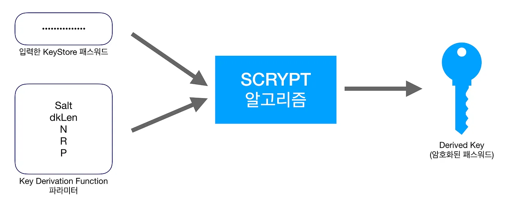
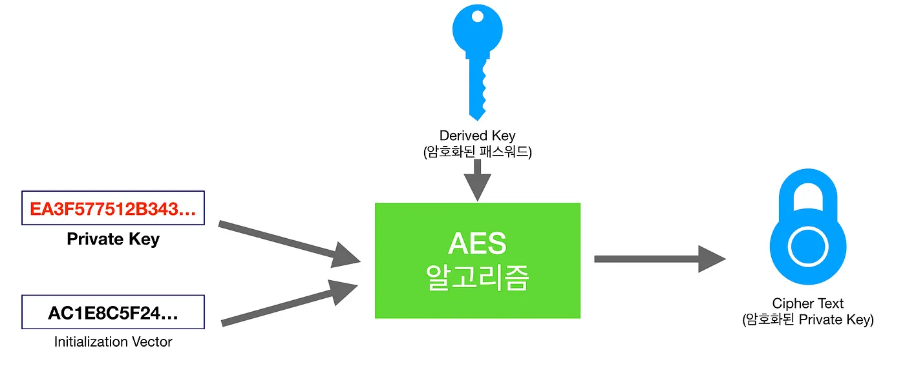

이더리움 플랫폼에서는 본인을 확인하는 수단으로 KeyStore 파일을 사용합니다. 사용자는 KeyStore 파일을 생성할 때 입력했던 비밀번호를 통해 유효한 사용자임을 인증하고 계좌에 접근할 수 있게 됩니다. 과연 어떠한 방식을 통해 KeyStore 파일이 생성되고, 어떠한 암호화 방식을 통해 사용자의 Private Key를 안전하게 보관하는지 알아보겠습니다.

## KeyStore 파일이란?

> 결국, 필요한 것은 Private Key!

이더리움 KeyStore 파일은 이더리움 Private Key의 암호화된 버전입니다. KeyStore 파일은 특정 계좌에 대해 본인을 인증하는 수단이며, 이것은 트랜잭션을 사이닝하기 위해 사용됩니다.

물론, Private Key를 직접 사용해도 됩니다. 결국, KeyStore 파일에 암호를 입력하면 복호화 과정 후 Private Key를 도출해 사용하기 때문이죠. 하지만, 이러한 암호화되지 않은 중요한 정보를 직접 다루는 것은 매우 취약하며, 다양한 방법으로 탈취될 수 있습니다.

만약 Private Key가 탈취되었을 경우, 공격자는 당신의 계좌에 대한 모든 권한을 얻을 수 있기 때문에 매우 위험합니다. 따라서 여러 지갑 애플리케이션, 웹사이트에서 추천하지 않는 방법이기도 합니다.


이러한 이유로 인해, 이더리움 KeyStore 파일이 사용됩니다. 이더리움 KeyStore 파일은 Private Key를 암호화한 파일이라고 생각하시면 됩니다. 이더리움 KeyStore 파일을 통해 "**안전성**"과 "**사용성**"이라는 두 마리 토끼를 잡을 수 있습니다.

- **안전성:** 공격자는 추가로 암호까지 알아내야 함
- **사용성:** 복잡한 Private Key 대신 KeyStore 파일 + 패스워드 조합을 사용

따라서 이더리움 KeyStore 파일은 이더리움 Private Key의 암호화된 파일이며, 이를 통해 사용자는 직접적으로 Private Key를 노출하지 않고 안전하게 거래를 할 수 있게 됩니다.

## KeyStore 파일의 구조

KeyStore 파일의 암복호화 원리에 앞서, 실제 KeyStore 파일을 살펴보며 어떠한 내용이 들어있는지 간단히 파악해봅시다.

```json
{
    "version": 3,
    "id": "4c07993f-ded2-405a-b83d-3b627eebe5cd",
    "address": "e449efddf8c9b174bbd40a0e0e1902d6eee72068",
    "Crypto": {
        "cipher": "aes-128-ctr",
        "cipherparams": {
          "iv": "7d416faf14c88bb124486f6cd851fa88"
        },
        "ciphertext":"e99f6d0e37f33124ee3020fad01363d9d7500efce913aede8a8119229b7a5f2e",
        "kdf": "scrypt",
        "kdfparams": {
            "dklen": 32,
            "salt": "c47f395c9031233453168f01b5a9999a06ec97c829a395ecd16e1ad37102ec7f",
            "n": 8192,
            "r": 8,
            "p": 1
        },
        "mac": "82078437ee94331c69125eef4001ff4b78b481e909a62a9ac25aa916237b70be"
    }
}
```

여기서, crypto 객체가 KeyStore 파일 암호화에 대한 정보를 담고 있습니다.

- **cipher:** Private Key 암호화에 사용한 알고리즘의 이름
- **cipherparams:** 위 알고리즘에 필요한 변수
- **ciphertext:** 위 알고리즘으로 Private Key를 암호화한 결과값
- **kdf (Key Derivation Function):** 패스워드 암호화에 사용한 알고리즘의 이름
- **kdfparams:** 위 알고리즘에 필요한 변수
- **mac:** KeyStore 파일 사용 시, 패스워드 입력값 검증을 위해 사용됨

이제 KeyStore 파일의 생성 및 암호화 과정, 그리고 입력된 패스워드 일치 여부에 대한 검증과정에 대해 단계별로 알아보겠습니다.

## 생성 및 암호화 과정

### 1. Public / Private Key 생성

제일 먼저, 사용될 Public, Private Key를 생성합니다. 여러 가지 공개키 암호 알고리즘이 있지만 이더리움 플랫폼에선 이산대수 문제 기반 알고리즘 중 하나인 ECDSA (Elliptic Curve Digital Signature Algorithm)를 사용해 Public, Private Key를 생성합니다.

> ECDSA를 사용하는 이유는, RSA(소인수분해 문제 방식) 알고리즘보다 훨씬 짧은 키를 사용하면서 비슷한 수준의 암호화 강도를 제공하기 때문입니다.

생성된 Public Key는 계좌의 Address 생성에 필요한 정보가 되고, Private Key는 이 Address에 대해 유효한 사용자임을 증명하는 데 꼭 필요한 정보가 됩니다.

### 2. 입력받은 패스워드 암호화

위의 과정을 통해, 제일 중요한 Private Key가 생성되었습니다. 또한, 패스워드도 입력받았으니, 이를 가지고 Private Key를 암호화하면 되겠죠? 하지만 입력받은 패스워드를 직접 암호화 키로 사용하지 않고, 이를 암호화한 값을 사용하는 게 안전합니다. _(자세한 이유는 2편 참조)_



패스워드라는 정보의 특성상 복호화할 필요가 없으므로(암호화된 값을 단순 비교하면 됨), 단방향 암호화 알고리즘 중 하나인 **Scrypt**를 사용해 패스워드를 암호화합니다.

- **kdf (Key Derivation Function):** 암호화 알고리즘의 이름입니다. Scrypt를 사용합니다.
- **kdfparams:** kdf에서 필요한 요소들을 기재합니다. kdf를 Scrypt로 선택했으므로, 하위 항목들은 Scrypt에 필요한 인자들이 들어가게 됩니다.
- **salt:** 암호화에 필요한 salt 값입니다. 32byte의 랜덤값이 사용되고, 32byte이므로 64자리의 hex 문자열이 들어갑니다.
- **dklen:** Derived Key Length의 약자입니다. 결과값의 길이(byte)가 됩니다.
- **n:** CPU/Memory 비용입니다. 값이 클수록 암호화 강도가 증가합니다.
- **r:** Block Size입니다. 일반적으로 8이 사용됩니다.
- **p:** 병렬화 수준입니다. 값이 클수록 암호화 강도가 증가합니다.

_(자세한 설명은 안전한 패스워드를 위한 KDF와 Hash, 그리고 Scrypt을 참고해주세요)_

### 3. Private Key 암호화

본격적으로 Private Key를 암호화하는 과정입니다. 2번 단계에서 생성한 결과값을 키로 사용해 Private Key를 암호화합니다. Private Key는 복호화가 필요한 데이터이므로(결국, 거래에 사용되는 값은 Private Key) 양방향 알고리즘을 사용해야 하는데요, 여기선 **AES** 알고리즘이 사용됩니다.



- **cipher:** 암호화 알고리즘의 이름입니다. aes-128-ctr을 사용합니다.
- **cipherparams:** 알고리즘에서 필요한 요소들을 기재합니다. 하위 항목들은 AES에 필요한 인자들이 들어가게 됩니다.
- **iv (Initialization Vector):** 암호화에 필요한 초기값입니다. 16byte의 랜덤값이 사용되고, 16byte이므로 32자리의 hex 문자열이 들어갑니다.
- **ciphertext:** 위 암호화의 결과값입니다.

### 4. mac 생성

이제 crypto 객체 내부에서 설명이 안 된 항목이 하나 남았습니다. 바로 mac 값입니다. 이 정보는 실제 KeyStore 파일을 사용할 때, 사용자가 입력한 패스워드의 일치 여부를 확인하고 Private Key를 복호화해도 되는지 확인하는 용도로 사용됩니다.


Derived Key(32byte)의 뒷부분 16byte와 Cipher Text(32byte)를 이어붙인 값을 SHA3-256 해시 함수로 암호화합니다. [SHA3-256](https://ko.wikipedia.org/wiki/SHA-3)의 스펙에 따라, 32byte의 결과가 생성되는데, 이것이 mac 값으로 사용됩니다.

이렇게 이더리움 KeyStore 파일 관련 첫 번째 이야기로 생성 및 암호화 과정에 대해 자세히 알아보았습니다. 글을 읽으시면서 궁금한 점이 있을 수 있는데요, (예: 왜 Scrypt 결과값은 저장되지 않을까? 복호화는 어떻게 이루어지는 것일까? 랜덤한 값의 salt를 사용하는 이유는?) 복호화 및 추가적인 설명이 필요한 부분에 대해서는 이어지는 글로 이야기해보겠습니다.

감사합니다.
