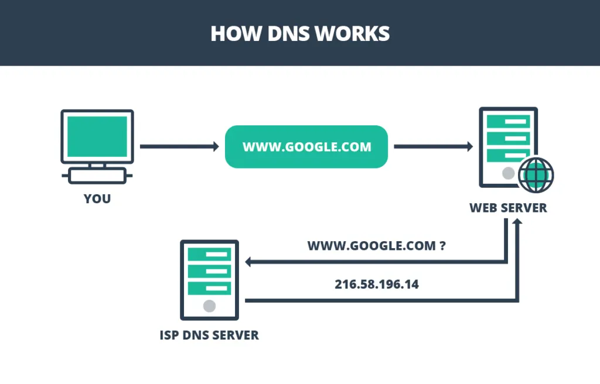
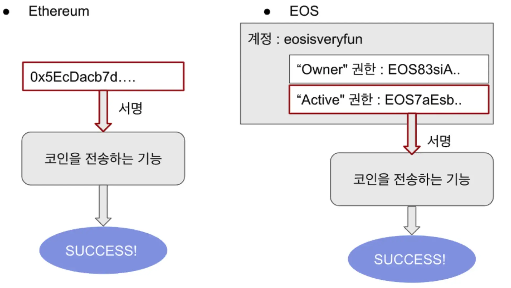
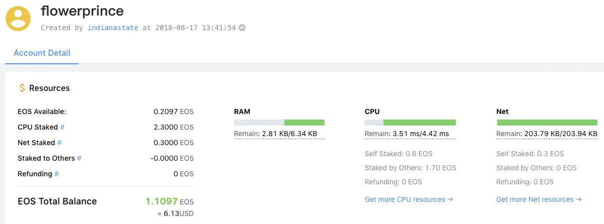
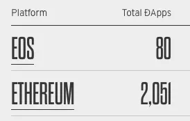
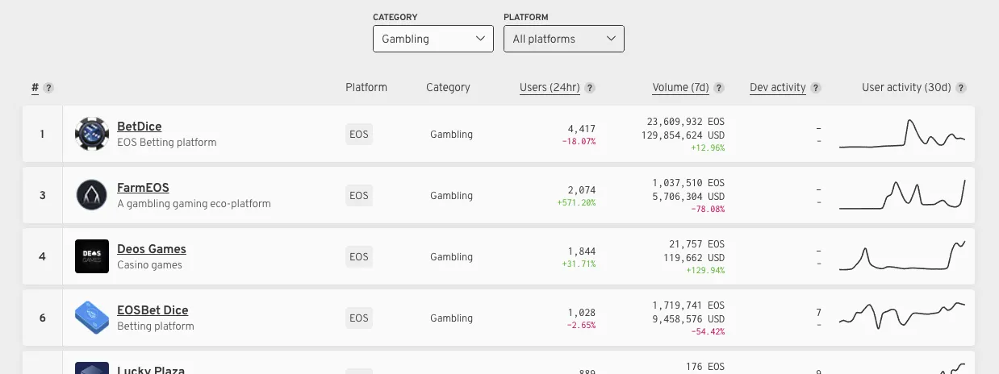
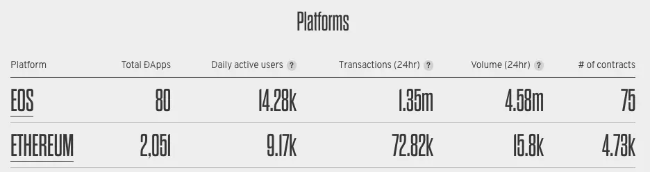

안녕하세요, 김상호입니다. 오늘은 특정 기술 분야에 대한 이야기보다 조금 넓게 블록체인 생태계를 살펴보려고 합니다. 다양한 코인이 존재하지만, 그 중에서 2세대, 3세대를 대표하는 이더리움과 이오스를 비교해보았습니다.

## 등장 배경

2000년 후반, 블록체인의 시작을 알리는 비트코인이 등장했습니다. 초기에는 많은 사람들이 알지 못했고 거래량도 많지 않았습니다. 하지만 2010년을 지나오며 점점 사람들은 블록체인에 관심을 갖기 시작했고, 비트코인의 소스를 활용한 다양한 프로젝트들이 등장하게 됩니다. 지금도 1세대 코인의 대표주자인 비트코인의 상징성은 엄청나며, 아직도 시가총액 1위를 유지하고 있는 블록체인 생태계의 강자입니다.

비트코인을 통해 사람들은 컴퓨터 상에서 코인을 전송할 수 있게 되었습니다. 그리고 2010년에 10,000 비트코인으로 파파존스 피자를 결제한 사례는 유명하죠.


하지만 블록체인 기술을 통해 더욱 다양한 서비스를 구축하기 위해, **프로그래밍이 가능한 블록체인 코인**에 대한 수요는 점점 늘어나게 됩니다. 이때 비탈릭 부테린이 등장하며, 애플리케이션 개발이 가능한 스크립트 언어가 탑재된 코인에 대한 이야기를 시작합니다. 이는 2015년, 2세대 코인의 대표주자인 이더리움이 탄생하게 된 배경이 되었습니다.


이더리움을 통해 사람들은 블록체인 위에서 작동하는 프로그램(스마트 컨트랙트)에 대한 가능성을 보았으며, 현재까지도 가장 많은 dApp을 보유하고 있고 시가총액 2위를 달리고 있습니다.

이더리움 이후, 많은 사람이 블록체인에 관심을 갖게 됩니다. 비트코인, 이더리움의 단점을 보완하겠다고 나선 여러 프로젝트가 우후죽순처럼 시작되게 되고, 이 시기를 보통 3세대라 칭합니다.


3세대 코인 중 이오스는 **이더리움 킬러**라는 별명으로 ICO를 진행하였습니다. 약 1년에 걸친 상당히 긴 시간의 독특한 ICO를 진행하며, 2018년까지 약 71억 달러의 자금을 모았습니다. 이오스도 이더리움과 같이 스마트 컨트랙트 개발이 가능한 자체 엔진을 탑재하였으며, 수수료의 부담이 없고, 이더리움 대비 약 200배 빠른 처리속도를 무기로 생태계를 확장해나가고 있습니다. 현재 가장 활성화된 3세대 코인이라 볼 수 있으며, 시가총액 5위를 달리고 있습니다.


짧은 시간 동안 블록체인 생태계 내에서 다양한 프로젝트가 시작되었습니다. 스마트 컨트랙트 개발이 가능한 프로젝트 중에서 현재 이더리움과 이오스가 제일 많이 회자되고 있다고 볼 수 있는데요. 여기서 우리는 2세대 코인의 대표주자 이더리움, 3세대 코인의 유망주 이오스 중 어느 프로젝트가 추후 시장을 선도할 것인지 궁금해지게 됩니다. 이에 대해 사용성, 수수료, dApp 활성화 수준 측면에서 비교해보도록 하겠습니다.

## 측면 1 : 사용성

기존의 대표적인 코인인 비트코인, 이더리움은 **주소**의 개념이 존재합니다. 주소는 은행 계좌의 계좌번호와 같은 역할을 합니다. 따라서 A가 B에게 이더(이더리움 플랫폼의 기축 통화. ETH)를 송금을 하기 위해선 B의 주소를 알아야 합니다. 이더리움의 주소는 숫자와 문자의 조합으로 이루어지며, 예를 들어 아래와 같은 형식을 갖습니다.

```text
0x15a664416e42766a6cc0a1221d9c088548a6e731
0xc5b4aaa4a05017e2e44d483d132c8c9c82cbc493
0x69189716420FFCc0cA2e4F9869433389Df331f9c
```

상당히 복잡합니다. 이처럼 이더리움의 주소는 사람이 읽을 수 있는 형식이 아니므로(non human-readable), 일반적인 사용자가 해당 주소를 사용하는데 친숙함을 느끼기가 쉽지 않을 것이라 생각합니다.

이오스는 주소의 개념 상위에 **계정**이라는 레이어가 존재합니다. 계정은 계좌번호라기보다 **아이디**에 가깝다고 볼 수 있습니다. 사용자는 이오스 블록체인에 마치 회원가입을 하듯 계정을 생성하게 되고, 다른 이의 계정에 이오스를 송금할 수 있습니다.

이오스의 계정을 IP 주소와 도메인에 비유할 수도 있습니다. 인터넷에서 특정 사이트에 접속하기 위해선 원칙적으로 해당 사이트의 IP 주소를 알아야 합니다. 하지만 우리는 네이버에 접속할 때 아무도 125.209.222.142라는 IP 주소를 브라우저에 입력하지 않습니다. 이미 인터넷 환경에는 IP 주소를 사람이 읽을 수 있는 문자열로 바꿔주는 DNS가 있기 때문에, 우리는 복잡한 IP 주소 대신 www.naver.com 이라는 도메인을 통해 사이트에 접속하게 됩니다.



이오스의 계정은 아래와 같은 형식을 갖습니다.

```text
flowerprince
upbitwallets
lioninjungle
```

이처럼 이오스의 계정은 사람이 읽을 수 있는 문자열입니다(human-readable). 따라서 자신의 계정명을 외울 수 있고, 다른 이에게 알려주기 수월하며, 일반 사용자에게 좀 더 친숙할 수 있습니다.

이렇게 이더리움과 이오스의 사용자 구분 방식의 차이로 인해, 송금을 할 때 서명의 주체에서 차이를 보입니다. 아래의 도식은 이더리움과 이오스에서 송금 방식의 차이를 나타냅니다.



## 측면 2 : 수수료

모든 컴퓨터 네트워크에서, 어떠한 액션을 취하기 위해선(예: 코인 송금) 누군가의 컴퓨터가 해당 작업을 처리할 것입니다. 세상에 공짜는 없으므로, 이에 대한 비용을 누군가는 지불을 해야 합니다.

이더리움에서는 모든 트랜잭션에 대해 **수수료**가 발생합니다. A가 B에게 일정량 이더를 송금한다면, 해당 행위를 컴퓨터로 처리하고 블록체인에 기록하는 작업을 수행한 이에게 일정량의 수수료를 지불하게 되는 개념이죠. PoW 합의 알고리즘을 채용한 코인들의 특징이기도 합니다.


이오스는 조금 다른 방식을 가지고 있습니다. 이오스에서는 수수료의 개념이 없습니다. 대신에, 사용자는 이오스 시스템에 일정 금액의 이오스를 맡겨 놓으면 맡겨놓은 양만큼 이오스 네트워크를 사용할 수 있는 권한을 얻습니다. 또한, 맡겨놓은 금액은 소모되지 않으며 원하는 시간에 다시 되찾을 수 있도록 설계되었습니다.

사용자는 이오스 시스템에 자신의 이오스를 맡김으로써, 해당 수량만큼 **시스템 자원에 대한 소유권을 얻는 것**이라 볼 수 있습니다. 자원에는 CPU/NET/RAM 세 종류가 존재하며, 자신이 발생할 트랜잭션 종류에 따라 세 자원 중 어떤 것에 더 많이 할당해야 하는지 알 필요가 있습니다.



이러한 이오스의 독특한 구조 때문에 일반 사용자는 수수료의 부담을 덜 가질 수 있으나, 자원에 대한 이해가 수반되어야 제대로 이오스 시스템을 사용할 수 있다는 점에선 약간의 학습이 필요하다고 생각합니다.

## 측면 3 : dApp 활성화 정도

어떠한 생태계가 잘 돌아가는지 판단하기 위한 중요한 척도 중 하나는 생태계에 얼마나 많은 참여자가 존재하는가입니다. 블록체인 네트워크, 특히 이더리움과 이오스 같은 플랫폼 코인들은 해당 플랫폼 위에 얼마나 많은 dApp이 존재하는지가 중요 척도라 볼 수 있는데요. 이에 대한 정보는 [https://www.stateofthedapps.com/stats](https://www.stateofthedapps.com/stats) 에서 자세히 확인할 수 있습니다.

우선, 플랫폼 구분 없이 dApp 자체의 수는 계속 증가해왔습니다. 스마트 컨트랙트의 전통적인 강자답게 이더리움 기반의 dApp이 절대적으로 많은 수를 차지하고 있습니다. 그리고 가장 많은 dApp이 존재하는 카테고리는 exchange 관련 프로젝트(특정 플랫폼 기반의 토큰, 탈중앙화 거래소의 dApp 등)이며, 역시 이더리움 기반의 프로젝트가 대다수입니다.



그 다음으로 많은 수를 차지하는 분야는 도박 및 게임입니다. 이 분야는 이오스 플랫폼의 dApp들이 다수를 차지하고 있는 것을 알 수 있습니다.



이는 이더리움보다 월등히 빠른 이오스의 tps(초당 트랜잭션 처리 수)가 게임 같은 빠른 처리가 필요한 dApp 개발에 수월하기 때문이라고 생각됩니다.

dApp의 개수 외에 주목해야 할 점은 실제 dApp을 얼마나 사용하는지입니다.



플랫폼 코인의 절대강자 이더리움은 전체 dApp 수에서는 압도적인 우위를 보이고 있습니다. 하지만 Daily active users, Transactions 등의 항목을 보면 실제 이오스 쪽이 훨씬 활성화되어 있는 것을 알 수 있습니다.

## 그렇다면, 승자는?

여러 측면을 통해 이더리움과 이오스를 비교해보았습니다. 기존 시장의 절대강자 이더리움, 빠른 속도와 다양한 기능으로 무장한 신흥강자 이오스, 둘 중 어느 하나가 미래의 블록체인 플랫폼을 장악하리라 예측하기는 쉽지 않습니다. 또한, 각 플랫폼 모두 서로의 장단점을 보고 배우며 변화하고 있기도 합니다. 그리고 두 플랫폼이 추구하는 방향이 여러 가지 측면에서 조금씩 다르기 때문에, 승자에 대한 직접적인 예측이 무의미할 수도 있다고 생각합니다.

지금은 블록체인 플랫폼 자체가 초기 단계라고 생각합니다. 이렇게 짧은 시간 동안 다양한 프로젝트가 성장하는 모습을 바라보는 것은 개발자로서, 일반 사용자로서도 즐거운 일입니다. 이더리움, 이오스 모두 훌륭한 프로젝트라고 생각되며, 두 프로젝트의 향후 성장에 대해 귀추가 주목됩니다.
