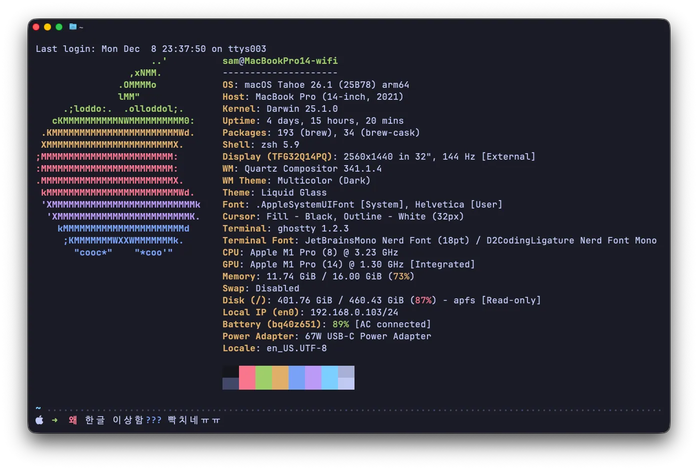
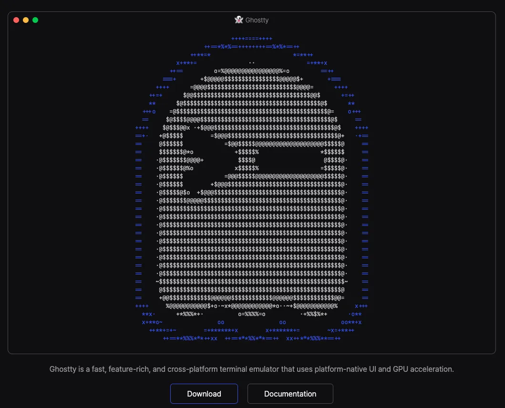
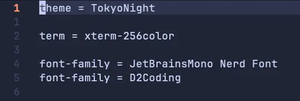

저는 Windows, Linux, macOS 환경에서 터미널 작업을 합니다. 따라서 크로스 플랫폼을 지원하는 WezTerm을 사용하고 있고, 설정파일을 통해 세 OS에서 **최대한..**! 동일한 환경을 구성하여 사용하고 있습니다.

그러던 어느 날, 여느 때와 마찬가지로 WezTerm의 설정파일을 수정하다 문득 **"내가 지금 쓸데없는 곳에 시간을 쏟는 게 아닐까?"** 라는 생각이 들었고, 웬만한 설정은 기본값을 써도 적당히 예쁜 **Ghostty**를 사용해보기로 했습니다.

## Ghostty 첫인상: 나쁘지 않은데?

Ghostty는 Windows를 지원하지 않지만, 최소한의 설정으로 원래 사용하던 WezTerm과 비슷한 환경을 꾸릴 수 있었습니다. 또한 각 OS의 native UI를 사용하기 때문에 속도도 WezTerm만큼 빠릿빠릿했고요. _(설정파일 수정을 통해 자주 쓰는 명령의 단축키도 통일할 수 있었으나, 또다시 설정 파일이 길어지는 걸 원치 않았기 때문에 이 부분은 그냥 쓰기로 결정했습니다.)_

그런데 터미널 사용 도중, 평소엔 눈치채지 못했던 문제들을 마주했습니다.

### 문제 1: 한글 정렬이 이상한데?

![[그림3] ls -al](./ls-al-output.webp)

ls -al 명령어의 결과입니다. 사진과 같이, 가나다 순으로 정렬되다가 "데이터시각화_6조_포스터.jpg" 파일부터 **두 번째 한글 오름차순 목록이 등장**합니다.

### 문제 2 : 왜 한글 글꼴이 다르게 출력되지?

현재 제 Ghostty 설정파일의 글꼴 부분은 아래와 같습니다.

따라서 영문, glyph(아이콘)은 JetBrainsMono Nerd Font가 사용되고, 한글은 D2Coding이 사용되어야 합니다. 그런데 이전 그림3을 보면, 첫 번째 한글 오름차순 묶음은 정의하지 않은 명조 틱한(?) 글꼴이 사용되었고, 두 번째 한글 오름차순 묶음부턴 설정파일에 정의된 D2Coding이 사용되고 있습니다.

단순한 설정 문제라고 생각해 이리저리 해결해보려 했으나, 결과는 바뀌지 않았습니다. 급기야 다른 터미널 에뮬레이터는 정상적인지 확인하기 위해 아래 5종의 터미널 에뮬레이터를 비교해봤습니다.

- **Ghostty**
- **WezTerm**
- **macOS 기본 터미널**
- **iTerm2**
- **kitty**

결과는 천차만별이었습니다. 파고들어 보니, 이는 **macOS의 유별난 한글 처리 방식(NFD)** 과 **터미널들의 철학 차이**가 빚어낸 **대환장 파티**였습니다.

## 배경 지식 1: 컴퓨터가 한글을 표현하는 방법

컴퓨터가 한글을 처리하는 방식은 생각보다 복잡합니다. 우리가 똑같이 화면에서 "한"이라는 글자를 보고 있더라도, 컴퓨터 내부에선 전혀 다른 0과 1의 조합으로 저장될 수 있기 때문입니다. 여기엔 유니코드 정규화 방식의 두 가지 표준인 **NFC**와 **NFD**가 있습니다.

### 한글의 특수성 (조합형 문자)

알파벳 **"A"** 는 더 이상 쪼갤 수 없는 하나의 문자입니다. 하지만 한글 **"한"** 은
**ㅎ+ㅏ+ㄴ**이라는 자소(낱자)들이 합쳐져 만들어집니다. 유니코드는 이 한글의 특성을 반영하여 두 가지 저장 방식을 모두 표준으로 인정했습니다.

### NFC (Normalization Form C): 완성형

- 의미 : Canonical Composition (정준 **결합**)
- 개념 : 자소들을 모두 합쳐 **하나의 완성된 글자**로 저장하는 방식
- 예시 : '한'을 저장할 때 컴퓨터는 `D55C`라는 **하나의 코드값**(Code Point)으로 기억

### NFD (Normalization Form D): 조합형

- 의미 : Canonical Decomposition (정준 **분해**)
- 개념 : 글자를 자소 단위로 **풀어서 나열**하여 저장하는 방식
- 예시 : '한'을 저장할 때 컴퓨터는 `1112`(`ㅎ`) + `1161`(`ㅏ`) + `11AB`(`ㄴ`)이라는 **세 개의 코드값의 연속**으로 기억

둘 다 합리적인 방식이고, 한글을 표현하기 위한 다양한 방법이 표준으로 존재한다는 것까진 이해했습니다. 하지만 문제는 지금부터입니다. 표준이 한 가지가 아니니, **각 환경에서 어떠한 방식을 차용하는지**에 따라 호환성에 문제가 생기기 시작합니다.

주요 4개 환경(Windows, macOS, Linux, Web)에서의 NFC/NFD 현황은 아래와 같습니다.

### 1. Windows

- 표준 : **NFC (완성형)**
- 저장 : Windows의 파일시스템(NTFS)는 어떤 형태든 저장은 해줍니다. (NFD 파일도 저장은 됨)
- 태도 : **NFC 방식을 권고하며, NFC 중심으로 생태계가 돌아갑니다.** (MSDN에서 normalize() 함수는 NFC 형태를 반환함)
- 출력(렌더링) : **융통성 ❌**
  — NFC(완성형)는 잘 보여주지만, NFD(조합형) 데이터가 들어오면 합쳐주지 않고 자소를 풀어서 보여줍니다.
  — 우리가 흔히 겪는 **자소 분리(ㅎㅏㄴ) 현상**의 원인입니다.

### 2. Linux

- 표준 : **NFC (완성형)**
- 저장 : Windows의 NTFS와 비슷하게, 리눅스의 파일시스템(ext4 등)도 받은 형태 그대로 저장합니다.
- 태도 : 강제성은 없으나, 개발자 간 **NFC로의 암묵적인 합의**가 이루어졌습니다.
- 출력(렌더링) : **반반**
  — 최신 데스크탑 환경(GNOME, KDE 등)의 폰트 렌더링 엔진이 좋아져서 NFD 파일도 합쳐서 잘 보여주는 편입니다.
  — 하지만 터미널(Console)이나 오래된 프로그램에서는 NFD 파일이 **자소가 분리되어 보이거나, 글자 수가 다르게 계산되는 문제**가 발생할 수 있습니다. (그래서 리눅스에서는 무조건 NFC를 쓰는 게 정신건강에 좋습니다.)

### 3. Web

- 표준 : **NFC (완성형)**
- 저장/전송 : URL이나 HTML 데이터는 **NFC로 전송하는 것이 원칙**입니다.
- 태도 : **W3C 표준**에서 **"웹에서는 NFC를 쓰자"고 공식 규정**했습니다.
- 출력(렌더링) : **반반**
  — **눈으로 볼 때 :** 크롬, 사파리 등 모던 브라우저는 NFD 텍스트도 화면에는 잘 합쳐서 보여줍니다.
  — **검색/처리 :** 하지만 컴퓨터는 '한'(NFC)과 'ㅎ+ㅏ+ㄴ'(NFD)을 **완전히 다른 글자**로 취급합니다. 따라서, NFC를 사용하지 않으면 검색 노출이 되지 않는 등 **실질적인 불이익**을 받을 수 있습니다.

### 4. macOS

- 표준 : **NFD (조합형)**
- 저장 : 파일시스템 차원에서 **강제로 NFD로 변환**해서 저장하는 경향이 강합니다. (사용자가 '한'으로 저장해도 'ㅎ+ㅏ+ㄴ'으로 쪼개서 저장함)
- 태도 : **시스템이 적극적으로 개입하여 NFD로 변환**합니다.
- 출력(렌더링) : **융통성은 매우 좋음 👍**
  — 자신들의 표준인 NFD는 물론이고, 윈도우에서 가져온 NFC 파일도 화면에 그릴 때는 **알아서 예쁘게 합쳐서 보여줍니다.**
  — 그래서 맥 사용자들은 자소 분리 문제를 평소엔 잘 느끼지 못합니다.

정리하자면 이렇습니다…

| 환경 | 표준(선호) | NFD 파일이 들어왔을 때 출력 | 비고 |
| --- | --- | --- | --- |
| Windows | NFC | **깨짐 (자소 분리)** | **자소 분리의 피해자** |
| Linux | NFC | 대부분 정상 (터미널은 케바케) | NFC 쓰는 게 국룰 |
| Web | NFC | 대부분 정상 (보이기는 함) | NFC 쓰는 게 국룰 (검색 등) |
| macOS | **NFD** | 정상 | **자소 분리의 가해자** (파일 내보낼 때) |

즉, **macOS만 NFD를 선호한다는 점**이, 우리가 가끔 마주하는 자소 분리(ㅎㅏㄴ) 현상의 근본적인 원인이라고 볼 수 있습니다.

하지만 이상합니다. **전 분명히 macOS에서 Ghostty를 사용 중이거든요.** macOS가 멱살잡고 예쁘게 그려줄 줄 알았는데, 실제론 파일명도 일부분 명조체로 나오고 정렬도 뒤죽박죽인 기이한 현상이 발생합니다.

다음 편에서 이어집니다.
