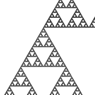

오래 유지되는 시스템을 만드는 걸 좋아합니다. 몇 년 동안 운영되는 백엔드를 자주 다루다 보니, 어떤 코드는 시간이 지나도 멀쩡한 반면 어떤 코드는 빠르게 무너지는 광경을 가까이에서 봐왔습니다. 그러면서 한 가지 결론에 도달했습니다. 시스템이 망가지는 본질은 **복잡성 누적**이고, 그 복잡성 누적의 진짜 원인은 결국 **목적의 흔들림**이라는 것. 겉으로 보이는 증상을 한 겹만 벗기면 그 아래엔 늘 같은 게 있었습니다.

_(이건 꽤 오래전부터 가져온 생각인데요.)_

모든 소프트웨어엔 만들어진 이유가 있습니다. 그 이유, 즉 목적이 흔들리지 않을 때 시스템은 오래 갑니다. 다만 이 목적이라는 게 한 번 정해두고 박제해두는 정적인 무엇이 아니라, 개발이 진행되는 동안 계속 돌아가는 사이클로 작동한다는 점이 중요합니다.

저는 이 사이클을 이렇게 정리합니다. **목적 정의 → 개발 → 기능 추가 시 목적 재확인 → 갱신/확정 → 다시 개발**. 새 기능이 등장하는 순간마다 처음 정의했던 목적과 부딪혀 보고, 어긋나면 목적을 새로 다듬거나 다시 확정한 뒤에야 다음 개발로 넘어갑니다. 단순한(하지만 지키기 쉽지 않은) 사이클입니다. 한 바퀴가 돌 때마다 목적이 갱신되거나 재확정되고, 그 흐름이 끊기는 순간부터 복잡성이 쌓이기 시작합니다.

_(말로는 단순합니다. 매 작업마다 이걸 도는 게 즐겁기만 한 건 아니지만요.)_

최근엔 AI로 코드를 짜는 비중이 부쩍 커졌습니다. 한 시간이 걸리던 작업이 십 분 만에 끝나고, 며칠 단위로 했을 일이 하루 안에 마무리됩니다. 속도가 빨라진 건 분명히 좋은 일인데, 그만큼 떠오르는 걱정이 하나 있습니다. 코드가 쏟아지는 만큼 목적과 어긋나는 부분도 같이 쏟아지고, 망가지는 속도도 빨라지지 않을까요? 결국 목적을 정의해야 할 "사람이" 속도를 따라가지 못한다면 사이클이 무너지는 것과 다를 게 없습니다. 정말 그럴까요?

그러던 중 superpowers를 만났습니다. Claude Code 위에서 작동하는 skill 모음으로, brainstorming부터 verification까지의 단계를 단계별로 강제합니다. 처음엔 그냥 편하길래 썼습니다. 그런데 며칠을 쓰다 보니, 이 도구가 강제하는 흐름이 어딘가 익숙한 모양이라는 게 보였습니다. 제가 평소 머릿속에서 돌리던 그 사이클이 거기 있었습니다.

어휘가 다를 뿐이었습니다. superpowers의 어휘는 **rigor at each step**, 제 사고방식의 어휘는 **purpose preservation**. 어휘는 다르지만 방향성은 같습니다. 한마디로 **무엇을 만들지 정하는 그 순간 개발 방향을 단단히 결정하는 것** 입니다. 즉 superpowers는 제 어렴풋한 사고 방식을 도구화한 형태라는 생각이 들었습니다.

단계 하나하나가 사이클의 어느 지점에 대응하는지 보면 더 또렷해집니다.

- **brainstorming**: 만들 것의 목적과 동기를 묻고 spec 문서를 산출합니다. 제 사이클의 "목적 정의"에 정확히 대응합니다.
- **writing-plans**: spec과 실행 계획을 분리해 둡니다. 구현이 바뀌어도 목적은 흔들리지 않게 잡아두는 장치입니다.
- **executing-plans**: 그 계획을 단계별로 실행합니다. 제 사이클의 "개발"에 정확히 대응합니다.
- **TDD**: 함수 단위의 spec입니다. 한 함수 안에서도 "무엇을 만들지"를 먼저 못 박고 그 다음 코드를 씁니다.
- **verification-before-completion**: 무언가가 됐다고 주장하기 전에 직접 실행해 검증하라고 요구합니다.
- **code-review / finishing**: 마무리 단계에서 한 번 더 전체를 훑게 합니다.

흥미로운 건, 이 흐름이 fractal하다는 점입니다. 큰 단위(brainstorm ↔ plan ↔ execute)에서도, 작은 단위(test ↔ code ↔ verify)에서도 같은 패턴이 그대로 반복됩니다.

이 블로그가 정확히 그렇게 만들어졌습니다.

`docs/spec-editorial-philosophy.md`가 사이트의 근본 정체성을 codify하고, sub-spec들이 이것을 바라봅니다 - `spec-migration.md` 첫머리의 ``Reference Philosophy: Follow `docs/spec-editorial-philosophy.md` ``가 그 예입니다.

post-detail 정렬 작업의 커밋 여섯 개를 시간순으로 따라가면:

1. `049f45b` add post detail centered layout design spec ← **brainstorm**
2. `23e794b` add implementation plan ← **plan**
3. `7081889` style: center post body ← **impl**
4. `3a6eda9` record post detail centered layout iteration ← **spec 갱신**
5. `1b1ae26` fix TOC overhang math ← spec 정합성
6. `5ac4c26` align design spec wide-figure math with the SSOT ← **SSOT 정렬**

위처럼 한 사이클이 통째로 git에 남았습니다. `prose comfort bump`(`b44c224`), `code-block copy button`(`0b4dd6f`)와 같은 기능 추가 건도 동일한 사이클을 통해 개발되었습니다.

정리하자면 이렇습니다. 시스템은 복잡성이 쌓일 때 망가지고, 복잡성은 목적이 흔들릴 때 쌓입니다. 그러니 목적이 흔들리지 않으면 시스템도 쉽게 망가지지 않습니다. 제가 superpowers를 쓰는 이유는 단순합니다. 제 사고방식의 좋은 expression이라서요. 도구가 강제하는 흐름과 제 머릿속 사이클이 정확히 같은 곳을 가리키니, 빨라진 속도 위에서도 사이클이 그대로 굴러갑니다.

**도구가 사고를 바꾸는 게 아니라, 좋은 도구는 사고를 더 단단하게 만들어줍니다.**
