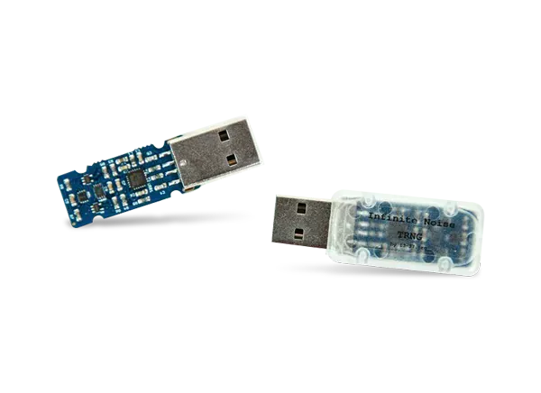

이전 글 : [안전한 난수 만들기 (1/2)](/posts/safe-random-history)

1편에서 설명한 난수들은 초깃값(seed)에 기반을 두어 알고리즘을 통해 난수를 생성합니다. **의사 난수 생성기(Pseudo-Random Number Generator)** 라고 하며, 사실상 무작위로 보이는 결과를 생성합니다. 하지만 초깃값이 같다면 같은 결과를 생성하고, 초깃값과 알고리즘을 통해 다음 숫자를 예측할 가능성이 존재합니다. 따라서 PRNG는 암호학적인 용도나 보안이 중요한 경우의 난수 생성엔 한계가 있습니다. 이러한 경우 다른 유형의 난수 생성기가 필요합니다.

## 진성 난수 생성기 (True Random Number Generator)

예측이 불가능에 가깝고, 생성된 난수들의 분포가 편향되지 않은 **가장 안전한 유형의 난수를 생성**합니다. 방사성 붕괴, 우주배경복사, 대기 잡음, 양자 현상과 같이 통계적으로 무작위 시그널을 생성하는(또는 지금까지 그렇게 알려진) 물리적 현상에서 엔트로피(예측 불가능한 정도)를 수집하여 생성할 수 있습니다. 이러한 TRNG는 보통 반도체 칩 형태로 제작됩니다.

주변에서 쉽게 볼 수 있는 예로 CPU가 있습니다. 최근 사용되는 대부분의 CPU는 TPM(Trusted Platform Module)이라고 하는 보안 모듈이 내장되어 있고, 이 TPM의 주요 구성요소 중 하나가 TRNG입니다. CPU의 TRNG의 경우 보통 반도체 소자의 열 잡음(Thermal noise) 등을 통해 엔트로피를 수집합니다.

> **RDRAND**와 같은 CPU 명령어를 통해 수집된 엔트로피를 읽어올 수 있습니다

이처럼 TRNG를 사용하여 예측 불가능에 가까운 안전한 난수를 생성할 수 있지만, 단점도 존재합니다.

TRNG는 엔트로피를 수집하기 위해 물리적 현상을 이용합니다. 따라서 PRNG에 비해 설계와 구현이 복잡해지며, 비용이 증가합니다. 특히 해당 현상을 이용하기 어렵거나 물리적 크기나 전력 소비가 한정적인 환경(예: 휴대용 기기)에선 무작위성을 보장하기 어려울 수 있습니다. 또한, 실생활에서 난수를 사용하기 위해 충분한 속도가 보장되어야 하는데, TRNG 구현 방법의 특성상 알고리즘 계산 결과인 PRNG 대비 생성 속도가 느릴 수 있습니다.

이러한 TRNG의 단점을 고려할 때, TRNG만큼 안전하면서 PRNG만큼의 빠르고 효율적인 난수 생성을 할 수 있는 다른 방법이 필요합니다.

## 암호학적으로 안전한 의사 난수 생성기 (CSPRNG)

**CSPRNG**(Cryptographically Secure Pseudo-Random Number Generator)는 PRNG의 한 종류이지만, **보안 및 암호학적 요구 사항을 만족하도록 설계되어 충분한 수준의 예측 불가능한 난수를 생성**합니다.

우선 CSPRNG는 아래와 같은 다양한 소스로부터 충분한 엔트로피를 얻어와 초깃값으로 사용합니다.

- **하드웨어 이벤트** : 마우스의 움직임, 시스템 인터럽트 타이밍, 디스크 I/O 등
- **시스템 상태** : 시스템 시간, CPU 온도 등
- **하드웨어 장치** : 앞서 설명한 CPU의 TRNG를 CSPRNG의 소스로 사용할 수 있음

이처럼 충분한 엔트로피를 통해 초깃값을 설정하고, 해당 값을 통해 생성기가 초기화됩니다. 이후 PRNG와 같이 내부 알고리즘을 통해 안전한 난수를 빠르게 생성할 수 있습니다. 또한, 대부분의 알고리즘은 새로운 엔트로피가 등장할 때마다 생성기를 재초기화하므로 더욱더 예측 불가능한 난수가 생성되도록 설계되었습니다.

## CSPRNG 사용하기

이처럼 CSPRNG는 암호학적으로 충분히 안전한 난수를 빠르게 생성할 수 있습니다. 우리는 대부분의 운영체제, 프로그래밍 언어에서 CSPRNG를 사용할 수 있습니다.

- **Linux, MacOS** : **/dev/random** 과 **/dev/urandom** 파일에 운영체제 레벨에서 수집한 엔트로피가 저장됩니다. 이 파일들은 운영체제 커널의 `get_random_bytes` 와 같은 함수에서 사용되며, OpenSSL과 같은 다양한 암호화 라이브러리에서 난수 생성 시 활용됩니다. (리눅스 커널의 [random.c](https://git.kernel.org/pub/scm/linux/kernel/git/stable/linux.git/tree/drivers/char/random.c) 에 자세히 설명되어 있습니다)
- **Windows** : [Cryptography API: Next Generation (CNG)](https://learn.microsoft.com/en-us/windows/win32/seccng/cng-portal) 의 **BCryptGenRandom** 함수
- **Node.js** : **crypto.randomBytes**, **crypto.randomInt** (v14 이상) 함수
- **Python** : **os.urandom** 함수
- **Java** : **java.security.SecureRandom** 함수
- **C#** : **System.Security.Cryptography.RandomNumberGenerator.Create** 함수

지금까지 난수의 역사와 더불어 난수 생성기의 두 가지 유형인 TRNG와 CSPRNG에 대해서 알아보았습니다. 우리는 CSPRNG를 통해 비용 효율적이면서도 안전한 난수를 생성할 수 있습니다. 운영체제 또는 언어를 사용할 때, 사용하게 될 난수 생성 함수가 안전한 방법을 통해 난수 생성을 하는지 확인하는 것이 중요합니다.

긴 글 읽어주셔서 감사합니다.
