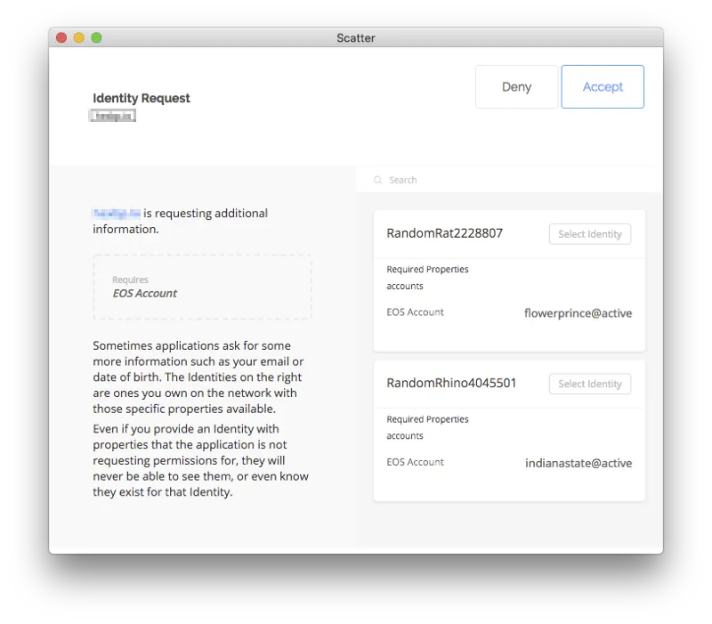

안녕하세요, 김상호입니다. 얼마 전 [eosjs를 이용한 EOS 코인 전송](/posts/eosjs-coin-transfer)에 대해 알아보았습니다. 이를 통해 eos 블록체인에서 가능한 작업들을 웹 환경에서 수행할 수 있다는 것을 알 수 있었습니다.

하지만 eosjs만 가지고 서비스를 개발하기엔 문제가 있습니다. 가장 큰 문제는 **"사용자의 프라이빗 키를 안전하게 전달할 수 있는지"** 입니다. 아래의 내용은 저번 글에서 다뤘던 소스코드 중 일부입니다.

```javascript
let eos = Eos({
    chainId: '038f4b0fc8ff18a4f0842a8f05...',
    keyProvider: [
        "5JR9m7o......",
        "5JAj2AMS5....",
        ......
    ],
    httpEndpoint: "https://eos.greymass.com:443,
    broadcast: true,
    verbose: true,
    sign: true
});
```

초기 eosjs 설정 부분입니다. chain ID, 연결할 node의 정보와 같이 **사용될 계정의 프라이빗 키**가 필요합니다. 결국 사용자에게 해당 소스가 포함된 웹 페이지가 전달되므로, 클라이언트 측 로직을 작성해 직접 입력받게 한다면 하드코딩을 피할 수는 있습니다. 하지만 프라이빗 키와 같은 민감한 정보를 웹 브라우저에 입력하는 작업 자체가 보안성의 측면에서 권장되지 않는 방법입니다.

방법은 없는 걸까요? 어떻게 하면 웹 페이지에 직접 프라이빗 키를 입력하지 않고 eosjs에서 프라이빗 키를 사용하게 할 수 있을까요? 여기서 크롬 확장 플러그인과 스캐터가 활약합니다.

## 크롬 확장 플러그인

크롬 확장 플러그인은 크롬 브라우저에 설치할 수 있는 작은 프로그램입니다. 이를 통해, 사용자는 추가적으로 자신이 원하는 기능을 크롬 브라우저에 추가해 사용할 수 있습니다.

또한 크롬 확장 플러그인은 현재 사용자가 보고 있는 페이지에 접근할 수 있습니다. 그리고 플러그인은 현재 보고있는 웹 페이지와 별도로 독립된 자바스크립트 scope를 가질 수 있습니다. 따라서 해커가 의도한 사이트에 접속한 상태일지라도, 크롬 확장 플러그인 내부의 값을 변경할 수 없도록 설계되었습니다.

## 스캐터(Scatter)

스캐터는 EOS 또는 이더리움의 키를 관리하는 프로그램입니다. 스캐터를 사용해 직접 프라이빗 키를 웹 페이지에 입력하지 않고, 프라이빗 키가 필요할 때마다(eosjs측에서 transfer 서명 요청 등) 스캐터에 저장된 프라이빗 키를 웹 페이지가 요청해 사용할 수 있도록 구현되었습니다.


> [!NOTE]
> 1. 현재 스캐터는 클래식(크롬 확장 플러그인), 데스크톱 버전, 모바일 버전이 존재합니다. 본 포스팅에서는 스캐터 클래식을 사용하였습니다.
> 2. 스캐터 설치 및 자세한 사용 방법에 대해서는 [여기](https://medium.com/hexlant/하나부터-열까지-모두-알려주겠다-scatter-계정-만들기-feat-hexbp-연동하기-3eb59fdbad64)를 확인해주세요.

실제로 eosjs + 스캐터를 이용해 eos 블록체인에 접근해봅시다. 우선 스캐터 설치 여부를 확인해야 합니다.

```javascript
document.addEventListener('scatterLoaded', scatterExtension => {
    const scatter = window.scatter;
    window.scatter = null;

    // Do something...
});
```

스캐터가 설치되었다면, scatterLoaded라는 이벤트가 발생합니다. 따라서 위처럼 해당 이벤트를 catch하여 계속 진행할지, 아니면 스캐터 설치를 안내할지 분기할 수 있습니다.

위 소스에서 window.scatter 레퍼런스를 null로 바꾸고, 임의의 scatter라는 변수명으로 재설정하는 부분이 있습니다. window 객체는 스캐터 외의 다른 크롬 확장 플러그인에서 접근이 가능하므로, window 하위에 있는 scatter 레퍼런스를 null 처리해줘야 안전합니다.

Do something 부분에 아래 부분을 추가해줍니다.

```javascript
const network = {
    blockchain: 'eos',
    protocol: 'http',
    host: '52.199.125.75',
    port: '8888',
    chainId: '038f4b0fc8ff18a4f0842a8f0564611f6e96e8535901dd45e43ac8691a1c4dca',
};

const eosNetwork = {
    chainId: network.chainId,
    httpEndpoint: network.protocol + "://" + network.host + ":" + network.port,
    broadcast: true,
    verbose: true,
    sign: true
};

scatter.getIdentity({accounts:[network]}).then(identity => {

    const account = scatter.identity.accounts.find(account => account.blockchain === network.blockchain);
    const eos = this.scatter.eos(network, Eos, eosNetwork);


}, function(error) {
    console.log("login failed")
});
```

위 소스코드를 통해 network 변수에 설정한 정보를 토대로 eosjs 및 스캐터를 설정합니다. 위 상태에서 해당 페이지를 실행해보면 아래와 같은 창이 하나 뜨는 것을 확인할 수 있습니다.



스캐터에 저장된 계정 중 로그인에 사용할 계정을 선택하는 화면이 출력됩니다. 우리는 network를 eos로 설정하였으므로 (network 변수의 blockchain 항목), 스캐터에 저장된 계정 중 eos 관련 계정이 리스트에 출력됩니다. 원하는 계정을 선택하고 Accept를 누르면 eosjs와 스캐터에 해당 계정이 연동됩니다.

이번 시간에는 스캐터에 대한 대략적인 설명과 스캐터와 eosjs를 연동해 특정 계정을 연동하는 방법에 대해 알아보았습니다. 다음 시간에는 스캐터를 이용해 연동한 계정으로 코인 전송과 같은 트랜잭션을 날리는 과정에 대해 설명하겠습니다.

감사합니다.
