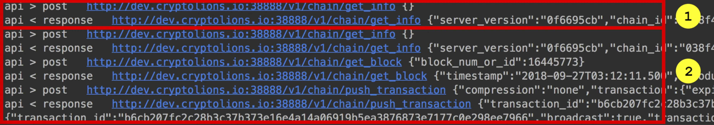
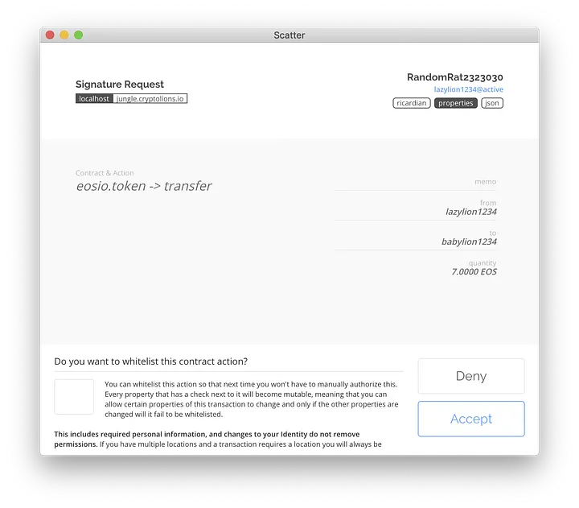
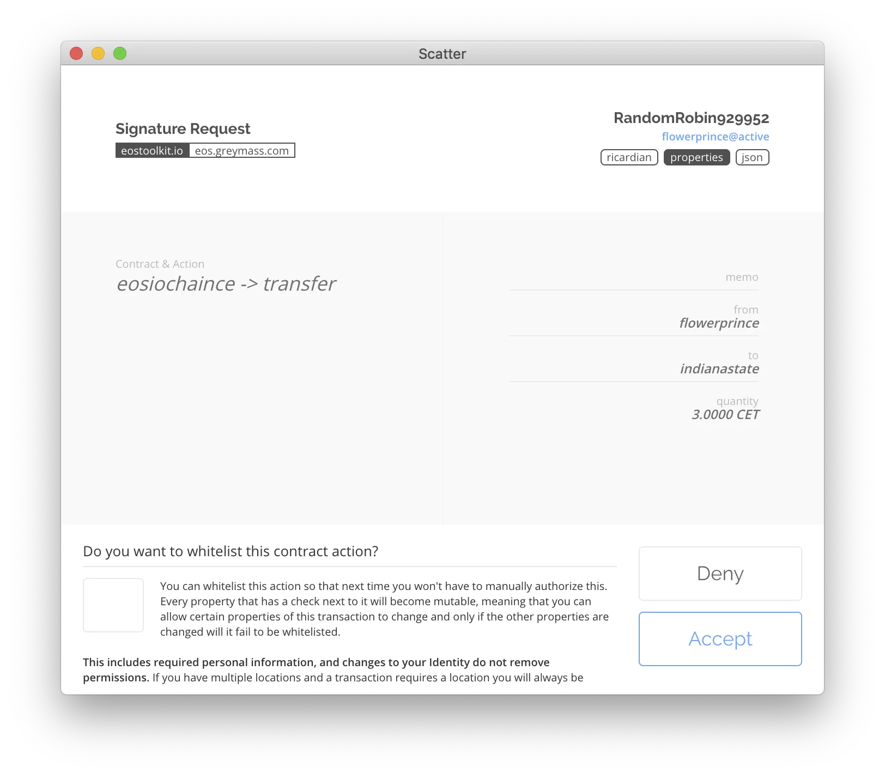
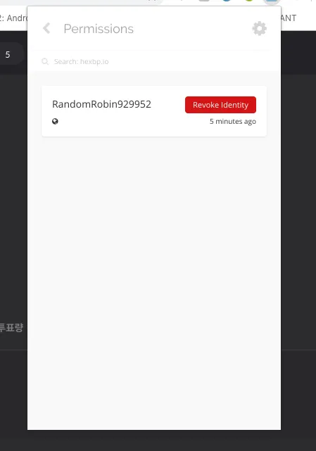

안녕하세요, 김상호입니다. 저번 시간에 스캐터를 이용해 eos 블록체인의 계정을 웹 서비스에 연동해보았습니다. 이번 시간에는 연동한 eos 계정으로 블록체인 위에서 할 수 있는 다양한 작업들에 대해 알아보겠습니다.

## 송금(transfer)

eos는 transfer라는 명령어를 가지고 있습니다. 이 명령어를 사용해 특정 계정의 계좌에서 다른 계정으로 EOS 토큰을 보낼 수 있습니다. 명령어와 실행 결과는 아래와 같습니다.


이러한 송금 기능을 웹 서비스에 추가하기 위해 우리는 eosjs를 사용했었습니다. 오늘 진행할 스캐터를 사용하는 방법도 결국 eosjs를 사용하게 되므로 소스상 차이는 없습니다. 하지만, 작업들에 필요한 **"인증"** 과정에서 차이가 나게 됩니다.

```javascript
this.eos.transfer('babylion1234', 'lazylion1234', '12.0000 EOS', 'this is memo field');
```

위의 예제는 eosjs의 transfer 메서드입니다. 위 소스코드를 이용해 eos의 transfer 명령어와 동일한 작업을 수행할 수 있습니다. 실행 결과는 아래와 같습니다.



차이점은 단 한가지, **"인증"이 이루어지는 방법**입니다.

이전 글에서 설명했던것처럼, 블록체인에서 어떠한 작업을 수행하기 위해서 Private Key가 필요합니다. eosjs 단독으로 사용할 경우 이는 아래와 같이 소스코드 내에 값을 입력해둬야 합니다.

```javascript
let eos = Eos({
    chainId: '038f4b0fc8ff18a4f0842a8f05...',
    keyProvider: [
        "5JR9m7o......",
        "5JAj2AMS5....",
        ......
    ],
    httpEndpoint: "https://eos.greymass.com:443,
    broadcast: true,
    verbose: true,
    sign: true
});
```

이후, transfer와 같은 메서드가 실행될 때 KeyProvider 배열에서 필요한 Private Key를 찾아 서명하도록 설계되었습니다.

하지만 스캐터가 연동되었다면 위의 설정 없이 메서드 실행이 가능합니다. 대신 아래와 같은 화면을 만나게 되죠.



## 커스텀 토큰 송금 (transaction)

eosjs에서 transaction 메서드를 사용해 다양한 작업을 수행할 수 있습니다. 따라서 커스텀 토큰을 송금할 때 똑같이 transaction 메서드를 사용하면 되며, 소스 실행 시 아래와 같은 스캐터 팝업이 뜨게 됩니다.



## 투표 (voteproducer)

마지막 예시로 EOS의 투표 트랜잭션을 생성할 수 있습니다. 소스코드는 아래와 같이 트랜잭션 메서드 내부에 voteproducer 액션을 정의해 사용하면 됩니다.

```javascript
this.eos.transaction(tr => {
    tr.voteproducer("flowerprince", "", ["acroeos12345", "teamgreymass"]);
});
```

flowerprince 계정이 두 개의 BP에 대해 투표를 진행하는 내용입니다. 해당 소스코드에 대한 스캐터 인증 팝업은 아래와 같습니다.


voteproducer와 같이, eosjs는 주요 컨트랙트들의 abi를 보고 필요 메서드를 생성해줍니다. 이를 transaction 내부에서 사용하면 되겠습니다.

## 스캐터 로그아웃 — 방법1 : 스캐터에서 직접 로그아웃

스캐터를 통해 계정 연동을 했다면 스캐터 플러그인의 Permissions 메뉴에 아래와 같이 연동된 사이트의 목록이 보입니다.


이를 해제(로그아웃)하는 방법은 간단합니다. 해당 목록을 선택 후 **Revoke Identity** 버튼을 누르면 인증 해제됩니다.



## 스캐터 로그아웃 — 방법2 : 소스코드 (eosjs) 에서 처리

하지만 사이트를 방문한 사용자들에게 로그아웃을 위해 스캐터 사용법을 알려줄 수는 없는 노릇입니다. eosjs는 프로그래밍적인 방법으로 스캐터 로그아웃을 진행하는 메서드를 제공합니다.

```javascript
if(this.scatter.identity) {
    this.scatter.forgetIdentity();
}
```

위 소스코드는 우선 identity의 존재 여부를 확인하고, 존재한다면 (스캐터 연동됨) 이를 **forgetIdentity()** 메서드를 사용해 해제하는 과정을 보여줍니다. 당연히 방법1과 방법2는 동일한 효과를 지닙니다.

지금까지 두 개의 포스팅을 통해 eosjs와 스캐터를 이용해 웹서비스에 적용할 수 있는 방법을 알아보았습니다. 궁금하신 점이나 잘못된 점이 있다면 댓글 부탁드리겠습니다.

감사합니다.
